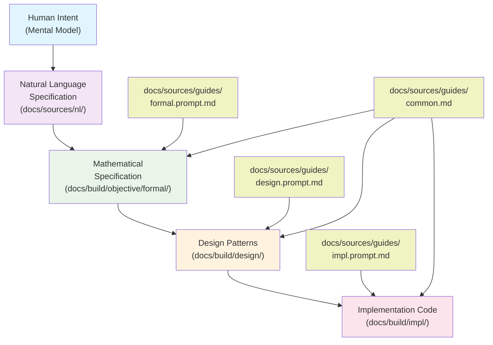
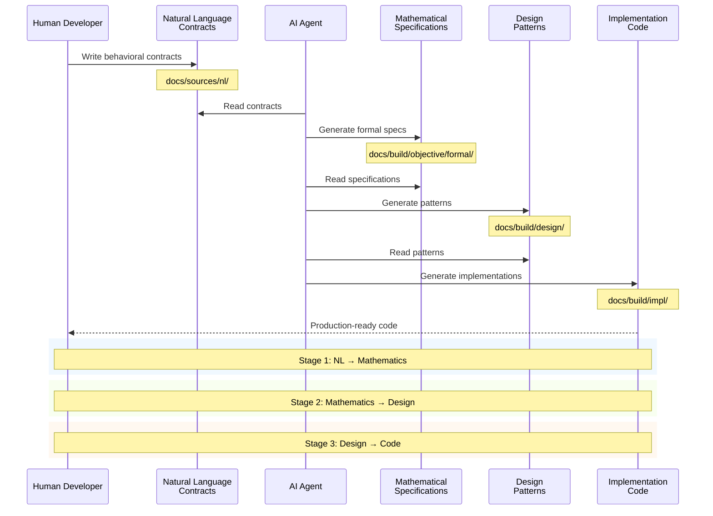
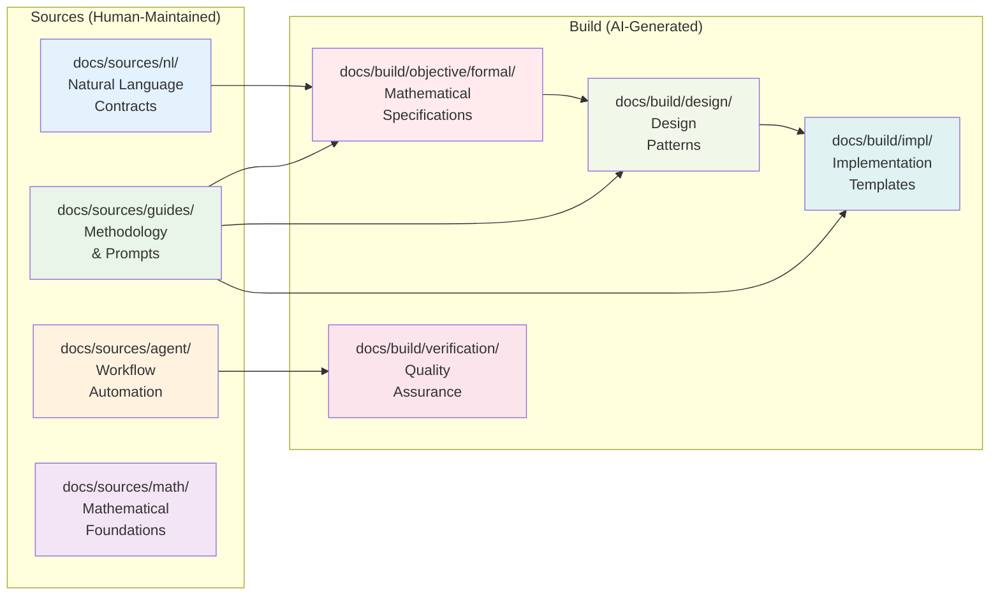

# QiCore v4.0: An AI-Human Collaboration Framework

> **Addressing the Context Alignment Problem in AI-Assisted Software Development**  
> **Version**: 4.0.1  
> **Status**: Stable Framework  
> **Approach**: Category theory as a semantic translation layer  
> **Author**: Zhifeng Zhang

## Table of Contents
- [The Problem We Solve](#the-problem-we-solve)
- [The Innovation](#the-innovation)
- [How It Works](#how-it-works)
- [The 4-Stage Process](#the-4-stage-process)
- [Project Structure](#project-structure)
- [Getting Started](#getting-started)
- [Understanding the Process](#understanding-the-process)
- [Implementation Guide](#implementation-guide)
- [Verification](#verification)
- [Academic Papers](#academic-papers)
- [FAQ](#faq)

## The Problem We Solve

### The Context Alignment Challenge

In traditional AI-assisted development, humans and AI face a fundamental communication problem:

```
Human thinks: "Handle errors gracefully"
       ↓
AI interprets: ??? (Could be try-catch, error codes, monads, etc.)
       ↓
Result: Inconsistent, unpredictable implementations
```

**The core issues:**
1. **Context Misalignment**: Humans and AI don't share the same understanding
2. **Hidden AI Context**: AI's interpretation is opaque to humans
3. **Ambiguity Cascade**: Each transformation loses fidelity
4. **Unpredictable Output**: No guarantee AI generates what humans intended

## The Innovation

### Category Theory as the Universal Translation Layer

QiCore v4.0 introduces a novel approach: **using category theory as a precise, mathematical intermediate language** that both humans and AI can understand unambiguously.

```
Human Intent (Natural Language)
       ↓ [Stage 1: Mathematical Formalization]
Category Theory Patterns (Precise, Unambiguous)
       ↓ [Stage 2: Design Patterns]
Language-Agnostic Designs (Implementation Strategies)
       ↓ [Stage 3: Code Generation]
Working Code (Multiple Languages)
```



### Why Category Theory?

Category theory provides:
1. **Universal Pattern Language**: Every software pattern has a categorical equivalent
2. **Composition Rules**: How patterns combine is mathematically defined
3. **Verification Framework**: Mathematical laws ensure correctness
4. **Cross-Language Consistency**: Same behavior across all implementations

## How It Works

### The Two-Phase Development Model

**Phase 1: Design (Human + AI Collaboration)**
- Humans write natural language specifications
- AI transforms them through mathematical formalization
- Together they create unambiguous design documents

**Phase 2: Implementation (AI Alone)**
- AI has complete, unambiguous context
- Generates code following exact patterns
- No interpretation or guessing needed

## The 4-Stage Process

> **Complete Development Workflow**: From idea to working code  
> **Detailed Process Guide**: See `docs/guides/guide.md` for step-by-step transformation instructions  
> **Verification Checklist**: Use `check-list.md` to ensure all files are properly configured

### Stage 0: Natural Language Specification
**Human Domain - What We Want**

- **Purpose**: Create the input contracts that drive the entire process
- **Files**: 
  - `docs/sources/nl/qi.v4.class.contracts.md` - 8 behavioral contracts
  - `docs/sources/nl/qi.v4.component.contracts.md` - 5 component organization
- **Example**: "Operations that can fail should return either success or error"
- **Who**: Human developers write these specifications

### Stage 1: Mathematical Formalization
**Translation Layer - Making It Precise**

- **Purpose**: AI uses category theory to formalize specifications
- **Process**: Use `docs/sources/guides/formal.prompt.md` + `docs/sources/guides/common.md`
- **Input**: Natural language contracts from Stage 0
- **Output**: `docs/build/objective/formal/qi.v4.formal.spec.md`
- **Example**: 
  ```latex
  Result<T> = Success(T) | Failure(QiError)
  Monad laws: left identity, right identity, associativity
  ```

### Stage 2: Design Analysis
**Pattern Derivation - How To Build It**

- **Purpose**: Derive implementation patterns from mathematics
- **Process**: Use `docs/sources/guides/design.prompt.md` + `docs/sources/guides/common.md`  
- **Input**: `docs/build/objective/formal/qi.v4.formal.spec.md`
- **Output**: `docs/build/design/qi.v4.design.analysis.md`
- **Example**: Railway-oriented programming pattern for Result monad

### Stage 3: Implementation
**Code Generation - Building It**

- **Purpose**: Implement patterns in target languages
- **Process**: Use `docs/sources/guides/impl.prompt.md` + `docs/sources/guides/common.md`
- **Input**: `docs/build/design/qi.v4.design.analysis.md`
- **Output**: 
  - `docs/build/impl/qi.v4.[lang].template.md` - Code templates
  - `docs/build/impl/qi.v4.[lang].impl.md` - Implementation guide
- **Languages**: TypeScript (`ts`), Python (`py`), Rust (`rs`), Haskell (`hs`), Go (`go`)

### Process Flow Summary
```
Stage 0: Human writes NL contracts
   ↓
Stage 1-3: AI transforms through mathematical pipeline (see docs/sources/guides/guide.md)
   ↓
Result: Production-ready code in multiple languages
```



## Project Structure

```
├── docs/                        # Technical documentation
│   ├── sources/                 # Source files that drive the design process
│   │   ├── agent/              # AI workflow orchestration
│   │   │   ├── build/         # YAML workflow definitions
│   │   │   └── verification/  # Verification instructions
│   │   ├── guides/            # Core methodology files
│   │   │   ├── common.md     # Mathematical foundations & patterns
│   │   │   ├── formal.prompt.md  # Stage 1: NL → Math transformation
│   │   │   ├── design.prompt.md  # Stage 2: Math → Design patterns
│   │   │   └── impl.prompt.md    # Stage 3: Design → Code
│   │   ├── math/              # Mathematical study guides
│   │   └── nl/                # Natural language contracts (input)
│   └── build/                   # Generated outputs from design process
│       ├── design/            # Stage 2 output: Design patterns
│       ├── impl/              # Stage 3 output: Implementation templates
│       ├── objective/         # Stage 1 output: Mathematical specs
│       │   └── formal/       # Formal mathematical specifications
│       └── verification/      # Verification results
├── papers/                     # Academic papers
├── essays/                     # Philosophical essays
├── README.md                   # This file
├── check-list.md              # Framework verification checklist
├── LICENSE                     # MIT License
└── .gitignore                 # Git ignore patterns
```



## Getting Started

### Prerequisites
- Understanding of basic software patterns (error handling, configuration, etc.)
- AI assistant or automation tool that can process the workflow files
- No category theory knowledge required!

### Quick Start

1. **Verify Setup** - Use our comprehensive checklist:
   ```bash
   # Check all required files are present
   cat check-list.md
   ```

2. **Follow the Process Guide** - Detailed step-by-step instructions:
   ```bash
   # Read the complete transformation guide
   cat docs/sources/guides/guide.md
   ```

3. **Review Natural Language Specifications**
   ```bash
   cat docs/sources/nl/qi.v4.class.contracts.md
   cat docs/sources/nl/qi.v4.component.contracts.md
   ```

4. **Run the 3-Stage Transformation** (see `docs/sources/guides/guide.md` for details):
   ```bash
   # Stage 1: Mathematical Formalization
   # Use docs/sources/guides/formal.prompt.md + docs/sources/guides/common.md
   # Input: docs/sources/nl/*.contracts.md
   # Output: docs/build/objective/formal/qi.v4.formal.spec.md
   
   # Stage 2: Design Analysis  
   # Use docs/sources/guides/design.prompt.md + docs/sources/guides/common.md
   # Input: docs/build/objective/formal/qi.v4.formal.spec.md
   # Output: docs/build/design/qi.v4.design.analysis.md
   
   # Stage 3: Implementation (choose language: ts, py, rs, hs, go)
   # Use docs/sources/guides/impl.prompt.md + docs/sources/guides/common.md
   # Input: docs/build/design/qi.v4.design.analysis.md
   # Output: docs/build/impl/qi.v4.[LANG].template.md + docs/build/impl/qi.v4.[LANG].impl.md
   ```

### Automated Workflows (Optional)
The YAML files in `docs/sources/agent/build/` can automate the process:
- `inst.formal.yaml` - Stage 1 workflow
- `inst.design.yaml` - Stage 2 workflow  
- `inst.impl.[lang].yaml` - Stage 3 workflows for each language

## Understanding the Process

### The Mathematical Foundations (`docs/sources/guides/common.md`)

This file contains the "vocabulary" that enables translation:

1. **Monads** - For error handling (Result pattern)
2. **Monoids** - For configuration merging
3. **Functors** - For data transformations
4. **State Machines** - For circuit breakers
5. **Stream Coalgebras** - For efficient streaming
6. **Performance Tiers** - Language-specific performance targets

### Stage 1: Natural Language → Mathematics

**Input Example**:
```markdown
`map(transformFunction)` - Transform success value, pass through failures unchanged
```

**Mathematical Output**:
```latex
map: (A → B) × Result<A> → Result<B>

Semantics:
map(f, Success(x)) = Success(f(x))
map(f, Failure(e)) = Failure(e)

Laws:
- Identity: map(id) = id
- Composition: map(g ∘ f) = map(g) ∘ map(f)
```

### Stage 2: Mathematics → Design Patterns

**Mathematical Input**: Result monad with laws

**Design Pattern Output**:
```
Railway-Oriented Programming:
- Success path: →→→→→→→→→→→→→
                    ↘      ↗
- Failure path: - - - - - - -

Operations flow on success track
Any failure switches to error track
```

### Stage 3: Design Patterns → Code

**Design Pattern Input**: Railway-oriented programming

**TypeScript Output**:
```typescript
class Result<T> {
  map<U>(fn: (value: T) => U): Result<U> {
    if (this.isSuccess) {
      return Result.success(fn(this.data));
    }
    return this as Result<U>;
  }
}
```

**Haskell Output**:
```haskell
instance Functor Result where
  fmap f (Success x) = Success (f x)
  fmap _ (Failure e) = Failure e
```

## Implementation Guide

### For Framework Users

1. **Write Natural Language Contracts**
   - Describe what you want in plain English
   - Focus on behavior, not implementation
   - Use the provided contract templates

2. **Run the Transformation Pipeline**
   - Execute stages 1-3 in order
   - Review outputs at each stage
   - Verify patterns match intent

3. **Use Generated Code**
   - Import the generated modules
   - Follow the implementation guide
   - Run the provided tests

### For Framework Contributors

1. **Extending the Pattern Library**
   - Add new patterns to `docs/sources/guides/common.md`
   - Update prompt files with new patterns
   - Create examples in contracts

2. **Adding New Languages**
   - Create `docs/sources/agent/build/inst.impl.[lang].yaml`
   - Follow the pattern mapping in `docs/sources/guides/impl.prompt.md`
   - Ensure mathematical properties preserved

## Verification

### Mathematical Properties
Each implementation includes tests for:
- **Monad Laws** (Result)
- **Monoid Laws** (Configuration)
- **Functor Laws** (Transformations)
- **State Machine Invariants** (Circuit Breaker)

### Cross-Language Consistency
- Same inputs produce equivalent outputs
- Performance within language tier targets
- Behavioral tests pass across all languages

### Coverage Metrics
- **64 Operations** fully specified
- **8 Contracts** mathematically formalized
- **5 Components** with clear boundaries
- **5 Languages** supported

## Academic Papers

The `papers/` directory contains peer-reviewed academic work:

- **[Position Paper](papers/position.md)** - Mathematical framework for human-AI collaboration
- **[Conference Paper](papers/conference.md)** - Practical framework demonstration
- **[Design Process](papers/design.process.md)** - Complete academic treatment
- **[Key Arguments](papers/key.arguments.md)** - Core thesis defense
- **[Technical Report](papers/technical.report.md)** - Implementation details and validation

## FAQ

### Do I need to know category theory?
**No!** The framework handles the mathematical complexity. You only need to:
- Write natural language specifications
- Understand basic software patterns
- Run the transformation pipeline

### Why is this better than traditional code generation?
Traditional approaches guess at your intent. QiCore v4.0:
- Creates unambiguous specifications
- Preserves mathematical correctness
- Ensures cross-language consistency
- Provides verifiable implementations

### Can I use just parts of the framework?
Yes! Each component is independent:
- Use just Result for error handling
- Use just Configuration for settings
- Mix and match as needed

### How do I debug generated code?
The framework provides:
- Clear pattern documentation
- Comprehensive tests
- Implementation guides
- Pattern-to-code mapping

### What if I need custom patterns?
1. Add mathematical definition to `docs/guides/common.md`
2. Update design patterns in `docs/guides/design.prompt.md`
3. Implement in target languages
4. Verify properties preserved

## License

This project is licensed under the MIT License - see the [LICENSE](LICENSE) file for details.

## Contributing

1. Fork the repository
2. Create your feature branch (`git checkout -b feature/new-feature`)
3. Commit your changes (`git commit -m 'Add new feature'`)
4. Push to the branch (`git push origin feature/new-feature`)
5. Open a Pull Request

## Citation

If you use QiCore v4.0 in academic work, please cite:

```bibtex
@misc{zhang2025qicore,
  title={QiCore v4.0: An AI-Human Collaboration Framework},
  author={Zhang, Zhifeng},
  year={2025},
  month={June},
  url={https://github.com/zhifengzhang-sz/qicore-v4}
}
```

## Summary

QiCore v4.0 addresses AI-assisted development challenges by resolving the context alignment problem. Using category theory as a translation layer, it enables:

- **Precise Communication**: No ambiguity between human intent and AI implementation
- **Mathematical Correctness**: Verified properties and laws
- **Cross-Language Consistency**: Same behavior everywhere
- **Systematic Process**: Repeatable, reliable transformations

The future of software development isn't about AI replacing developers - it's about creating better tools for expressing intent and getting reliable implementations. QiCore v4.0 provides that tool.

---

**Ready to start?** Begin with the natural language contracts in `docs/sources/nl/` and follow the 4-stage process to get production-ready implementations in your language of choice! 