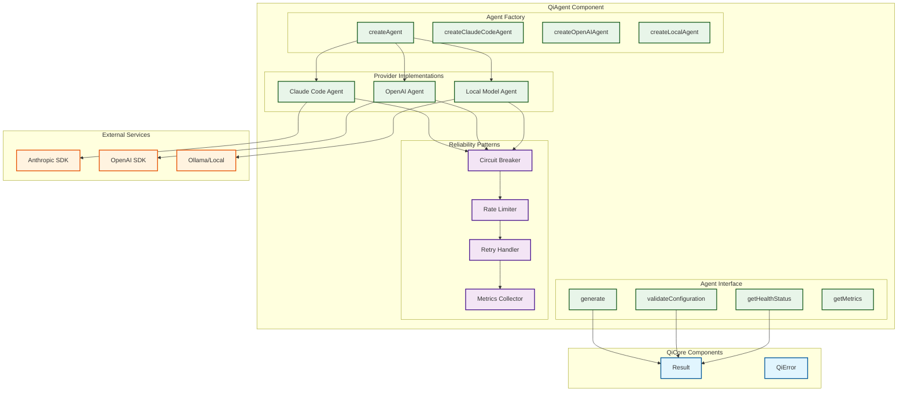

# QiAgent v4.0 Component Contract

> **Purpose**: Multi-Provider AI Agent Interaction Component  
> **Depends on**: QiCore Base Component (Result<T>, QiError)  
> **Implements**: Unified AI model interactions with comprehensive error handling  
> Version: v4.0  
> Date: June 29, 2025  
> Status: Production Implementation  
> Purpose: Production-ready AI agent abstraction for Claude Code, OpenAI, and local models

## Component Architecture Overview

QiAgent provides a production-grade unified interface for interacting with multiple AI providers through a pluggable agent architecture with comprehensive reliability patterns.



---

## QiAgent Component

**Purpose**: Production-grade unified AI agent interaction layer providing consistent interface across multiple AI providers with comprehensive reliability patterns, error handling, and performance monitoring.

### Component Interface

```
QiAgentComponent provides:
  Agent Factory operations (pure):
    - createAgent(config) → Result<Agent>
    - createClaudeCodeAgent(config) → Agent
    - createOpenAIAgent(config) → Agent  
    - createLocalAgent(config) → Agent
  
  Agent operations (async):
    - generate(request) → async Result<AgentResponse>
    - generateStream(request) → AsyncIterableIterator<Result<string>>
    - validateConfiguration() → Result<void>
    - getHealthStatus() → HealthStatus
    - getMetrics() → AgentMetrics
  
  Configuration operations (pure):
    - createDefaultAgentConfig(provider) → AgentConfig
    - createClaudeCodeConfig(apiKey?) → AgentConfig
    - createOpenAIConfig(apiKey?) → AgentConfig
    - createLocalConfig(endpoint) → AgentConfig
  
  Validation operations (pure):
    - validateGenerationRequest(request) → Result<GenerationRequest>
```

### Included Contracts

- **Multi-Provider Support**: Claude Code SDK, OpenAI API, local models (Ollama)
- **Agent Abstraction**: Unified interface hiding provider-specific implementation details
- **Reliability Patterns**: Circuit breaker, rate limiting, retry with exponential backoff
- **Configuration Management**: Type-safe configuration with environment variable fallbacks
- **Error Handling**: Consistent QiError-based error reporting across all providers
- **Performance Monitoring**: Comprehensive metrics collection and health status reporting
- **Request Validation**: Type-safe validation with detailed error messages
- **Streaming Support**: Optional streaming generation for real-time responses

### Dependencies

- **QiCore Base Component**: Uses Result<T> for error handling and QiError for structured failures
- **External AI SDKs**: Integrates with @anthropic-ai/sdk, openai, and local model endpoints
- **Type Safety**: Full TypeScript coverage with runtime validation

### Exported Types

- `Agent`: Core agent interface for AI interactions
- `AgentProvider`: Supported provider enumeration ('claude-code', 'openai', 'local', 'anthropic', 'bedrock', 'vertex')
- `AgentConfig`: Provider configuration including authentication and reliability settings
- `AgentAuthentication`: Authentication credential structure
- `AgentResponse`: Standardized response format with usage metrics
- `GenerationRequest`: Type-safe request structure for AI generation
- `ProviderInfo`: Provider capabilities and model support information
- `AgentMetrics`: Performance and reliability metrics
- `CircuitBreakerConfig`: Circuit breaker configuration options
- `RetryConfig`: Retry strategy configuration

### Component Guarantees

- **Provider Abstraction**: Consistent interface regardless of underlying AI service
- **Type Safety**: Full TypeScript coverage with runtime validation
- **Error Consistency**: Standardized QiError format across all providers
- **Reliability**: Circuit breaker prevents cascade failures
- **Performance**: Rate limiting and metrics collection
- **Security**: Secure credential handling with environment variable fallbacks
- **Extensibility**: Easy addition of new AI providers through Agent interface
- **Resource Management**: Proper cleanup and connection management
- **Monitoring**: Health status and performance metrics for production observability

### Reliability Patterns

**Circuit Breaker Pattern:**
- Prevents cascade failures during provider outages
- Configurable failure thresholds and recovery timeouts
- Automatic state transitions (closed → open → half-open → closed)
- Metrics collection for circuit breaker trips

**Rate Limiting:**
- Token bucket algorithm with sliding window
- Provider-specific rate limits
- Graceful degradation with meaningful error messages
- Usage metrics for monitoring and alerting

**Retry Strategy:**
- Exponential backoff with optional jitter
- Smart error classification (retryable vs non-retryable)
- Configurable retry limits and delay parameters
- Preserves original error context

**Metrics Collection:**
- Request count, success rate, response times
- Rate limit hits and circuit breaker trips
- Health status determination based on performance
- Production-ready observability data

### Internal Dependencies

- Agent Factory uses configuration validation and provider-specific implementations
- All agents implement common Agent interface with reliability patterns
- Circuit breaker wraps retry handler which wraps rate limiter
- Metrics collector tracks all reliability pattern activations
- Configuration helpers provide sensible defaults for each provider

### Usage Example

```typescript
// Creating and configuring agents with reliability patterns
const claudeConfig = QiAgent.createClaudeCodeConfig(process.env.ANTHROPIC_API_KEY);
claudeConfig.circuitBreaker = {
  failureThreshold: 5,
  timeout: 30000,
  monitoringPeriod: 60000
};
claudeConfig.rateLimit = 10; // 10 requests per minute
claudeConfig.retryBackoff = {
  initialDelay: 1000,
  maxDelay: 30000,
  multiplier: 2,
  jitter: true
};

const agentResult = QiAgent.createAgent(claudeConfig);

if (agentResult._tag === "Right") {
  const agent = agentResult.right;
  
  // Validate configuration
  const configValidation = agent.validateConfiguration();
  if (configValidation._tag === "Left") {
    console.error('Agent configuration invalid:', configValidation.left);
    return;
  }
  
  // Generate with comprehensive error handling
  const request: GenerationRequest = {
    model: {
      id: 'claude-3.5',
      name: 'Claude 3.5 Sonnet',
      provider: 'anthropic',
      modelName: 'claude-3-5-sonnet-20241022',
      temperature: 0.7,
      maxTokens: 4000
    },
    systemPrompt: 'You are an expert TypeScript programmer.',
    userPrompt: 'Implement a Result<T> monad with comprehensive error handling.',
  };
  
  const generationResult = await agent.generate(request);
  if (generationResult._tag === "Right") {
    const response = generationResult.right;
    console.log('Generated code:', response.content);
    console.log('Usage:', response.usage);
    console.log('Model:', response.model);
  } else {
    console.error('Generation failed:', generationResult.left);
  }
  
  // Monitor agent health and performance
  const healthStatus = agent.getHealthStatus();
  const metrics = agent.getMetrics();
  
  console.log('Health:', healthStatus.status, healthStatus.reason);
  console.log('Success Rate:', metrics.successRate);
  console.log('Average Response Time:', metrics.averageResponseTime);
}

// Multi-provider support with unified interface
const providers = ['claude-code', 'openai', 'local'] as const;
const agents = await Promise.all(
  providers.map(async provider => {
    const config = QiAgent.createDefaultAgentConfig(provider);
    return QiAgent.createAgent(config);
  })
);

// Provider capabilities inspection
const providerInfo = agent.getProviderInfo();
console.log(`Using ${providerInfo.provider} v${providerInfo.version}`);
console.log('Capabilities:', providerInfo.capabilities);
console.log('Supported models:', providerInfo.modelSupport);
```

### Error Conditions

- **INVALID_PROVIDER**: Unknown or unsupported AI provider specified
- **MISSING_AUTH**: Required authentication credentials not provided
- **NETWORK_ERROR**: Communication failure with AI service  
- **TIMEOUT_ERROR**: Operation exceeded configured timeout limit
- **VALIDATION_ERROR**: Generation request fails validation checks
- **RATE_LIMITED**: Rate limit exceeded (either local or provider)
- **SERVICE_UNAVAILABLE**: AI service temporarily unavailable
- **CIRCUIT_BREAKER_OPEN**: Circuit breaker preventing requests due to failures
- **RETRY_EXHAUSTED**: All retry attempts failed
- **INVALID_TEMPERATURE**: Temperature outside valid range (0-2)
- **INVALID_MAX_TOKENS**: Max tokens outside valid range (1-10000)
- **EMPTY_RESPONSE**: Provider returned empty or invalid response

### Performance Specifications

- **Agent Creation**: < 10ms for configuration and validation
- **Request Validation**: < 1ms per request
- **Circuit Breaker Overhead**: < 0.1ms per operation
- **Rate Limiter Overhead**: < 0.5ms per check
- **Retry Delays**: Configurable exponential backoff (default 1s to 30s)
- **Memory Usage**: < 5MB per agent instance
- **Metrics Collection**: < 1ms overhead per request
- **Health Check**: < 5ms for status determination

### Provider Support Matrix

| Provider | Status | Authentication | Features | Reliability |
|----------|--------|----------------|----------|-------------|
| Claude Code | ✅ Production | API Key | Full feature set | Circuit breaker, retry, metrics |
| OpenAI | ✅ Production | API Key | Full feature set | Circuit breaker, retry, metrics |
| Local (Ollama) | 🚧 Planned | Endpoint URL | Basic features | Circuit breaker, retry |
| Anthropic Direct | 🚧 Planned | API Key | Full feature set | Circuit breaker, retry |
| AWS Bedrock | 🚧 Planned | AWS Credentials | Enterprise features | Circuit breaker, retry |
| Google Vertex | 🚧 Planned | GCP Credentials | Enterprise features | Circuit breaker, retry |

### Extensibility Guide

```typescript
// Adding a new provider with full reliability patterns
export const createCustomAgent = (config: AgentConfig): Agent => {
  const circuitBreaker = new CircuitBreaker(config.circuitBreaker);
  const rateLimiter = config.rateLimit ? new RateLimiter(config.rateLimit) : null;
  const retryHandler = new RetryHandler(config.retryBackoff);
  const metrics = new MetricsCollector();
  
  const validateConfig = (): Result<void> => {
    // Provider-specific validation
    if (!config.authentication.customAuth) {
      return failure(createQiError('MISSING_AUTH', 'Custom auth required', 'SECURITY'));
    }
    return success(undefined);
  };
  
  const generate = async (request: GenerationRequest): Promise<Result<AgentResponse>> => {
    return await circuitBreaker.execute(async () => 
      await retryHandler.executeWithRetry(async () => {
        // Provider-specific implementation with proper error handling
        // All wrapped in Result<T> pattern
      }, config.maxRetries)
    );
  };
  
  return {
    generate,
    validateConfiguration: validateConfig,
    getProviderInfo: () => ({ 
      provider: 'custom', 
      version: '1.0.0',
      capabilities: ['text-generation'],
      modelSupport: ['custom-model-1']
    }),
    getMetrics: () => metrics.getMetrics(),
    getHealthStatus: () => ({ status: 'healthy' })
  };
};
```

---

**QiAgent v4.0 provides production-grade AI agent interactions with comprehensive reliability patterns, making it suitable for mission-critical applications requiring high availability and observability.**