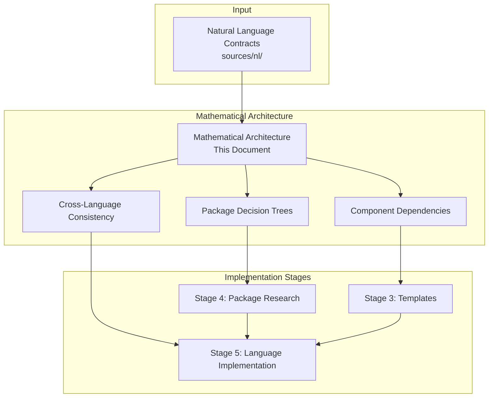
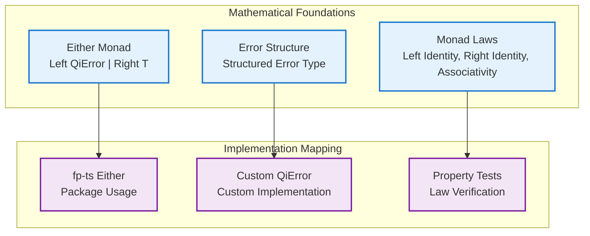
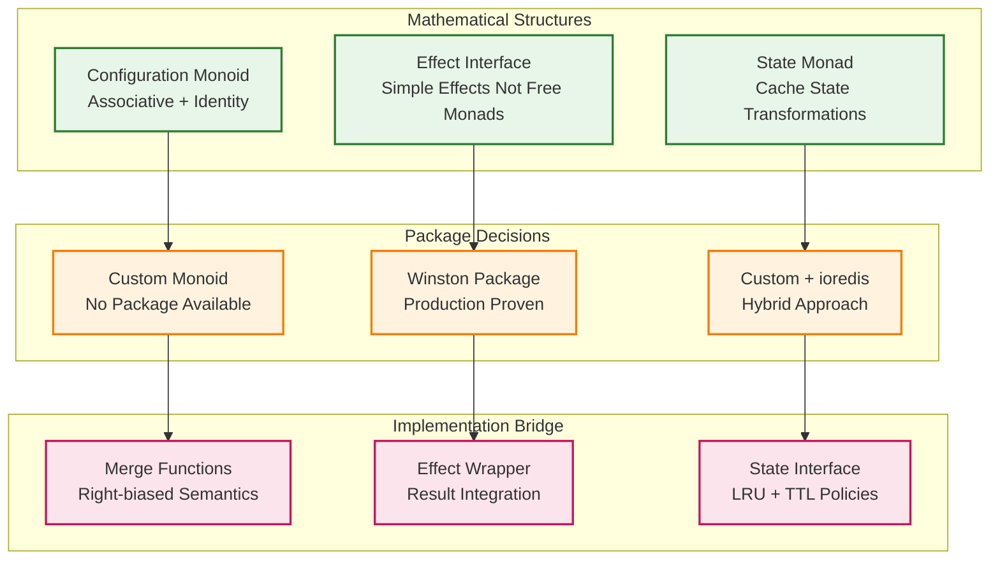
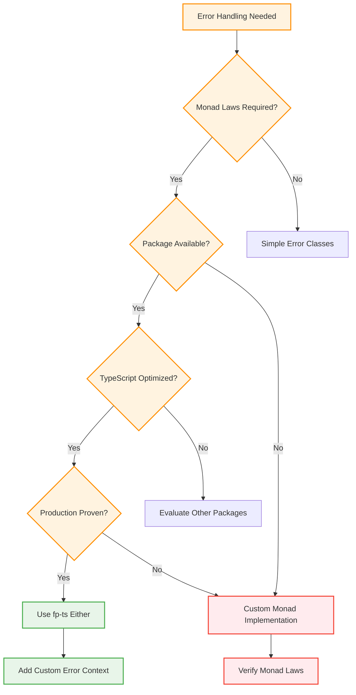
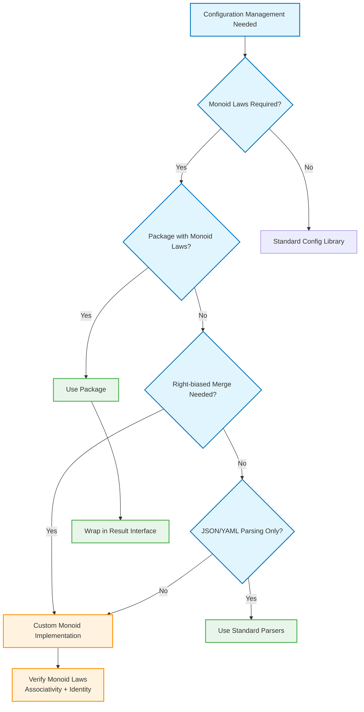
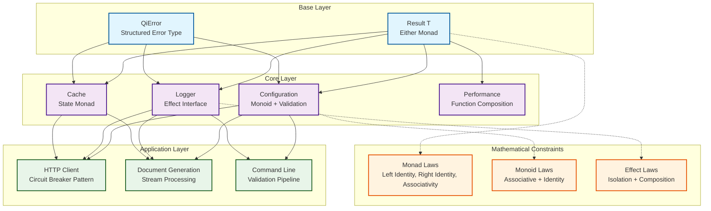
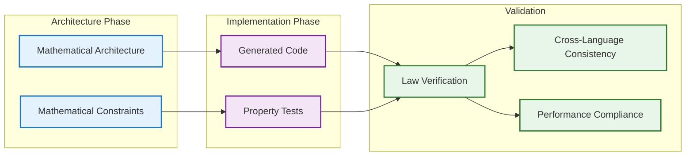

# QiCore v4.0 Mathematical Architecture

> **Mathematical Architecture & Implementation Bridge**  
> **Purpose**: Visual architecture bridging mathematical contracts to implementation decisions  
> **Process**: Natural Language Contracts → Mathematical Architecture → Implementation Stages  
> Version: v4.0  
> Date: June 30, 2025  
> Status: Architecture Specification  

## Process Overview

## 1. Mathematical Architecture Diagrams

### Base Component Mathematical Structure

### Core Component Mathematical Structure

## 2. Package Decision Trees

### Decision Tree: Error Handling

### Decision Tree: Configuration Management

## 3. Component Dependency Graphs

### Dependency Flow with Mathematical Constraints

## 4. Cross-Language Behavioral Consistency Maps

### Error Handling Consistency

| Mathematical Property | TypeScript | Python | Haskell | Implementation Strategy |
|----------------------|------------|--------|---------|------------------------|
| **Monad Laws** | fp-ts Either | returns Either | Either (native) | Package-first where available |
| **Error Context** | Custom interface | Custom dataclass | Custom record | Consistent across languages |
| **Chaining** | flatMap | bind | >>= | Same semantic behavior |
| **Performance** | <100μs | <100μs | <50μs | Tier-appropriate targets |

### Configuration Consistency

| Mathematical Property | TypeScript | Python | Haskell | Implementation Strategy |
|----------------------|------------|--------|---------|------------------------|
| **Monoid Laws** | Custom impl | Custom impl | Custom impl | No packages provide proper laws |
| **Merge Semantics** | Right-biased | Right-biased | Right-biased | Consistent precedence rules |
| **Identity Element** | Empty Map | Empty dict | Empty Map | Same mathematical behavior |
| **Associativity** | Verified by tests | Verified by tests | Compiler verified | Property testing |

## 5. Implementation Stage Integration

### Stage 3: Language-Agnostic Templates

**Input from Architecture**:
- Component dependency graphs → Template structure
- Mathematical constraints → Interface requirements  
- Package decisions → Implementation patterns

**Output to Stage 4**:
- Package requirements with mathematical constraints
- Custom implementation specifications
- Performance tier requirements

### Stage 4: Package Research

**Input from Architecture**:
- Package decision trees → Research criteria
- Mathematical requirements → Package evaluation
- Cross-language consistency → Multi-language package evaluation

**Output to Stage 5**:
- Concrete package selections with rationale
- Gap analysis for custom implementations
- Integration strategy for each language

### Stage 5: Language-Specific Implementation

**Input from Architecture**:
- Cross-language consistency maps → Behavioral requirements
- Mathematical architecture → Implementation validation
- Component dependencies → Integration patterns

**Output**:
- Production-ready implementations
- Mathematical law verification
- Cross-language behavioral consistency

## 6. Architecture Validation

### Mathematical Correctness Validation

### Implementation Bridge Quality Gates

1. **Mathematical Architecture → Templates**
   - All mathematical structures have template representations
   - Package decisions are clearly specified
   - Performance tiers are defined

2. **Templates → Package Research**
   - Decision trees guide package evaluation
   - Mathematical requirements drive selection criteria
   - Gap analysis identifies custom implementation needs

3. **Package Research → Implementation**
   - Cross-language consistency maintained
   - Mathematical laws verified in each language
   - Performance targets met per language tier

## Success Metrics

### Architecture Phase Success
- **Complete Mathematical Coverage**: All NL contracts have mathematical representations
- **Clear Package Decisions**: Decision trees lead to unambiguous choices
- **Implementation Readiness**: Sufficient detail for Stage 3-5 execution

### Implementation Bridge Success
- **Stage Integration**: Each stage has clear inputs from architecture
- **Validation Completeness**: All mathematical properties verified in implementations
- **Cross-Language Consistency**: Behavioral equivalence across TypeScript, Python, Haskell

---

**This mathematical architecture approach bridges the gap between natural language contracts and implementation stages, providing visual clarity for complex mathematical relationships while maintaining the package-first philosophy.** 