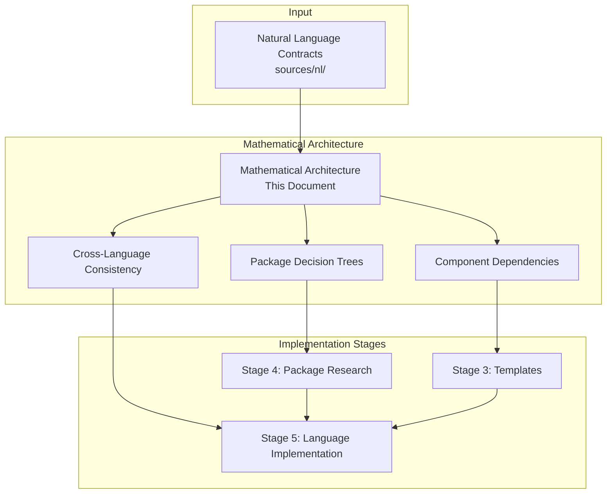
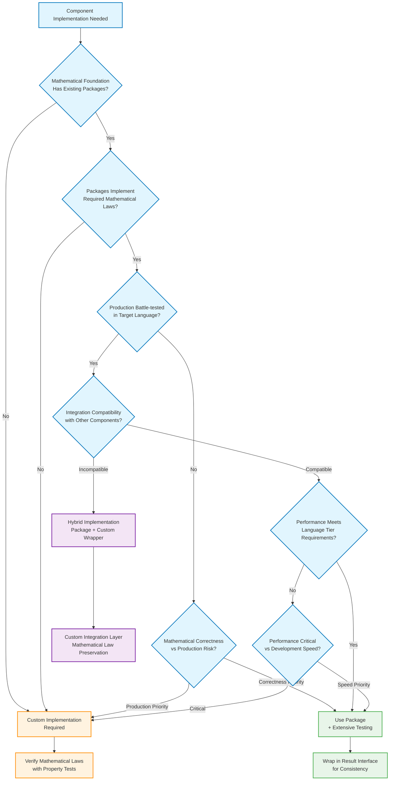
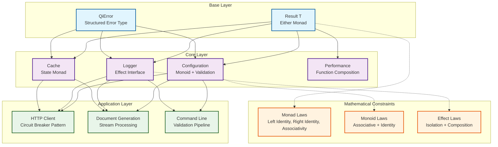
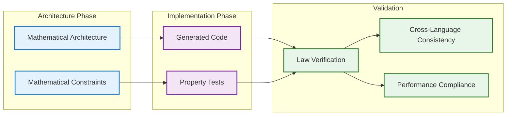

# QiCore v4.0 Mathematical Architecture

> **Mathematical Architecture & Implementation Bridge**  
> **Purpose**: Visual architecture bridging mathematical contracts to implementation decisions  
> **Process**: Natural Language Contracts → Mathematical Architecture → Implementation Stages  
> Version: v4.0  
> Date: June 30, 2025  
> Status: Architecture Specification  

## Contract → Architecture Traceability

### Direct Mapping: NL Contracts to Mathematical Structures

| NL Contract Specification | Mathematical Architecture | Rationale |
|---------------------------|---------------------------|-----------|
| **Base Component: `success(data) → Result containing data`** | Either Monad (Right constructor) | Success case maps to Right value in Either<Error, T> |
| **Base Component: `failure(error) → Result containing error`** | Either Monad (Left constructor) | Failure case maps to Left value in Either<Error, T> |
| **Base Component: `fromTryCatch(operation) → Result`** | Either Monad bind operation | Exception handling via monadic composition |
| **Core Component: `merge(configs) → Result<ConfigData>`** | Configuration Monoid | Associative merge operation with identity element |
| **Core Component: `get(config, key) → Result<value>`** | Functor map operation | Safe key access via Result<T> functor |
| **Core Component: `log(level, message, context?) → void`** | Effect Interface | Side-effect isolation with structured context |
| **Core Component: `set(cache, key, value, ttl) → Result<void>`** | State Monad | Cache state transformation with Result wrapper |

### Architectural Requirements Derived from Contracts

| Contract Requirement | Mathematical Constraint | Implementation Implication |
|---------------------|------------------------|---------------------------|
| **Base: "Zero Dependencies"** | Self-contained algebraic structures | Either/Error must not require external packages |
| **Base: "Immutable after creation"** | Persistent data structures | Copy-on-write or functional update patterns |
| **Base: "Thread-Safe"** | Pure functional operations | No mutable shared state |
| **Core: "Independent Services"** | Composable but decoupled monads | Config/Logger/Cache have separate mathematical foundations |
| **Core: "Consistent Error Handling"** | Unified Result<T> wrapper | All operations lift to same monad |

### Contract Interface → Mathematical Operation Mapping

From **Base Component Contract**:
```
success(data) → Result containing data          ⟹  Right: T → Either<E, T>
failure(error) → Result containing error        ⟹  Left: E → Either<E, T>  
map(result, f) → Result with transformed data   ⟹  fmap: (T → U) → Either<E, T> → Either<E, U>
flatMap(result, f) → Result with chained op     ⟹  bind: Either<E, T> → (T → Either<E, U>) → Either<E, U>
```

From **Core Component Contract**:
```
merge(configs) → Result<ConfigData>             ⟹  mappend: Config → Config → Config (monoid)
fromFile(path) → async Result<ConfigData>      ⟹  IO Either: FilePath → IO (Either Error Config)
log(level, message, context?) → void           ⟹  Effect: LogLevel → Message → Context → IO ()
```

## Process Overview



## 1. Mathematical Architecture Diagrams

### Unified Component Mathematical Architecture

```mermaid
graph TD
    subgraph MathFoundations["Mathematical Foundations"]
        Either["Either Monad<br/>Error Handling Laws"]
        Monoid["Configuration Monoid<br/>Associative + Identity"]
        Effect["Effect Interface<br/>I/O + Logging Laws"]
        State["State Monad<br/>Cache Management"]
        Function["Function Composition<br/>Performance Measurement"]
        Functor["Functor Laws<br/>Data Transformations"]
    end
    
    subgraph Components["QiCore Components"]
        Result["Result&lt;T&gt;<br/>Either QiError T"]
        QiError["QiError<br/>Structured Error Type"]
        Config["Configuration<br/>Merge Operations"]
        Logger["Logger<br/>Structured Logging"]
        Cache["Cache<br/>State + TTL + LRU"]
        Performance["Performance<br/>Timing Functions"]
    end
    
    subgraph PackageStrategy["Package Strategy"]
        FpTs["fp-ts Either<br/>Battle-tested Monad"]
        CustomMonoid["Custom Monoid<br/>No Package Available"]
        Winston["Winston<br/>Production Logging"]
        CustomCache["Custom + ioredis<br/>Hybrid Approach"]
        CustomPerf["Custom Functions<br/>Lightweight Timing"]
        CustomError["Custom QiError<br/>Domain-specific Context"]
    end
    
    subgraph Laws["Mathematical Laws"]
        MonadLaws["Left Identity<br/>Right Identity<br/>Associativity"]
        MonoidLaws["Associativity<br/>Identity Element"]
        EffectLaws["Isolation<br/>Composition<br/>Error Handling"]
        FunctorLaws["Identity<br/>Composition"]
    end
    
    Either --> Result
    Either --> QiError
    Monoid --> Config
    Effect --> Logger
    State --> Cache
    Function --> Performance
    
    Result --> FpTs
    QiError --> CustomError
    Config --> CustomMonoid
    Logger --> Winston
    Cache --> CustomCache
    Performance --> CustomPerf
    
    Either -.-> MonadLaws
    Monoid -.-> MonoidLaws
    Effect -.-> EffectLaws
    Functor -.-> FunctorLaws
    
    classDef math fill:#e3f2fd,stroke:#1976d2,stroke-width:2px
    classDef component fill:#f3e5f5,stroke:#7b1fa2,stroke-width:2px
    classDef package fill:#fff3e0,stroke:#f57c00,stroke-width:2px
    classDef laws fill:#e8f5e9,stroke:#2e7d32,stroke-width:2px
    
    class Either,Monoid,Effect,State,Function,Functor math
    class Result,QiError,Config,Logger,Cache,Performance component
    class FpTs,CustomMonoid,Winston,CustomCache,CustomPerf,CustomError package
    class MonadLaws,MonoidLaws,EffectLaws,FunctorLaws laws
```



### Component Mathematical Specifications

| Component | Mathematical Foundation | Key Laws | Custom vs Package | Rationale |
|-----------|------------------------|-----------|-------------------|-----------|
| **Result&lt;T&gt;** | Either Monad | Left/Right Identity, Associativity | fp-ts Either | Battle-tested monad implementation |
| **QiError** | Product Type + Context | Structure Preservation | Custom Implementation | Domain-specific error context needed |
| **Configuration** | Monoid | Associativity, Identity Element | Custom Implementation | No packages provide proper monoid laws |
| **Logger** | Effect Interface | Isolation, Composition | Winston + Custom Wrapper | Production-proven with Result integration |
| **Cache** | State Monad + Policies | State Transformation Laws | Custom + ioredis | LRU + TTL policies require custom logic |
| **Performance** | Function Composition | Identity, Associativity | Custom Implementation | Lightweight timing without dependencies |

## 2. Unified Component Implementation Decision Tree

### Package vs Custom Decision Framework



### Universal Decision Criteria

| Criterion | Package Favors | Custom Favors | Hybrid Solution |
|-----------|----------------|---------------|-----------------|
| **Mathematical Laws** | Package implements correctly | No suitable packages | Package partial + custom laws |
| **Production Readiness** | Battle-tested in production | Untested/experimental packages | Proven package + custom integration |
| **Performance Requirements** | Meets language tier targets | Package too slow/heavy | Package core + custom optimization |
| **Integration Complexity** | Clean API compatibility | Poor integration with Result<T> | Package + custom wrapper |
| **Maintenance Overhead** | Community maintained | Full control needed | Selective custom components |
| **Development Speed** | Immediate availability | Long development cycle | Fastest viable hybrid |

### Application to All Components

Applied to all QiCore components:

- **Result<T>**: Either monad → fp-ts (package) due to battle-tested laws
- **QiError**: Structured errors → Custom due to domain-specific context needs  
- **Configuration**: Monoid → Custom due to no packages with proper monoid laws
- **Logger**: Effect interface → Hybrid (Winston + custom Result wrapper)
- **Cache**: State monad → Hybrid (ioredis + custom LRU/TTL logic)
- **Performance**: Function composition → Custom due to lightweight requirements

## 3. Component Dependency Graphs

### Dependency Flow with Mathematical Constraints



## 4. Cross-Language Behavioral Consistency Maps

### Error Handling Consistency

| Mathematical Property | TypeScript | Python | Haskell | Implementation Strategy |
|----------------------|------------|--------|---------|------------------------|
| **Monad Laws** | fp-ts Either | returns Either | Either (native) | Package-first where available |
| **Error Context** | Custom interface | Custom dataclass | Custom record | Consistent across languages |
| **Chaining** | flatMap | bind | >>= | Same semantic behavior |
| **Performance** | <100μs | <100μs | <50μs | Tier-appropriate targets |

### Configuration Consistency

| Mathematical Property | TypeScript | Python | Haskell | Implementation Strategy |
|----------------------|------------|--------|---------|------------------------|
| **Monoid Laws** | Custom impl | Custom impl | Custom impl | No packages provide proper laws |
| **Merge Semantics** | Right-biased | Right-biased | Right-biased | Consistent precedence rules |
| **Identity Element** | Empty Map | Empty dict | Empty Map | Same mathematical behavior |
| **Associativity** | Verified by tests | Verified by tests | Compiler verified | Property testing |

## 5. Implementation Stage Integration

### Stage 3: Templates

**Input from Architecture**:
- Component dependency graphs → Template structure
- Mathematical constraints → Interface requirements  
- Package decisions → Implementation patterns

**Output to Stage 4**:
- Package requirements with mathematical constraints
- Custom implementation specifications
- Performance tier requirements

### Stage 4: Package Research

**Input from Architecture**:
- Package decision trees → Research criteria
- Mathematical requirements → Package evaluation
- Cross-language consistency → Multi-language package evaluation

**Output to Stage 5**:
- Concrete package selections with rationale
- Gap analysis for custom implementations
- Integration strategy for each language

### Stage 5: Language-Specific Implementation

**Input from Architecture**:
- Cross-language consistency maps → Behavioral requirements
- Mathematical architecture → Implementation validation
- Component dependencies → Integration patterns

**Output**:
- Production-ready implementations
- Mathematical law verification
- Cross-language behavioral consistency

## 6. Architecture → Implementation Traceability

### Forward Linkage: Architecture to Implementation

This mathematical architecture is implemented in language-specific guides:

- **TypeScript Implementation**: [typescript/docs/qi/core/impl/impl.md](../../../typescript/docs/qi/core/impl/impl.md)
  - **Maps**: Mathematical structures → TypeScript patterns + packages
  - **Implements**: Either Monad → fp-ts, Configuration Monoid → Custom implementation
  - **Verifies**: Monad laws → Property tests, Performance → TypeScript tier compliance

- **Python Implementation**: [python/docs/qi/core/impl/impl.md](../../../python/docs/qi/core/impl/impl.md) *(planned)*
  - **Maps**: Mathematical structures → Python patterns + packages  
  - **Implements**: Either Monad → returns library, Configuration Monoid → Custom dataclasses
  - **Verifies**: Monad laws → hypothesis tests, Performance → Python tier compliance

- **Haskell Implementation**: [haskell/docs/qi/core/impl/impl.md](../../../haskell/docs/qi/core/impl/impl.md) *(planned)*
  - **Maps**: Mathematical structures → Native Haskell types
  - **Implements**: Either Monad → Native Either, Configuration Monoid → Native monoid instance
  - **Verifies**: Monad laws → Compiler verification, Performance → Haskell tier compliance

### Architecture Decision Impact on Implementation

| Architectural Decision | Implementation Impact | Verification Requirement |
|------------------------|----------------------|-------------------------|
| **Either Monad for Result<T>** | Language-specific monad implementation | Property tests for monad laws |
| **Configuration Monoid** | Custom implementation across all languages | Property tests for monoid laws |
| **Effect Interface for Logger** | Wrapper pattern preserving mathematical properties | Integration tests + law verification |
| **State Monad for Cache** | Cache abstraction with Result<T> integration | State transformation law tests |
| **Package-First Strategy** | Language-specific package research and selection | Performance + correctness benchmarks |

### Implementation Quality Gates

From this architecture, each language implementation must satisfy:

1. **Contract Compliance**: All NL contract operations implemented
2. **Mathematical Correctness**: All architectural laws verified
3. **Performance Targets**: Language tier requirements met
4. **Integration Consistency**: Cross-language behavioral equivalence

## 7. Architecture Validation

### Mathematical Correctness Validation



### Implementation Bridge Quality Gates

1. **Mathematical Architecture → Templates**
   - All mathematical structures have template representations
   - Package decisions are clearly specified
   - Performance tiers are defined

2. **Templates → Package Research**
   - Decision trees guide package evaluation
   - Mathematical requirements drive selection criteria
   - Gap analysis identifies custom implementation needs

3. **Package Research → Implementation**
   - Cross-language consistency maintained
   - Mathematical laws verified in each language
   - Performance targets met per language tier

## Success Metrics

### Architecture Phase Success
- **Complete Mathematical Coverage**: All NL contracts have mathematical representations
- **Clear Package Decisions**: Decision trees lead to unambiguous choices
- **Implementation Readiness**: Sufficient detail for Stage 3-5 execution

### Implementation Bridge Success
- **Stage Integration**: Each stage has clear inputs from architecture
- **Validation Completeness**: All mathematical properties verified in implementations
- **Cross-Language Consistency**: Behavioral equivalence across TypeScript, Python, Haskell

---

**This mathematical architecture approach bridges the gap between natural language contracts and implementation stages, providing visual clarity for complex mathematical relationships while maintaining the package-first philosophy.** 