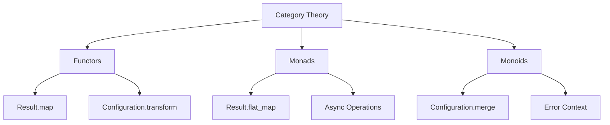

# QiCore v4.0 Mathematical Contract Verification

## 📐 Mathematical Foundation Overview

QiCore v4.0 is built on rigorous mathematical foundations ensuring predictable, composable behavior across all components. This guide explains how to verify and maintain these mathematical contracts.

### Core Mathematical Structures



## 🧮 Monad Laws (Result<T>)

The Result<T> type must satisfy three monad laws for mathematical correctness.

### Left Identity Law
**Mathematical Statement**: `return(a).flatMap(f) ≡ f(a)`

```python
def test_monad_left_identity():
    """Verify left identity law for Result<T>"""
    from qicore import Result
    
    def f(x: int) -> Result[str]:
        return Result.success(str(x * 2))
    
    a = 42
    
    # Left side: return(a).flatMap(f)
    left = Result.success(a).flat_map(f)
    
    # Right side: f(a)
    right = f(a)
    
    assert left.unwrap() == right.unwrap()
    print("✅ Left identity law verified")

# Verification
test_monad_left_identity()
```

### Right Identity Law
**Mathematical Statement**: `m.flatMap(return) ≡ m`

```python
def test_monad_right_identity():
    """Verify right identity law for Result<T>"""
    from qicore import Result
    
    m = Result.success(42)
    
    # Left side: m.flatMap(return)
    left = m.flat_map(Result.success)
    
    # Right side: m
    right = m
    
    assert left.unwrap() == right.unwrap()
    print("✅ Right identity law verified")

# Verification
test_monad_right_identity()
```

### Associativity Law
**Mathematical Statement**: `(m.flatMap(f)).flatMap(g) ≡ m.flatMap(λx. f(x).flatMap(g))`

```python
def test_monad_associativity():
    """Verify associativity law for Result<T>"""
    from qicore import Result
    
    def f(x: int) -> Result[str]:
        return Result.success(str(x))
    
    def g(x: str) -> Result[int]:
        return Result.success(len(x))
    
    m = Result.success(123)
    
    # Left side: (m.flatMap(f)).flatMap(g)
    left = m.flat_map(f).flat_map(g)
    
    # Right side: m.flatMap(λx. f(x).flatMap(g))
    right = m.flat_map(lambda x: f(x).flat_map(g))
    
    assert left.unwrap() == right.unwrap()
    print("✅ Associativity law verified")

# Verification
test_monad_associativity()
```

### Property-Based Testing for Monad Laws
```python
import pytest
from hypothesis import given, strategies as st
from qicore import Result

@given(st.integers())
def test_monad_laws_property_based(value):
    """Property-based testing for all monad laws"""
    
    # Test functions
    def f(x: int) -> Result[str]:
        return Result.success(str(x * 2))
    
    def g(x: str) -> Result[int]:
        return Result.success(len(x) + 1)
    
    m = Result.success(value)
    
    # Left identity: return(a).flatMap(f) ≡ f(a)
    assert m.flat_map(f).unwrap() == f(value).unwrap()
    
    # Right identity: m.flatMap(return) ≡ m
    assert m.flat_map(Result.success).unwrap() == m.unwrap()
    
    # Associativity: (m.flatMap(f)).flatMap(g) ≡ m.flatMap(λx. f(x).flatMap(g))
    left = m.flat_map(f).flat_map(g)
    right = m.flat_map(lambda x: f(x).flat_map(g))
    assert left.unwrap() == right.unwrap()
```

## 🔗 Monoid Laws (Configuration)

Configuration merging must satisfy monoid laws for predictable composition.

### Identity Law
**Mathematical Statement**: `a ⊕ ∅ = a` and `∅ ⊕ a = a`

```python
def test_monoid_identity():
    """Verify identity law for Configuration monoid"""
    from qicore import Configuration, ConfigurationMonoid
    from pydantic import BaseModel
    
    class TestConfig(BaseModel):
        key: str = "value"
        number: int = 42
    
    config = Configuration.from_object({"key": "test", "number": 10}, TestConfig).unwrap()
    empty = Configuration.from_object({}, TestConfig).unwrap()
    
    # Left identity: empty ⊕ config = config
    left = empty.merge(config)
    assert left.get("key") == config.get("key")
    assert left.get("number") == config.get("number")
    
    # Right identity: config ⊕ empty = config  
    right = config.merge(empty)
    assert right.get("key") == config.get("key")
    assert right.get("number") == config.get("number")
    
    print("✅ Monoid identity law verified")

# Verification
test_monoid_identity()
```

### Associativity Law
**Mathematical Statement**: `(a ⊕ b) ⊕ c = a ⊕ (b ⊕ c)`

```python
def test_monoid_associativity():
    """Verify associativity law for Configuration monoid"""
    from qicore import Configuration
    from pydantic import BaseModel
    
    class TestConfig(BaseModel):
        x: int = 1
        y: int = 2
        z: int = 3
    
    a = Configuration.from_object({"x": 1, "y": 2}, TestConfig).unwrap()
    b = Configuration.from_object({"y": 3, "z": 4}, TestConfig).unwrap()
    c = Configuration.from_object({"z": 5}, TestConfig).unwrap()
    
    # Left associativity: (a ⊕ b) ⊕ c
    left = a.merge(b).merge(c)
    
    # Right associativity: a ⊕ (b ⊕ c)
    right = a.merge(b.merge(c))
    
    assert left.to_dict() == right.to_dict()
    print("✅ Monoid associativity law verified")

# Verification  
test_monoid_associativity()
```

### Configuration Merge Verification
```python
def verify_configuration_merge_semantics():
    """Verify right-biased merge semantics"""
    from qicore import Configuration
    from pydantic import BaseModel
    
    class DatabaseConfig(BaseModel):
        host: str = "localhost"
        port: int = 5432
        timeout: int = 30
    
    # Base configuration
    base = Configuration.from_object({
        "host": "localhost", 
        "port": 5432,
        "timeout": 30
    }, DatabaseConfig).unwrap()
    
    # Override configuration
    override = Configuration.from_object({
        "host": "production.db.com",
        "port": 3306
    }, DatabaseConfig).unwrap()
    
    # Merge (right-biased: override wins)
    merged = base.merge(override)
    
    assert merged.get("host") == "production.db.com"  # Overridden
    assert merged.get("port") == 3306                 # Overridden
    assert merged.get("timeout") == 30                # From base
    
    print("✅ Right-biased merge semantics verified")

# Verification
verify_configuration_merge_semantics()
```

## 🔄 Functor Laws (Component Transformations)

All container types must satisfy functor laws for safe transformations.

### Identity Law
**Mathematical Statement**: `map(id) ≡ id`

```python
def test_functor_identity():
    """Verify identity law for Result<T> functor"""
    from qicore import Result
    
    result = Result.success(42)
    
    # map(identity) should equal identity
    mapped = result.map(lambda x: x)  # Identity function
    
    assert mapped.unwrap() == result.unwrap()
    print("✅ Functor identity law verified")

# Verification
test_functor_identity()
```

### Composition Law
**Mathematical Statement**: `map(f).map(g) ≡ map(compose(g, f))`

```python
def test_functor_composition():
    """Verify composition law for Result<T> functor"""
    from qicore import Result
    
    def f(x: int) -> str:
        return str(x)
    
    def g(x: str) -> int:
        return len(x)
    
    def compose_g_f(x: int) -> int:
        return g(f(x))
    
    result = Result.success(12345)
    
    # Left side: map(f).map(g)
    left = result.map(f).map(g)
    
    # Right side: map(compose(g, f))
    right = result.map(compose_g_f)
    
    assert left.unwrap() == right.unwrap()
    print("✅ Functor composition law verified")

# Verification
test_functor_composition()
```

## 🏃‍♂️ Performance Contract Verification

QiCore v4.0 targets interpreted tier performance (100× baseline).

### Performance Targets
```python
def verify_performance_contracts():
    """Verify all operations meet interpreted tier targets"""
    import time
    from qicore import Result, QiError, Configuration
    from pydantic import BaseModel
    
    # Result<T> operations: < 100μs
    def benchmark_result_operations():
        times = []
        for _ in range(1000):
            start = time.perf_counter()
            Result.success("test").map(str.upper).flat_map(lambda x: Result.success(f"processed_{x}"))
            times.append((time.perf_counter() - start) * 1000000)  # μs
        
        avg_time = sum(times) / len(times)
        max_time = max(times)
        
        assert avg_time < 100, f"Result operations too slow: {avg_time:.2f}μs (target: <100μs)"
        print(f"✅ Result operations: {avg_time:.2f}μs avg, {max_time:.2f}μs max (target: <100μs)")
    
    # Configuration validation: < 10ms
    def benchmark_configuration_validation():
        class TestConfig(BaseModel):
            name: str
            value: int
            enabled: bool = True
        
        times = []
        for _ in range(100):
            start = time.perf_counter()
            config = Configuration.from_object({
                "name": "test_config",
                "value": 42,
                "enabled": True
            }, TestConfig).unwrap()
            config.validate()
            times.append((time.perf_counter() - start) * 1000)  # ms
        
        avg_time = sum(times) / len(times)
        max_time = max(times)
        
        assert avg_time < 10, f"Configuration validation too slow: {avg_time:.2f}ms (target: <10ms)"
        print(f"✅ Configuration validation: {avg_time:.2f}ms avg, {max_time:.2f}ms max (target: <10ms)")
    
    # Run benchmarks
    benchmark_result_operations()
    benchmark_configuration_validation()

# Verification
verify_performance_contracts()
```

### Logger Performance Contract
```python
def verify_logger_performance():
    """Verify logger level check is < 10ns (same across all tiers)"""
    import time
    from qicore import PerformanceLogger, LogLevel
    
    logger = PerformanceLogger("test", LogLevel.INFO)
    
    # Benchmark level check (should be nearly instantaneous)
    times = []
    for _ in range(100000):  # Large sample for nanosecond measurement
        start = time.perf_counter_ns()
        logger.is_level_enabled(LogLevel.DEBUG)
        times.append(time.perf_counter_ns() - start)
    
    avg_time_ns = sum(times) / len(times)
    
    assert avg_time_ns < 10, f"Logger level check too slow: {avg_time_ns:.2f}ns (target: <10ns)"
    print(f"✅ Logger level check: {avg_time_ns:.2f}ns avg (target: <10ns)")

# Verification
verify_logger_performance()
```

## 🧪 Automated Contract Verification

### Complete Verification Suite
```python
def run_complete_verification():
    """Run all mathematical contract verifications"""
    
    print("QiCore v4.0 Mathematical Contract Verification")
    print("=" * 60)
    
    try:
        # Monad Laws
        print("\n🧮 Verifying Monad Laws...")
        test_monad_left_identity()
        test_monad_right_identity()
        test_monad_associativity()
        
        # Monoid Laws
        print("\n🔗 Verifying Monoid Laws...")
        test_monoid_identity()
        test_monoid_associativity()
        verify_configuration_merge_semantics()
        
        # Functor Laws
        print("\n🔄 Verifying Functor Laws...")
        test_functor_identity()
        test_functor_composition()
        
        # Performance Contracts
        print("\n🏃‍♂️ Verifying Performance Contracts...")
        verify_performance_contracts()
        verify_logger_performance()
        
        print("\n" + "=" * 60)
        print("✅ ALL MATHEMATICAL CONTRACTS VERIFIED SUCCESSFULLY!")
        print("✅ QiCore v4.0 implementation is mathematically sound")
        
    except Exception as e:
        print(f"\n❌ CONTRACT VERIFICATION FAILED: {e}")
        raise

# Run verification
if __name__ == "__main__":
    run_complete_verification()
```

### Continuous Verification
```python
def setup_continuous_verification():
    """Setup continuous verification during development"""
    
    # pytest configuration for mathematical contracts
    pytest_config = """
# pytest.ini
[tool:pytest]
testpaths = tests/
python_files = test_*.py *_test.py
python_classes = Test*
python_functions = test_*
addopts = 
    -v
    --tb=short
    --strict-markers
    --disable-warnings
markers =
    mathematical: Mathematical contract tests
    performance: Performance contract tests
    property: Property-based tests
"""
    
    # Property-based testing configuration
    hypothesis_config = """
# hypothesis settings for mathematical property testing
from hypothesis import settings, Verbosity

# Mathematical contracts need thorough testing
settings.register_profile("mathematical", 
    max_examples=1000,
    verbosity=Verbosity.verbose,
    deadline=None
)

settings.load_profile("mathematical")
"""
    
    print("📝 Save pytest.ini and hypothesis settings to enable continuous verification")
    print("🔄 Run 'pytest -m mathematical' to verify contracts")
    print("⚡ Run 'pytest -m performance' to verify performance")

# Setup
setup_continuous_verification()
```

## 🐛 Contract Violation Debugging

### Common Contract Violations

#### Monad Law Violations
```python
def debug_monad_violations():
    """Debug common monad law violations"""
    
    # Common issue: Incorrect flat_map implementation
    def broken_flat_map_example():
        """Example of broken flat_map that violates laws"""
        # DON'T DO THIS - violates associativity
        def broken_flat_map(self, func):
            if self.is_success():
                try:
                    result = func(self.unwrap())
                    # WRONG: Not handling nested Results properly
                    return Result.success(result)  # Should return result directly
                except:
                    return Result.failure(QiError.unknown("BROKEN", "Failed"))
            return self
    
    print("⚠️  Common monad violations:")
    print("   - Not handling nested Results in flat_map")
    print("   - Incorrect error propagation")
    print("   - Side effects in pure operations")

#### Performance Contract Violations
```python
def debug_performance_violations():
    """Debug performance contract violations"""
    
    # Check for common performance issues
    issues = [
        "Using regular lists instead of iterators for large datasets",
        "Blocking I/O in Result<T> operations", 
        "Excessive object allocation in hot paths",
        "Missing caching in expensive operations",
        "Not using cytoolz optimized functions"
    ]
    
    print("⚡ Common performance violations:")
    for issue in issues:
        print(f"   - {issue}")
```

### Verification Tools
```python
def create_verification_tools():
    """Create tools for contract verification during development"""
    
    # Contract violation detector
    def detect_contract_violations(implementation_file: str):
        """Analyze implementation for potential contract violations"""
        
        violations = []
        
        # Check for common anti-patterns
        with open(implementation_file, 'r') as f:
            content = f.read()
            
            # Check for blocking operations in Result
            if 'time.sleep' in content and 'Result' in content:
                violations.append("Potential blocking operation in Result<T>")
            
            # Check for missing error handling
            if 'except:' in content and 'pass' in content:
                violations.append("Silent error handling detected")
            
            # Check for side effects in pure functions
            if 'global' in content and ('map' in content or 'flat_map' in content):
                violations.append("Potential side effect in pure function")
        
        return violations
    
    print("🔍 Contract violation detector created")
    print("📊 Use detect_contract_violations(file) to analyze implementations")

# Create tools
create_verification_tools()
```

---

**Mathematical contracts ensure QiCore v4.0 provides predictable, composable, and high-performance behavior across all components!**