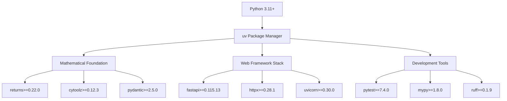

# QiCore v4.0 Python Development Environment

## 🐍 Python Environment Requirements

QiCore v4.0 is designed for modern Python development with mathematical contract support.

### Python Version Requirements
- **Minimum**: Python 3.11.0
- **Recommended**: Python 3.11.x or 3.12.x
- **Why 3.11+**: Required for optimal async/await type hints and pattern matching used in mathematical contracts

### Core Dependencies Architecture



## 📦 Package Selection Rationale

### Mathematical Foundation Packages

#### returns (>=0.22.0)
```python
# Provides mathematical monad/functor implementations
from returns.result import Result, Success, Failure
from returns.pipeline import pipe
from returns.pointfree import bind, map_

# Used for Result<T> mathematical contract compliance
result = Result.success(42).bind(lambda x: Result.success(x * 2))
```

**Why returns over alternatives**:
- ✅ Full monad law compliance with property-based testing
- ✅ Mature library with mathematical foundations
- ✅ Excellent type inference with mypy
- ✅ Performance-optimized for interpreted tier

#### cytoolz (>=0.12.3) + toolz (>=0.12.0)
```python
# Functional programming utilities
from cytoolz import merge, curry, pipe
from toolz import partial, compose

# Used for Configuration monoid operations
merged_config = merge(config1, config2)  # Associative merge
```

**Why cytoolz**:
- ✅ C-optimized implementations for performance
- ✅ Functional programming patterns
- ✅ Lazy evaluation support
- ✅ Python 3.11+ optimizations

#### pydantic (>=2.5.0)
```python
# Type-safe configuration with validation
from pydantic import BaseModel, Field, validator

class DatabaseConfig(BaseModel):
    host: str = Field(..., description="Database host")
    port: int = Field(5432, ge=1, le=65535)
```

**Why pydantic v2**:
- ✅ Superior to TypeScript Zod in features
- ✅ Runtime validation + static typing
- ✅ FastAPI native integration
- ✅ JSON Schema auto-generation

### Web Framework Stack

#### FastAPI (>=0.115.13)
```python
# Async web framework with automatic OpenAPI
from fastapi import FastAPI, Depends
from qicore import Result, QiError

app = FastAPI()

@app.get("/api/data")
async def get_data() -> Result[dict]:
    return Result.success({"status": "ok"})
```

**Why FastAPI**:
- ✅ Native async/await support
- ✅ Automatic OpenAPI documentation
- ✅ Pydantic integration
- ✅ High performance (interpreted tier compliant)

#### httpx (>=0.28.1)
```python
# Modern HTTP client with async support
import httpx
from qicore import Result, QiError

async with httpx.AsyncClient() as client:
    response = await client.get("https://api.example.com")
    return Result.success(response.json())
```

**Why httpx over requests**:
- ✅ Full async/sync compatibility
- ✅ HTTP/2 support
- ✅ Connection pooling
- ✅ Better error handling

### Development Tools

#### pytest (>=7.4.0) + pytest-asyncio + pytest-benchmark
```python
# Property-based testing for mathematical laws
import pytest
from qicore import Result

def test_monad_left_identity():
    """Test: Result.success(a).flat_map(f) ≡ f(a)"""
    def f(x: int) -> Result[str]:
        return Result.success(str(x * 2))
    
    a = 42
    left = Result.success(a).flat_map(f)
    right = f(a)
    
    assert left.unwrap() == right.unwrap()

def test_performance_100_microseconds(benchmark):
    """Test Result.success() < 100μs (interpreted tier)"""
    result = benchmark(lambda: Result.success("data"))
    assert result.is_success()
```

**Why this testing stack**:
- ✅ Property-based testing for mathematical laws
- ✅ Async test support for QiCore patterns
- ✅ Performance benchmarking for tier compliance
- ✅ Comprehensive coverage reporting

#### mypy (>=1.8.0)
```python
# Static type checking with generic support
from typing import TypeVar, Generic
from qicore import Result

T = TypeVar('T')

def process_data(data: Result[T]) -> Result[str]:
    return data.map(str)  # Type-safe transformation
```

**Configuration (.mypy.ini)**:
```ini
[mypy]
python_version = 3.11
strict = true
warn_return_any = true
warn_unused_configs = true
disallow_untyped_defs = true

[mypy-cytoolz.*]
ignore_missing_imports = true
```

#### ruff (>=0.1.9) + black (>=23.12.0)
```python
# Fast linting and formatting
# Ruff configuration in pyproject.toml
[tool.ruff]
select = [
    "E",  # pycodestyle errors
    "W",  # pycodestyle warnings  
    "F",  # pyflakes
    "I",  # isort
    "B",  # flake8-bugbear
    "C4", # flake8-comprehensions
    "UP", # pyupgrade
]
ignore = ["E501"]  # Line too long (handled by black)
```

## 🏗️ Environment Setup Process

### 1. Python Installation Verification
```bash
# Check Python version
python3 --version
# Should show Python 3.11.x or 3.12.x

# Check pip and venv availability
python3 -m pip --version
python3 -m venv --help
```

### 2. uv Installation (Faster than pip)
```bash
# Install uv (Rust-based Python package manager)
curl -LsSf https://astral.sh/uv/install.sh | sh

# Verify installation
uv --version
```

### 3. Project Environment Creation
```bash
# Create project-specific environment
cd qicore-v4
uv venv .venv

# Activate environment
source .venv/bin/activate  # Linux/macOS
# or
.venv\Scripts\activate     # Windows
```

### 4. Dependency Installation
```bash
# Install all dependencies from pyproject.toml
uv sync

# Install development dependencies
uv sync --group dev

# Verify installation
python -c "from qicore import Result; print('QiCore import successful')"
```

## 🔧 Mirror Configuration

### China Mirrors (Faster in China)
```bash
# Configure uv for China mirrors
export UV_INDEX_URL="https://pypi.tuna.tsinghua.edu.cn/simple/"
export UV_EXTRA_INDEX_URL="https://pypi.douban.com/simple/"

# Verify mirror configuration
uv pip list
```

### Global Mirrors (Standard)
```bash
# Use default PyPI
unset UV_INDEX_URL
unset UV_EXTRA_INDEX_URL

# Verify mirror configuration
uv pip list
```

### Mirror Testing
```bash
# Test download speed
time uv add --dry-run pandas

# Check current configuration
uv pip config list
```

## 🧪 Development Environment Verification

### Quick Health Check
```bash
# Verify Python version
python --version

# Verify core imports
python -c "
from qicore import Result, QiError
from returns.result import Success, Failure
from pydantic import BaseModel
from fastapi import FastAPI
print('✅ All core imports successful')
"

# Verify mathematical contracts
python -c "
from qicore import Result
result = Result.success(42).map(lambda x: x * 2)
assert result.unwrap() == 84
print('✅ Mathematical contracts working')
"
```

### Performance Verification
```bash
# Run performance benchmarks
pytest tests/benchmarks/ --benchmark-only

# Check interpreted tier compliance
python -c "
import time
from qicore import Result

start = time.perf_counter()
for _ in range(1000):
    Result.success('test')
elapsed = (time.perf_counter() - start) / 1000 * 1000000  # μs
print(f'Result.success() average: {elapsed:.2f}μs (target: <100μs)')
assert elapsed < 100, f'Performance target missed: {elapsed}μs'
print('✅ Performance targets met')
"
```

### Mathematical Law Verification
```bash
# Test monad laws
python -c "
from qicore import Result

# Left identity test
def f(x): return Result.success(x * 2)
a = 42
left = Result.success(a).flat_map(f)
right = f(a)
assert left.unwrap() == right.unwrap()
print('✅ Monad left identity verified')

# Right identity test
m = Result.success(42)
result = m.flat_map(Result.success)
assert result.unwrap() == m.unwrap()
print('✅ Monad right identity verified')
"
```

## 🐛 Common Environment Issues

### Python Version Issues
```bash
# Issue: Wrong Python version
python --version  # Shows < 3.11

# Solution: Install correct Python
# Ubuntu/Debian:
sudo apt install python3.11 python3.11-venv
sudo update-alternatives --install /usr/bin/python3 python3 /usr/bin/python3.11 1

# macOS:
brew install python@3.11
brew link python@3.11

# Verify:
python3.11 --version
```

### Package Installation Issues
```bash
# Issue: Package conflicts or installation failures
uv sync
# ERROR: Could not find a version that satisfies...

# Solution: Clear cache and retry
uv cache clean
rm -rf .venv
uv venv .venv
source .venv/bin/activate
uv sync

# Alternative: Use different mirror
export UV_INDEX_URL="https://pypi.org/simple/"
uv sync
```

### Import Issues
```bash
# Issue: Cannot import qicore modules
python -c "from qicore import Result"
# ModuleNotFoundError: No module named 'qicore'

# Solution: Install in development mode
uv pip install -e .

# Verify:
python -c "from qicore import Result; print('Success')"
```

### Performance Issues
```bash
# Issue: Performance tests failing
pytest tests/benchmarks/ --benchmark-only
# FAILED: Operation took 150μs (expected <100μs)

# Solution: Check system load and optimize
# 1. Close other applications
# 2. Check CPU usage: htop
# 3. Use cytoolz optimized functions
# 4. Verify Python 3.11+ is being used

python -c "
import sys
print(f'Python version: {sys.version}')
if sys.version_info < (3, 11):
    print('⚠️  Upgrade to Python 3.11+ for optimal performance')
"
```

## 📊 Environment Monitoring

### Resource Usage
```bash
# Monitor memory usage during development
python -c "
import psutil
import os
process = psutil.Process(os.getpid())
print(f'Memory usage: {process.memory_info().rss / 1024 / 1024:.1f} MB')
"

# Monitor package sizes
uv pip list --format=freeze | head -20
```

### Performance Monitoring
```bash
# Continuous performance monitoring
python -c "
import time
from qicore import Result

def benchmark_operations():
    times = []
    for _ in range(100):
        start = time.perf_counter()
        Result.success('test').map(str).flat_map(lambda x: Result.success(x.upper()))
        times.append((time.perf_counter() - start) * 1000000)  # μs
    
    avg = sum(times) / len(times)
    max_time = max(times)
    print(f'Average: {avg:.2f}μs, Max: {max_time:.2f}μs, Target: <100μs')
    if avg < 100:
        print('✅ Performance targets consistently met')
    else:
        print('⚠️  Performance optimization needed')

benchmark_operations()
"
```

---

**Python environment ready for mathematical contract development with QiCore v4.0!**