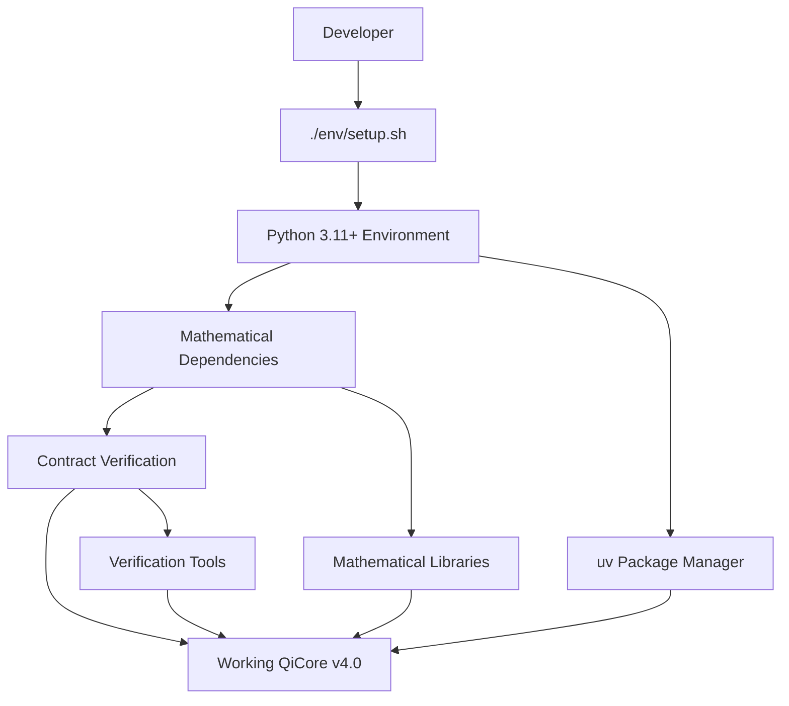

# QiCore v4.0 - Self-Contained Development Setup

**Mathematical Contract-Based Library Development Environment**

## 🎯 Quick Start (Any User, Any Location)

```bash
# Navigate to QiCore v4.0 directory
cd qicore-v4

# One-command setup (detects your location automatically)
./env/setup.sh
```

That's it! The script will:
- ✅ Check prerequisites (Python 3.11+, uv, curl)
- ✅ Detect your location and suggest optimal mirrors
- ✅ Configure Python development environment
- ✅ Install mathematical contract dependencies
- ✅ Setup verification tools and run initial tests
- ✅ Show you what to do next

## 🌐 For Specific Locations

### China Users (Faster Downloads)
```bash
./env/setup.sh china
```

### Global Users (Standard Setup)
```bash
./env/setup.sh global
```

## 🔄 Mirror Management (After Setup)

Switch mirrors anytime during development:

```bash
# China mirrors (faster in China)
source env/mirrors.sh china

# Global mirrors (standard)
source env/mirrors.sh global

# Check current setup
source env/mirrors.sh show

# Test connectivity
source env/mirrors.sh test
```

## 🛠️ Development Workflow

After initial setup:

```bash
# 1. Enter development environment
source env/activate.sh

# 2. Optional: Set preferred mirrors
source env/mirrors.sh china  # or global

# 3. Start developing
python -m qicore.generate.stage5 --language=python

# 4. Add dependencies as needed
uv add package-name

# 5. Verify mathematical contracts
python -m qicore.verify --contracts
```

## ✨ Key Features

- **🚀 Self-contained**: No global configuration pollution
- **🔄 Reproducible**: Same results for every user
- **🇨🇳 China-optimized**: Fast downloads with China mirrors
- **🌐 Global-friendly**: Works everywhere
- **⚡ Fast**: uv + Python optimized for mathematical development
- **🛡️ Safe**: Session-scoped changes only
- **📐 Mathematical**: Built-in contract verification

## 📁 Project Structure

```
qicore-v4/
├── env/
│   ├── setup.sh          # Complete project setup
│   ├── activate.sh       # Environment activation
│   ├── mirrors.sh        # Mirror management
│   ├── verify.sh         # Verification tools
│   └── README.md         # Environment documentation
├── src/                  # Generated source code
├── tests/                # Mathematical law tests
├── docs/                 # Documentation
│   ├── sources/          # 5-stage methodology
│   ├── build/            # Generated outputs
│   └── setup/            # Setup documentation
├── pyproject.toml        # Python dependencies (managed by uv)
├── uv.lock              # Locked dependency versions
└── examples/            # Usage examples
```

## 🆚 Why This Approach?

| Feature | QiCore v4.0 Setup | Global pip/conda | Docker Only |
|---------|------------------|------------------|-------------|
| Setup Time | 2-5 minutes | 10-30 minutes | 5-15 minutes |
| Global Pollution | ❌ None | ⚠️ Moderate | ❌ None |
| Reproducibility | ✅ Perfect | ⚠️ User-dependent | ✅ Good |
| Mathematical Tools | ✅ Built-in | ⚠️ Manual setup | ⚠️ Complex |
| Performance | ✅ Optimized | ⚠️ Variable | ⚠️ Overhead |
| Contract Verification | ✅ Automated | ❌ Manual | ⚠️ Limited |

## 🔧 Architecture: uv + Python + Mathematical Contracts

- **uv**: Fast Python package management with reproducible environments
- **Python 3.11+**: Modern async/await and type hints for mathematical contracts
- **Mathematical Libraries**: returns, cytoolz, pydantic for contract implementation
- **Verification Tools**: Automated monad/monoid/functor law verification
- **Result**: Best-in-class mathematical development environment

### Workflow Boundaries



## 🐛 Troubleshooting

### Prerequisites Missing
```bash
# Check what's needed
./env/setup.sh --help

# Install Python 3.11+ (if missing)
# On Ubuntu/Debian:
sudo apt update && sudo apt install python3.11 python3.11-venv

# On macOS:
brew install python@3.11

# On Windows:
# Download from python.org
```

### Slow Downloads
```bash
# Switch to appropriate mirrors
source env/mirrors.sh china   # if in China
source env/mirrors.sh global  # if elsewhere

# Test mirror speed
source env/mirrors.sh test
```

### Environment Issues
```bash
# Reset everything
deactivate  # Exit current environment if active
source env/activate.sh  # Re-enter
uv sync  # Reinstall dependencies
```

### Mathematical Contract Failures
```bash
# Verify contracts step by step
python -m qicore.verify --contracts --verbose

# Check specific laws
python -m qicore.verify --monad-laws
python -m qicore.verify --monoid-laws
python -m qicore.verify --functor-laws

# Generate detailed report
python -m qicore.verification.report
```

### Performance Issues
```bash
# Check performance targets
python -m qicore.verify --performance

# Run benchmarks
pytest tests/benchmarks/ --benchmark-only

# Optimize for interpreted tier
python -m qicore.optimize --tier=interpreted
```

### Connectivity Problems
```bash
# Test your mirrors
source env/mirrors.sh test

# Switch mirrors
source env/mirrors.sh china  # or global

# Manual mirror configuration
export UV_INDEX_URL="https://pypi.tuna.tsinghua.edu.cn/simple/"
```

## 📚 Additional Documentation

- **[env/README.md](../env/README.md)** - Detailed environment management guide
- **[Mathematical Contracts](../sources/guides/common.md)** - Core mathematical foundations
- **[5-Stage Process](../sources/guides/guide.md)** - Complete development methodology
- **[Python Implementation](../build/impl/qi.v4.py.impl.md)** - Stage 5 implementation guide

## 🎉 Success Metrics

After running `./env/setup.sh`, you should have:

- ✅ Python 3.11+ development environment working
- ✅ Mathematical dependencies installed via uv
- ✅ Contract verification tools operational
- ✅ Property-based testing framework ready
- ✅ Performance benchmarking tools configured
- ✅ Session-scoped mirror configuration
- ✅ No global environment pollution
- ✅ All 13 QiCore components documented and ready for implementation

## 🚀 Getting Started Examples

### Quick Development Session
```bash
cd qicore-v4
./env/setup.sh china           # Setup with China mirrors
source env/activate.sh         # Enter development environment
python -m qicore.generate.stage5 --language=python  # Generate implementation
```

### Mathematical Contract Verification
```bash
source env/activate.sh         # Enter environment
python -m qicore.verify --contracts  # Verify all contracts
pytest tests/test_base/test_result.py -v  # Test Result<T> monad laws
```

### Adding New Mathematical Components
```bash
source env/activate.sh         # Enter environment
python -m qicore.research.packages --component=new_component  # Research packages
python -m qicore.generate.template --component=new_component  # Generate template
```

### Performance Optimization
```bash
source env/activate.sh         # Enter environment
pytest tests/benchmarks/ --benchmark-only  # Run performance tests
python -m qicore.optimize --tier=interpreted  # Optimize for Python interpreted tier
```

### Switching Mirrors Mid-Development
```bash
source env/mirrors.sh global   # Switch to global mirrors
uv sync                        # Re-sync with new mirrors
python -m qicore.verify --packages  # Verify package integrity
```

---

**This setup eliminates the need for global Python environment modifications and provides a clean, reproducible mathematical development experience for QiCore v4.0, regardless of location or experience level.**