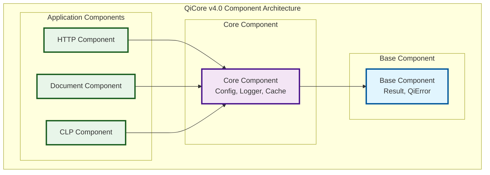

# QiCore v4.0 Component-Level Contracts

> **Stage 0: Problem Definition**  
> **Depends on**: [Class-Level Contracts](qi.v4.class.contracts.md)  
> **Implements**: Component boundaries and interfaces  
> Version: v4.0  
> Date: June 19, 2025  
> Status: Foundation Design Phase  
> Purpose: Component-level organization and interfaces for QiCore library

## Component Architecture Overview

QiCore v4.0 is organized into five distinct components, each providing a cohesive set of functionality with well-defined interfaces and dependencies.



---

## Base Component

**Purpose**: Foundational error handling and result types used by all other components

### Component Interface

```
BaseComponent provides:
  Result operations:
    - success(data) → Result containing data
    - failure(error) → Result containing error
    - fromTryCatch(operation) → Result from fallible operation
  
  Error operations:
    - create(code, message, category) → QiError
    - withContext(error, contextData) → QiError with context
    - withCause(error, causeError) → QiError with cause chain
```

### Included Contracts
- **Result<T>**: Type-safe error handling with functional composition
- **QiError**: Structured error representation with context and chaining

### Dependencies
- **None**: Base component has no dependencies

### Exported Types
- `Result<T>`: Success/failure container type
- `QiError`: Structured error type
- `ErrorCategory`: Error classification enum

### Component Guarantees
- **Zero Dependencies**: Can be used standalone
- **Immutable**: All types are immutable after creation
- **Thread-Safe**: Safe for concurrent use
- **Minimal Overhead**: < 1KB runtime overhead

### Usage Example
```typescript
// Creating and using Result types
const result = Result.success(42);
const doubled = result.map(x => x * 2); // Result<number> with value 84

const error = QiError.create("NETWORK_ERROR", "Connection failed", ErrorCategory.NETWORK);
const failure = Result.failure(error);
```

---

## Core Component

**Purpose**: Essential infrastructure services for configuration, logging, and caching

### Component Interface

```
CoreComponent provides:
  Configuration operations:
    - fromFile(path) → async Result<ConfigData>
    - fromObject(data) → Result<ConfigData>
    - fromEnvironment(prefix) → Result<ConfigData>
    - get(config, key) → Result<value>
    - merge(configs) → Result<ConfigData> // Monoid operation
  
  Logging operations:
    - create(config) → Result<Logger>
    - log(level, message, context?) → void
    - isLevelEnabled(level) → boolean
  
  Cache operations:
    - createMemory(config) → Result<Cache>
    - createPersistent(path, config) → async Result<Cache>
    - get(cache, key) → Result<value>
    - set(cache, key, value, ttl) → Result<void>
```

### Included Contracts
- **Configuration**: Multi-source config loading with monoid merge semantics
- **Logging**: Simple effect interface with level-based filtering
- **Cache**: High-performance caching with eviction policies

### Dependencies
- **Base Component**: Uses Result<T> and QiError throughout

### Exported Types
- `ConfigData`: Immutable configuration container
- `Logger`: Logger instance type
- `Cache`: Cache instance type
- `LogLevel`: Logging level enum
- `CacheConfig`: Cache configuration options

### Component Guarantees
- **Independent Services**: Config, Logger, and Cache can be used independently
- **Consistent Error Handling**: All operations return Result<T>
- **Async-Aware**: File I/O operations are properly async
- **Performance**: Operations meet language-tier performance targets
- **Resource Management**: Proper cleanup for persistent resources

### Internal Dependencies
- Configuration has no dependencies on Logger or Cache
- Logger may use Configuration for initialization
- Cache may use Configuration for settings and Logger for operations

### Usage Example
```typescript
// Async configuration loading with error handling
const configResult = await Configuration.fromFile("app.json");
const config = configResult.unwrapOr(defaultConfig);

// Monoid merge operation
const merged = Configuration.merge([defaultConfig, fileConfig, envConfig]);

// Simple logging interface
const logger = Logger.create({ level: LogLevel.INFO });
logger.info("Application started", { version: "1.0.0" });
```

---

## HTTP Component

**Purpose**: Asynchronous HTTP client functionality with robust error handling and resilience patterns

### Component Interface

```
HttpComponent provides:
  HTTP operations (all async):
    - get(url, options) → async Result<HttpResponse>
    - post(url, body, options) → async Result<HttpResponse>
    - put(url, body, options) → async Result<HttpResponse>
    - delete(url, options) → async Result<HttpResponse>
    - request(config) → async Result<HttpResponse>
    - stream(url, options) → async Result<Stream<Chunk>>
  
  Circuit Breaker operations:
    - withCircuitBreaker(config) → HttpClient
    - getCircuitState() → CircuitState
```

### Included Contracts
- **HTTP Client**: Full-featured HTTP client with retries and timeouts
- **Circuit Breaker**: Failure detection and recovery patterns
- **Streaming**: Support for chunked responses and large payloads

### Dependencies
- **Base Component**: Uses Result<T> and QiError
- **Core Component**: 
  - Uses Configuration for default settings (timeouts, retries)
  - Uses Logger for request/response logging
  - May use Cache for response caching

### Exported Types
- `HttpResponse`: Response data structure
- `HttpConfig`: Request configuration
- `HttpOptions`: Simplified request options
- `CircuitBreakerConfig`: Circuit breaker settings
- `CircuitState`: Current circuit state (CLOSED, OPEN, HALF_OPEN)
- `Stream<T>`: Async stream for chunked data

### Component Guarantees
- **Async Operations**: All operations are asynchronous
- **Automatic Retries**: Configurable retry policies with exponential backoff
- **Timeout Management**: Request-level timeout control
- **Connection Pooling**: Efficient connection reuse
- **Circuit Breaking**: Automatic failure detection and recovery
- **Streaming Support**: Memory-efficient large response handling

### Circuit Breaker Specification
```typescript
interface CircuitBreakerConfig {
  failureThreshold: number;      // Failures before opening (default: 5)
  resetTimeout: number;          // Ms before attempting reset (default: 60000)
  monitoringPeriod: number;      // Ms window for failure counting (default: 10000)
  halfOpenRequests: number;      // Requests to test in half-open (default: 3)
}
```

### Usage Example
```typescript
// HTTP with circuit breaker
const httpClient = HTTP.withCircuitBreaker({
  failureThreshold: 5,
  resetTimeout: 60000
});

// Streaming large response
const streamResult = await httpClient.stream("https://api.example.com/large-file");
if (streamResult.isSuccess) {
  const stream = streamResult.unwrap();
  for await (const chunk of stream) {
    // Process chunk without loading entire response in memory
    processChunk(chunk);
  }
}
```

---

## Document Component

**Purpose**: Template-based document generation with multiple format support and streaming capabilities

### Component Interface

```
DocumentComponent provides:
  Document operations:
    - generate(template, data) → async Result<Document>
    - generateFromFile(path, data) → async Result<Document>
    - generateStream(template, data) → async Result<Stream<DocumentChunk>>
    - generateBatch(templates, data) → async Result<Array<Document>>
    - validateTemplate(template, schema) → Result<ValidationResult>
```

### Included Contracts
- **Document Generation**: Multi-engine template processing
- **Streaming Generation**: Memory-efficient large document handling

### Dependencies
- **Base Component**: Uses Result<T> and QiError
- **Core Component**:
  - Uses Configuration for template paths and settings
  - Uses Logger for generation logging
  - May use Cache for compiled templates

### Exported Types
- `Document`: Generated document structure
- `Template`: Template definition
- `ValidationResult`: Template validation outcome
- `DocumentChunk`: Streamable document fragment
- `Stream<DocumentChunk>`: Async stream for large documents

### Component Guarantees
- **Format Agnostic**: Supports multiple output formats
- **Engine Agnostic**: Pluggable template engines
- **Batch Processing**: Efficient multi-document generation
- **Validation**: Pre-generation template validation
- **Streaming**: Memory-efficient large document generation

### Usage Example
```typescript
// Streaming large document generation
const streamResult = await Document.generateStream(template, largeDataset);
if (streamResult.isSuccess) {
  const stream = streamResult.unwrap();
  const writer = createFileWriter("output.pdf");
  
  for await (const chunk of stream) {
    await writer.write(chunk);
  }
  await writer.close();
}
```

---

## CLP Component

**Purpose**: Command-line argument parsing with validation and help generation

### Component Interface

```
CLPComponent provides:
  CLI operations:
    - parse(args, config) → Result<ParsedArguments>
    - parseString(input, config) → Result<ParsedArguments>
    - validate(args, config) → Result<ValidationResult>
    - generateHelp(config) → string
    - generateUsage(config) → string
```

### Included Contracts
- **Command-Line Processing**: Hierarchical command parsing

### Dependencies
- **Base Component**: Uses Result<T> and QiError
- **Core Component**:
  - Uses Configuration for default values
  - Uses Logger for debug output

### Exported Types
- `ParsedArguments`: Parsed command-line structure
- `ParserConfig`: Parser configuration
- `ValidationResult`: Argument validation outcome

### Component Guarantees
- **Type Safety**: Runtime type validation
- **Hierarchical Commands**: Nested command support
- **Auto Documentation**: Help and usage generation
- **POSIX Compliance**: Standard option parsing

---

## Component Initialization Patterns

### Async-Aware Initialization

```typescript
// Proper async initialization respecting dependencies
async function initializeQiCore(): Promise<Result<QiCoreContainer>> {
  // Base is always available (no initialization needed)
  const base = BaseComponent;
  
  // Initialize Core components with async operations
  const configResult = await Configuration.fromFile("app.json");
  if (configResult.isFailure) {
    return Result.failure(configResult.error);
  }
  const config = configResult.unwrap();
  
  // Logger initialization (sync)
  const loggerResult = Logger.create(config.get("logging"));
  if (loggerResult.isFailure) {
    return Result.failure(loggerResult.error);
  }
  const logger = loggerResult.unwrap();
  
  // Cache initialization (potentially async for persistent cache)
  const cacheConfig = config.get("cache");
  const cacheResult = cacheConfig.persistent
    ? await Cache.createPersistent(cacheConfig.path, cacheConfig)
    : Cache.createMemory(cacheConfig);
    
  if (cacheResult.isFailure) {
    logger.error("Cache initialization failed", cacheResult.error);
    return Result.failure(cacheResult.error);
  }
  
  // Initialize application components
  const core = { config, logger, cache: cacheResult.unwrap() };
  const http = HTTP.create(core);
  const document = Document.create(core);
  const clp = CLP.create(core);
  
  return Result.success({
    base,
    core,
    http,
    document,
    clp
  });
}
```

---

## Component Version Management

### Version Strategy

Each component maintains its own semantic version while ensuring compatibility:

```yaml
component_versions:
  base: "1.0.0"      # Most stable, rarely changes
  core: "1.2.0"      # Moderate change frequency
  http: "1.5.2"      # More frequent updates
  document: "1.3.1"  # Template engine updates
  clp: "1.1.0"       # Stable CLI interface

compatibility_matrix:
  - base: "1.0.0"
    compatible_with:
      core: "1.0.0 - 1.x"
      http: "1.0.0 - 1.x"
      document: "1.0.0 - 1.x"
      clp: "1.0.0 - 1.x"
  
  - core: "1.2.0"
    requires:
      base: "^1.0.0"
    compatible_with:
      http: "1.3.0 - 1.x"
      document: "1.2.0 - 1.x"
      clp: "1.0.0 - 1.x"
```

### Breaking Change Policy

1. **Base Component**: Breaking changes require major version bump of entire framework
2. **Core Component**: Breaking changes require coordinated update of dependent components
3. **Application Components**: Can have breaking changes independently with minor framework version bump

---

## Component Testing Strategy

### Unit Testing
- Each component has isolated unit tests
- Mock implementations for dependencies
- Property-based testing for mathematical laws

### Integration Testing
```typescript
// Example integration test
describe("HTTP with Cache Integration", () => {
  it("should cache successful responses", async () => {
    const cache = await Cache.createMemory({ maxSize: 100 });
    const http = HTTP.create({ cache });
    
    // First request hits network
    const result1 = await http.get("https://api.example.com/data");
    expect(result1.isSuccess).toBe(true);
    
    // Second request hits cache
    const result2 = await http.get("https://api.example.com/data");
    expect(result2.isSuccess).toBe(true);
    expect(cache.has("https://api.example.com/data")).toBe(true);
  });
});
```

---

## Dependencies and References

- **Depends on**: [Class-Level Contracts](qi.v4.class.contracts.md) - Defines the 8 contracts organized into these components
- **Implemented by**: [Formal Specification](../objective/formal/qi.v4.formal.spec.md) - Mathematical formalization of components
- **Used by**: [Design Analysis](../design/qi.v4.design.analysis.md) - Component-based design patterns
- **Version**: 4.0.0
- **Last Updated**: June 19, 2025