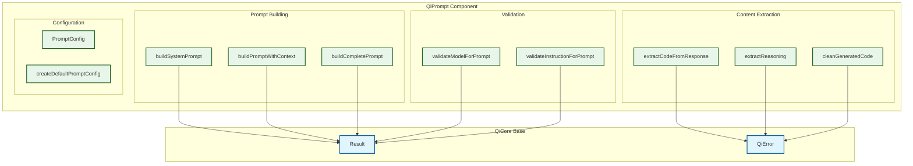

# QiPrompt Component Contract

> **Purpose**: Prompt Engineering Component for AI Code Generation Studies  
> **Depends on**: QiCore Base Component (Result<T>, QiError)  
> **Implements**: Pure prompt construction, content extraction, and validation  
> Version: v1.0  
> Date: June 28, 2025  
> Status: Implementation Phase  
> Purpose: All prompt engineering functionality for AI interactions

## Component Architecture Overview

QiPrompt provides pure functional operations for prompt engineering, template processing, and AI response content extraction. All operations are stateless and side-effect free.



---

## QiPrompt Component

**Purpose**: Pure functional prompt engineering for AI code generation, handling prompt construction, content extraction, and validation without side effects.

### Component Interface

```
QiPromptComponent provides:
  Prompt Building operations (pure):
    - buildSystemPrompt(model, instruction) → string
    - buildPromptWithContext(instruction) → string  
    - buildCompletePrompt(model, instruction, config?) → Result<PromptBundle>
  
  Content Extraction operations (pure):
    - extractCodeFromResponse(responseContent) → string
    - extractReasoning(responseContent) → string
    - cleanGeneratedCode(code) → string
  
  Validation operations (pure):
    - validateModelForPrompt(model) → Result<AIModel>
    - validateInstructionForPrompt(instruction) → Result<InstructionSet>
  
  Configuration operations (pure):
    - createDefaultPromptConfig() → PromptConfig
```

### Included Contracts
- **Prompt Construction**: Template-based prompt building with variable substitution
- **Content Extraction**: Pattern-based extraction of code and reasoning from AI responses
- **Input Validation**: Type-safe validation of AI models and instruction sets
- **Configuration Management**: Immutable configuration with sensible defaults

### Dependencies
- **QiCore Base Component**: Uses Result<T> for error handling and QiError for failures

### Exported Types
- `PromptConfig`: Configuration for prompt generation behavior
- `PromptBundle`: Complete prompt with system and user components
- `AIModel`: Model specification interface (re-exported)
- `InstructionSet`: Instruction specification interface (re-exported)

### Component Guarantees
- **Pure Functions**: All operations are side-effect free and deterministic
- **Immutable Data**: All inputs and outputs are immutable
- **Type Safety**: Full TypeScript type coverage with runtime validation
- **Error Handling**: All fallible operations return Result<T>
- **Performance**: All operations complete in < 10ms for typical inputs
- **Template Safety**: XSS-safe prompt construction

### Internal Dependencies
- Prompt Building has no dependencies on Content Extraction or Validation
- Content Extraction is independent of other subsystems
- Validation uses shared error creation utilities
- Configuration is used by Prompt Building only

### Usage Example
```typescript
// Building prompts
const model: AIModel = {
  id: 'claude-3.5',
  name: 'Claude 3.5 Sonnet',
  provider: 'anthropic',
  modelName: 'claude-3-5-sonnet-20241022',
  temperature: 0.7
};

const instruction: InstructionSet = {
  id: 'haskell-basic',
  content: 'Implement a pure function for list reversal',
  language: 'haskell',
  complexity: 'medium',
  tags: ['pure-function', 'list-processing']
};

// Complete prompt generation with validation
const promptResult = QiPrompt.buildCompletePrompt(model, instruction);
if (promptResult.isSuccess) {
  const { systemPrompt, userPrompt } = promptResult.data;
  // Use prompts with AI service
}

// Content extraction from AI response
const aiResponse = "Here's the implementation:\n```haskell\nreverse' [] = []\nreverse' (x:xs) = reverse' xs ++ [x]\n```";
const extractedCode = QiPrompt.extractCodeFromResponse(aiResponse);
const cleanedCode = QiPrompt.cleanGeneratedCode(extractedCode);

// Validation
const modelValidation = QiPrompt.validateModelForPrompt(model);
const instructionValidation = QiPrompt.validateInstructionForPrompt(instruction);
```

### Error Conditions
- **VALIDATION_ERROR**: Model or instruction fails validation checks
- **INVALID_TEMPLATE**: Prompt template contains invalid syntax
- **MISSING_REQUIRED_FIELD**: Required prompt configuration missing
- **CONTENT_EXTRACTION_FAILED**: Unable to extract meaningful content from AI response

### Performance Specifications
- **Prompt Building**: < 5ms for prompts up to 10KB
- **Content Extraction**: < 2ms for responses up to 100KB  
- **Validation**: < 1ms per model/instruction
- **Memory Usage**: < 1MB working memory for typical operations
- **Thread Safety**: All operations are pure and thread-safe 