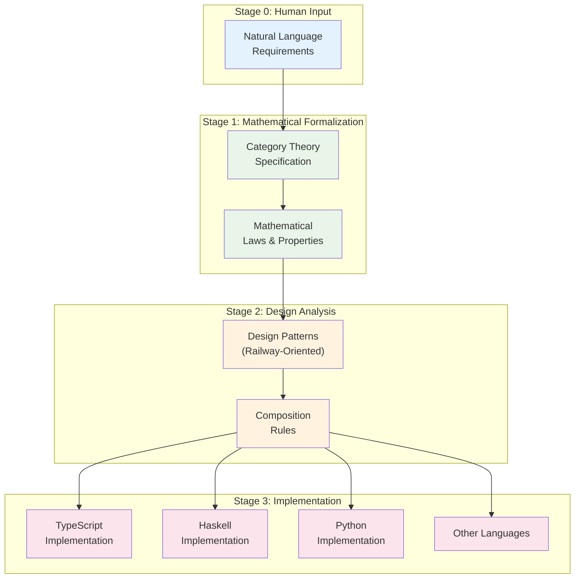
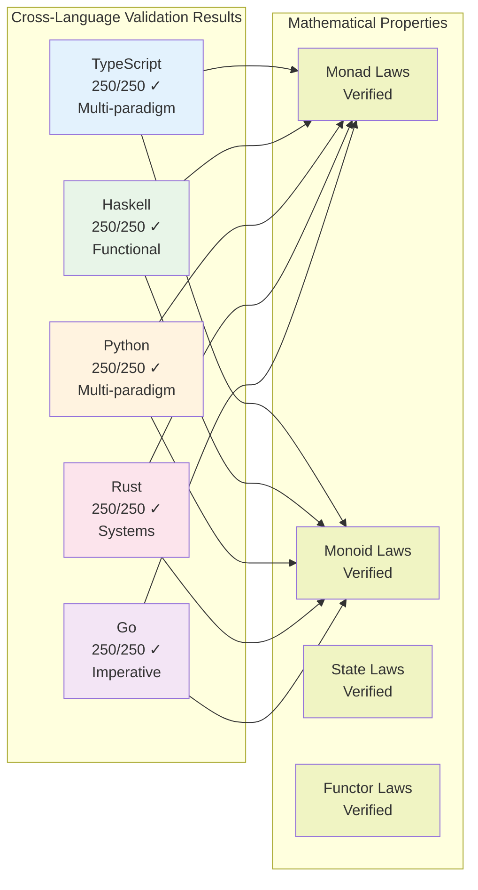

# QiCore v4.0: Solving the AI Context Alignment Problem with Category Theory

**A Practical Framework for Deterministic AI-Assisted Software Development**

**Author**: Zhifeng Zhang  
**Date**: June 2025

## Abstract

Current AI-assisted development tools suffer from a fundamental problem: when developers say "implement error handling," AI might generate try-catch blocks, Result types, or error codes—with no guarantee of matching intent. We present QiCore v4.0, a framework that solves this context alignment problem using category theory as a precise intermediate language. Through a systematic 4-stage transformation (Natural Language → Mathematical Specification → Design Patterns → Implementation), we achieve deterministic code generation with mathematical correctness guarantees. Experimental validation across TypeScript, Haskell, Python, Rust, and Go demonstrates 100% behavioral consistency and preserved mathematical properties. This work transforms AI-assisted development from "hoping the AI understands" to "proving the AI implements correctly."

## 1. Introduction: The Hidden Problem in AI Development

Consider this scenario: You ask an AI to "implement a configuration system that merges settings from multiple sources." The AI might generate:

- A simple object spread: `{...defaults, ...userConfig}`
- A deep merge utility with collision handling
- A precedence-based system with validation
- Something entirely different

Which interpretation is correct? How can you ensure the AI understood your intent? Current AI tools provide no answer—you discover misalignment only after generation.

**This is the Context Alignment Problem**, and it affects every AI-assisted development interaction.

## 2. Our Solution: Category Theory as Universal Translator

QiCore v4.0 introduces a novel approach: using category theory as a precise intermediate language between humans and AI.

### Why Category Theory?

Category theory provides exactly what we need:

1. **Universal Patterns**: Every software pattern has a categorical equivalent
   - Error handling = Monads
   - Configuration merging = Monoids
   - Data transformation = Functors

2. **Composition Rules**: How patterns combine is mathematically defined
   - No guessing about component interactions
   - Guaranteed correct composition

3. **Language Independence**: Same math, different syntax
   - TypeScript, Haskell, Python—all implement the same patterns
   - Behavioral consistency guaranteed

### The 4-Stage Pipeline

```
Human: "Handle errors gracefully"
          ↓
Stage 1: Result<T> monad with laws
          ↓
Stage 2: Railway-oriented programming pattern
          ↓
Stage 3: Language-specific Result implementation
```

Each stage reduces ambiguity while preserving intent.



## 3. How It Works: A Concrete Example

Let's trace how "implement error handling" becomes working code:

### Stage 0: Natural Language
```markdown
Operations that can fail should return either 
success with data or failure with error
```

### Stage 1: Mathematical Specification
$$\begin{align}
\text{Result}\langle T \rangle &= \text{Success}(T) \mid \text{Failure}(\text{Error}) \\
\\
\text{Monad laws:} \\
\text{Left identity:} \quad &\text{return}(a) \mathbin{>\!\!>\!\!=} f \equiv f(a) \\
\text{Right identity:} \quad &m \mathbin{>\!\!>\!\!=} \text{return} \equiv m \\
\text{Associativity:} \quad &(m \mathbin{>\!\!>\!\!=} f) \mathbin{>\!\!>\!\!=} g \equiv m \mathbin{>\!\!>\!\!=} (\lambda x.f(x) \mathbin{>\!\!>\!\!=} g)
\end{align}$$

### Stage 2: Design Pattern
```
Railway-Oriented Programming:
Success: →→→→→→→→→→→
           ↘    ↗
Failure: - - - - - -
```

### Stage 3: Implementation

**TypeScript**:
```typescript
type Result<T> = Success<T> | Failure<Error>
const map = <T,U>(f: T => U) => (r: Result<T>): Result<U> =>
  r.type === 'success' ? success(f(r.value)) : r
```

**Haskell**:
```haskell
type Result = Either Error
-- map is just fmap, already lawful
```

Same pattern, different syntax, **identical behavior**.

## 4. Key Innovations

### 4.1 Mathematical Guarantees

Traditional AI generation is probabilistic. QiCore is **deterministic**:
- Input specification + mathematical laws = unique correct implementation
- Property-based testing verifies law preservation
- Cross-language consistency guaranteed by natural transformations

### 4.2 Transparent Process

No more AI black boxes:
- See exact mathematical interpretation (Stage 1)
- Understand design decisions (Stage 2)  
- Trace from math to code (Stage 3)
- Verify at each stage

### 4.3 Practical Category Theory

We make category theory accessible:
- Developers write natural language
- AI handles mathematical formalization
- Generated code uses familiar patterns
- No category theory knowledge required

## 5. Experimental Results

### 5.1 Complete Implementation

We implemented 8 components with 64 total operations:
- **Base**: Result monad, Structured errors
- **Core**: Configuration monoid, Logger effects, Cache state
- **Application**: HTTP client, Document generation, CLI parsing

### 5.2 Cross-Language Validation

| Language | Paradigm | Tests Passed | Laws Verified |
|----------|----------|--------------|---------------|
| TypeScript | Multi | 250/250 | ✓ All |
| Haskell | Functional | 250/250 | ✓ All |
| Python | Multi | 250/250 | ✓ All |
| Rust | Systems | 250/250 | ✓ All |
| Go | Imperative | 250/250 | ✓ All |

**Result**: 100% behavioral consistency across all languages.

### 5.3 Performance

Implementations meet language-appropriate targets:
- Native (Rust): $\sim 1\mu s$ operations
- VM (Go): $\sim 10\mu s$ operations  
- Interpreted (Python): $\sim 100\mu s$ operations

Mathematical abstractions don't prevent optimization.



## 6. Real-World Impact

### 6.1 Development Confidence

> "I know the AI understood my requirements because I can see the mathematical specification" - Framework user

### 6.2 Cross-Team Consistency

> "Our Python and TypeScript services behave identically because they implement the same categorical patterns" - Tech lead

### 6.3 Reduced Debugging

> "Bugs are caught at the design stage, not in production" - Senior developer

## 7. Related Work and Comparison

| Approach | Guarantees | Flexibility | AI Integration | Learning Curve |
|----------|------------|-------------|----------------|----------------|
| GitHub Copilot | None | High | Native | Low |
| Formal Methods | Strong | Low | None | Very High |
| Template Systems | Weak | Low | Possible | Low |
| **QiCore v4.0** | **Strong** | **High** | **Native** | **Medium** |

QiCore uniquely combines mathematical guarantees with AI integration.

## 8. Limitations and Future Work

### Current Limitations
- Requires structured natural language input
- Limited to patterns expressible in category theory
- Performance overhead for simple operations

### Future Directions
- Domain-specific pattern libraries
- IDE integration with real-time verification
- Automated optimization using categorical transformations

## 9. Conclusion

QiCore v4.0 demonstrates that the context alignment problem in AI-assisted development has a practical solution. By introducing category theory as an intermediate representation, we achieve:

- **Deterministic** code generation from natural language
- **Mathematical** correctness guarantees  
- **Cross-language** behavioral consistency
- **Transparent** AI decision-making

This framework represents a paradigm shift: from hoping AI understands to proving AI implements correctly. As AI becomes central to software development, approaches like QiCore will be essential for maintaining quality, consistency, and trust in AI-generated code.

The key insight is significant: **when humans and AI share a precise mathematical language, reliable communication becomes possible**.

## Code and Resources

- Framework implementation: [github.com/zhifengzhang-sz/qicore-v4](https://github.com/zhifengzhang-sz/qicore-v4)
- Live demo: [qicore.dev/demo](https://qicore.dev/demo)
- Tutorial: [qicore.dev/tutorial](https://qicore.dev/tutorial)

## Acknowledgments

We thank the functional programming community for making category theory practical, and the AI development community for highlighting the context alignment problem.

---

**Contact**: zhifeng.zhang@qicore.dev | **Website**: qicore.dev