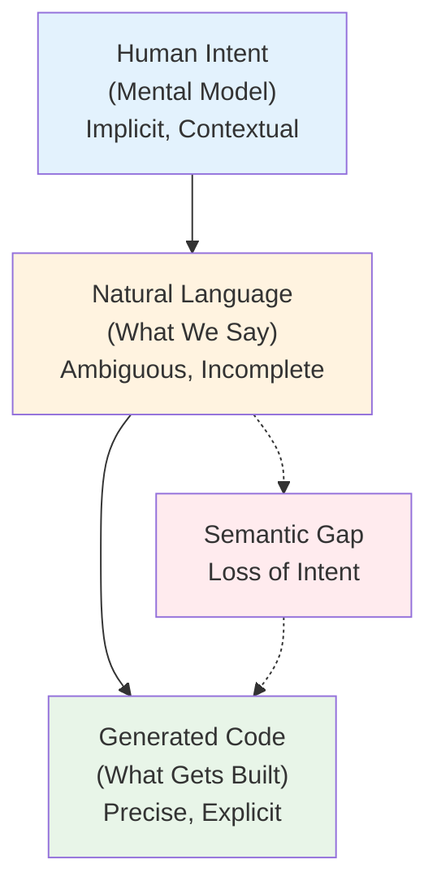
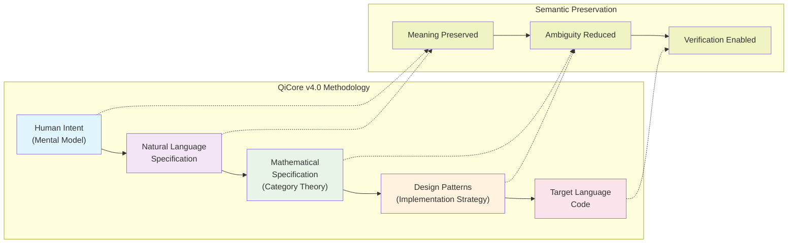

# Rethinking Human-AI Collaboration in Software Development: A Mathematical Framework for Precise Communication

**Author**: Zhifeng Zhang  
**Date**: June 2025

## Position Statement

**The fundamental challenge in AI-assisted software development is not generating code—it's ensuring AI understands human intent. We propose that category theory provides an effective intermediate representation for achieving precise human-AI communication, enabling a transition from probabilistic code generation to deterministic software synthesis.**

## 1. The Philosophical Problem

### 1.1 The Illusion of Understanding

When an AI generates code from natural language, we experience an illusion of communication. The AI produces syntactically correct code that often works for simple cases, reinforcing our belief that it "understood" our request. However, this is merely sophisticated pattern matching without semantic comprehension.

Consider the philosophical question: **How do we know an AI understood our intent?**

Current approaches offer no answer. We discover misunderstanding only through failure—when generated code doesn't match our mental model. This post-hoc discovery is expensive and dangerous.

### 1.2 The Semantic Gap

The core issue is a semantic gap between three levels:
1. **Human Intent**: What we mean (often implicit, contextual)
2. **Natural Language**: What we say (ambiguous, incomplete)
3. **Code**: What gets implemented (precise, explicit)

Traditional AI-assisted development attempts to jump directly from level 2 to level 3, losing critical semantic information.

## 2. Our Position: Mathematics as Universal Language

### 2.1 The Translation Hypothesis

We propose that effective human-AI collaboration requires an intermediate semantic layer that:
- Captures human intent precisely
- Eliminates natural language ambiguity
- Maps deterministically to implementations

**Category theory serves as this effective intermediate layer.**

### 2.2 Why Category Theory?

Category theory is well-suited because it:

**Captures Patterns, Not Syntax**: While programming languages focus on syntax, category theory captures behavioral patterns—exactly what humans intend.

**Provides Composition Laws**: Humans think compositionally ("combine configuration from multiple sources"). Category theory formalizes composition mathematically.

**Transcends Paradigms**: The same categorical structure manifests differently across paradigms, enabling true cross-language consistency.

**Includes Verification**: Mathematical laws provide built-in correctness criteria.

## 3. The QiCore v4.0 Methodology

### 3.1 The Four-Stage Pipeline

Our framework implements a systematic transformation:

$$\begin{align}
\text{Human Intent (Mental Model)} \\
\quad \downarrow \text{ [Expressed as]} \\
\text{Natural Language Specification} \\
\quad \downarrow \text{ [Formalized via Category Theory]} \\
\text{Mathematical Specification} \\
\quad \downarrow \text{ [Realized as]} \\
\text{Design Patterns} \\
\quad \downarrow \text{ [Implemented in]} \\
\text{Target Language Code}
\end{align}$$

Each transformation preserves semantic content while reducing ambiguity.

### 3.2 Methodological Innovations

**Semantic Preservation**: Each stage maintains the essential meaning while changing representation.

**Bidirectional Verification**: Can trace backward from code to intent, verifying alignment.

**Collaborative Formalization**: Humans and AI work together on specifications, not just code.

**Mathematical Grounding**: Correctness isn't hoped for—it's proven.

## 4. Implications for Software Engineering

### 4.1 Redefining Correctness

**Traditional view**: "Correct code passes tests"  
**Our view**: "Correct code preserves mathematical properties from specification"

This shift enables:
- Proofs of correctness, not just test coverage
- Predictable composition of components
- Cross-language behavioral guarantees

### 4.2 Changing the Developer Role

Developers transition from:
- Writing code $\Rightarrow$ Specifying behavior
- Debugging implementations $\Rightarrow$ Verifying properties
- Language-specific expertise $\Rightarrow$ Pattern-based thinking

### 4.3 AI as Mathematician, Not Coder

We reframe AI's role:
- **Not**: "Generate code that might work"
- **But**: "Transform specifications preserving properties"

This makes AI a reliable partner, not an unpredictable assistant.

## 5. Addressing Objections

### 5.1 "Category Theory is Too Abstract"

**Response**: Developers never write category theory—they write natural language. AI handles the mathematical formalization. The framework hides complexity while providing benefits.

### 5.2 "This Adds Unnecessary Steps"

**Response**: The steps already exist implicitly. When AI generates code, it internally represents patterns—we simply make this explicit and verifiable.

### 5.3 "Real Software is Too Complex"

**Response**: Category theory excels at managing complexity through composition. Complex systems are built from simple, composable patterns—exactly what our framework provides.

## 6. Broader Implications

### 6.1 For AI Development

This approach suggests a new direction for AI systems:
- Focus on semantic understanding, not syntax generation
- Build mathematical reasoning capabilities
- Develop formal verification skills

### 6.2 For Programming Languages

Future languages might:
- Expose categorical structures directly
- Provide built-in property verification
- Support cross-language behavioral types

### 6.3 For Software Engineering Education

We need to teach:
- Pattern-based thinking over syntax
- Mathematical properties over testing
- Specification skills alongside coding

## 7. Research Agenda

### 7.1 Immediate Questions

1. **Scalability**: How does the approach handle large-scale systems?
2. **Learnability**: What's the most effective way to teach this methodology?
3. **Tool Support**: What IDE features would accelerate adoption?

### 7.2 Long-term Directions

1. **Automated Reasoning**: Can AI automatically discover categorical structures?
2. **Domain-Specific Categories**: Can we formalize industry-specific patterns?
3. **Optimization Theory**: Can category theory guide performance optimization?

## 8. Call to Action

We call on the software engineering community to:

1. **Recognize the Problem**: Context alignment is the fundamental challenge in AI-assisted development
2. **Embrace Mathematical Foundations**: Formal methods aren't academic—they're practical necessities
3. **Rethink Human-AI Collaboration**: Move from code generation to specification transformation
4. **Contribute to the Framework**: Extend patterns, add languages, share experiences

## 9. Conclusion

The QiCore v4.0 framework represents a technical solution that embodies a philosophical shift in how we think about human-AI collaboration in software development. By introducing a mathematical intermediate layer, we transform AI from an unpredictable code generator into a reliable specification transformer.

The key insight is significant: **When humans and AI share a precise mathematical language, reliable communication becomes possible.**

This isn't about making programming harder—it's about making it more reliable, verifiable, and truly collaborative. As AI becomes increasingly central to software development, frameworks like QiCore v4.0 will be essential for maintaining human control, mathematical correctness, and cross-system consistency.

The future of software development isn't AI replacing humans—it's humans and AI collaborating through the universal language of mathematics.

## References

Awodey, S. (2010). Category Theory. Oxford University Press.

Moggi, E. (1991). Notions of computation and monads. Information and Computation, 93(1).

Spivak, D. I. (2014). Category Theory for the Sciences. MIT Press.

---

**Position Summary**: Category theory provides a semantic layer for human-AI collaboration, enabling deterministic, verifiable, and collaborative software development.