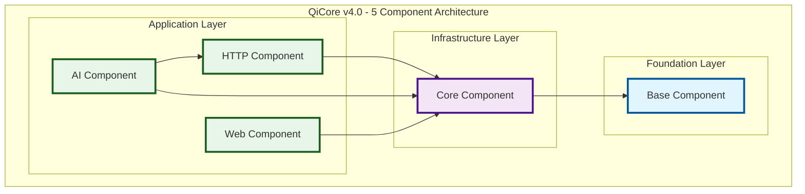

# QiCore v4.0 Core Class Contracts

> **Stage 1: Enhanced Property Specifications**  
> **Depends on**: Mathematical analysis and pattern matching  
> **Implements**: Core behavioral contracts for 5-component architecture  
> Version: v4.0  
> Date: January 2025  
> Status: Core Foundation Phase  
> Purpose: Essential class-level contracts for QiCore 5-component system

## Architecture Overview

QiCore v4.0 implements a **5-component architecture** with clear separation of concerns and minimal dependencies:



### Component Responsibilities

**Base Component**: Foundation error handling and result types
**Core Component**: Configuration, logging, and caching infrastructure  
**HTTP Component**: Asynchronous HTTP client with resilience patterns
**AI Component**: LLM interface and MCP protocol implementation
**Web Component**: Web framework with ASGI server support

---

## Base Component Contracts

### Result<T> Contract

**Purpose**: Type-safe error handling with functional composition, eliminating exceptions in normal control flow.

**Mathematical Properties**:
- **Functor**: `map(f) ∘ map(g) = map(f ∘ g)`
- **Monad**: Left identity, right identity, associativity laws
- **Immutable**: All operations return new instances

**Core Operations**:
```typescript
interface Result<T> {
  readonly isSuccess: boolean;
  readonly data: T | null;
  readonly error: QiError | null;
  
  // Functor operations
  map<U>(transform: (value: T) => U): Result<U>;
  
  // Monad operations  
  flatMap<U>(chain: (value: T) => Result<U>): Result<U>;
  
  // Utility operations
  unwrap(): T;                              // Throws on failure
  unwrapOr(defaultValue: T): T;            // Safe unwrap
  match<U>(onSuccess: (T) => U, onError: (QiError) => U): U;
  orElse(alternative: (QiError) => Result<T>): Result<T>;
}
```

**Factory Operations**:
```typescript
class Result {
  static success<T>(data: T): Result<T>;
  static failure<T>(error: QiError): Result<T>;
  static fromTryCatch<T>(operation: () => T): Result<T>;
}
```

**Error Conditions**:
- **Invariant Violation**: Exactly one of `data` or `error` must be non-null
- **unwrap() on Failure**: Must throw the contained QiError
- **Null Function Arguments**: Transform/chain functions must not be null

**Performance Targets**:
- **Construction**: < 1μs (native), < 10μs (VM), < 100μs (interpreted)
- **Operations**: O(1) complexity for all methods
- **Memory**: Minimal allocation overhead

---

### QiError Contract

**Purpose**: Structured error representation with rich context and debugging information.

**Core Properties**:
```typescript
interface QiError {
  readonly code: string;                    // Unique identifier
  readonly message: string;                 // Human-readable description
  readonly category: ErrorCategory;        // Error classification
  readonly context: Record<string, unknown> | null;  // Additional context
  readonly cause: QiError | null;          // Error chaining
  readonly timestamp: number;              // Epoch milliseconds
}
```

**Operations**:
```typescript
class QiError {
  constructor(code: string, message: string, category: ErrorCategory, context?: Record<string, unknown>);
  
  toString(): string;
  toStructuredData(): Record<string, unknown>;
  withContext(additionalContext: Record<string, unknown>): QiError;
  withCause(causeError: QiError): QiError;
}
```

**Error Categories**:
```typescript
enum ErrorCategory {
  VALIDATION = "VALIDATION",
  NETWORK = "NETWORK", 
  FILESYSTEM = "FILESYSTEM",
  CONFIGURATION = "CONFIGURATION",
  CACHE = "CACHE",
  TIMEOUT = "TIMEOUT",
  PERMISSION = "PERMISSION",
  UNKNOWN = "UNKNOWN"
}
```

**Constraints**:
- **Code Format**: Non-empty string, typically UPPER_SNAKE_CASE
- **Cause Chain**: Maximum depth of 10 to prevent cycles
- **Context Serialization**: All context values must be serializable

---

## Core Component Contracts

### Configuration Contract

**Purpose**: Multi-source configuration management with hierarchical merging and validation.

**Mathematical Properties**:
- **Monoid**: `merge` operation with empty config as identity
- **Associative**: `merge([a, merge([b, c])]) = merge([merge([a, b]), c])`
- **Commutative**: Later configs override earlier ones (right-biased)

**Core Operations**:
```typescript
interface Configuration {
  // Loading operations (async for I/O)
  static fromFile(filePath: string): Promise<Result<ConfigData>>;
  static fromObject(data: Record<string, unknown>): Result<ConfigData>;
  static fromString(content: string): Result<ConfigData>;
  static fromEnvironment(prefix?: string): Result<ConfigData>;
  
  // Monoid operations
  static merge(configs: ConfigData[]): Result<ConfigData>;
  static empty(): ConfigData;
  
  // Access operations
  static get<T>(config: ConfigData, key: string): Result<T>;
  static has(config: ConfigData, key: string): boolean;
  
  // Validation operations
  static validate(config: ConfigData, schema: ValidationSchema): Result<ConfigData>;
  static validateRequired(config: ConfigData, keys: string[]): Result<ConfigData>;
}
```

**Configuration Data**:
```typescript
interface ConfigData {
  readonly data: Record<string, unknown>;
  readonly source: string;                  // Origin of configuration
  readonly timestamp: number;              // Load timestamp
}
```

**Merge Semantics**:
- **Identity**: `merge([empty(), config]) = config`
- **Right Bias**: `merge([{a: 1}, {a: 2}]) = {a: 2}`
- **Deep Merge**: Nested objects are merged recursively

---

### Logging Contract

**Purpose**: High-performance structured logging with level-based filtering and multiple outputs.

**Core Interface**:
```typescript
interface Logger {
  // Level-based logging
  debug(message: string, context?: Record<string, unknown>): void;
  info(message: string, context?: Record<string, unknown>): void;
  warn(message: string, context?: Record<string, unknown>): void;
  error(message: string, error?: Error, context?: Record<string, unknown>): void;
  fatal(message: string, error?: Error, context?: Record<string, unknown>): void;
  
  // Performance optimization
  isLevelEnabled(level: LogLevel): boolean;
}
```

**Factory Operations**:
```typescript
class Logger {
  static create(config: LogConfig): Result<Logger>;
}

interface LogConfig {
  level: LogLevel;
  format: 'json' | 'text' | 'structured';
  destination: 'console' | 'file' | 'network';
  filePath?: string;                        // For file destination
  endpoint?: string;                        // For network destination
}
```

**Log Levels** (ascending priority):
```typescript
enum LogLevel {
  DEBUG = 0,
  INFO = 1,
  WARN = 2,
  ERROR = 3,
  FATAL = 4
}
```

**Performance Requirements**:
- **Level Check**: < 10ns for `isLevelEnabled()`
- **Disabled Levels**: < 100ns early exit
- **Enabled Logging**: < 10μs for simple messages, < 50μs with context

---

### Cache Contract

**Purpose**: High-performance caching with TTL, eviction policies, and persistence options.

**Core Interface**:
```typescript
interface Cache {
  // Basic operations
  get<T>(key: string): Result<T | null>;
  set<T>(key: string, value: T, ttl?: number): Result<void>;
  delete(key: string): Result<boolean>;
  clear(): Result<void>;
  
  // Batch operations
  getMany<T>(keys: string[]): Result<Map<string, T>>;
  setMany<T>(entries: Map<string, T>, ttl?: number): Result<void>;
  
  // Metadata operations
  has(key: string): boolean;
  size(): number;
  keys(): string[];
}
```

**Factory Operations**:
```typescript
class Cache {
  static createMemory(config: MemoryCacheConfig): Result<Cache>;
  static createPersistent(path: string, config: PersistentCacheConfig): Promise<Result<Cache>>;
}

interface MemoryCacheConfig {
  maxSize: number;                          // Maximum entries
  defaultTtl: number;                       // Default TTL in milliseconds
  evictionPolicy: 'LRU' | 'LFU' | 'FIFO';
}

interface PersistentCacheConfig extends MemoryCacheConfig {
  syncInterval: number;                     // Sync to disk interval
  compression: boolean;                     // Compress stored data
}
```

**Eviction Policies**:
- **LRU**: Least Recently Used (default)
- **LFU**: Least Frequently Used
- **FIFO**: First In, First Out

**Performance Requirements**:
- **Memory Cache**: O(1) for get/set operations
- **Persistent Cache**: O(1) with periodic O(n) sync
- **TTL Cleanup**: Background cleanup with minimal impact

---

## HTTP Component Contracts

### HTTP Client Contract

**Purpose**: Asynchronous HTTP client with resilience patterns, streaming, and circuit breaker support.

**Core Interface**:
```typescript
interface HttpClient {
  // Basic HTTP methods
  get(url: string, options?: HttpOptions): Promise<Result<HttpResponse>>;
  post(url: string, body: unknown, options?: HttpOptions): Promise<Result<HttpResponse>>;
  put(url: string, body: unknown, options?: HttpOptions): Promise<Result<HttpResponse>>;
  delete(url: string, options?: HttpOptions): Promise<Result<HttpResponse>>;
  
  // Generic request
  request(config: HttpConfig): Promise<Result<HttpResponse>>;
  
  // Streaming support
  stream(url: string, options?: HttpOptions): Promise<Result<AsyncIterable<Uint8Array>>>;
}
```

**Factory Operations**:
```typescript
class HttpClient {
  static create(config?: HttpClientConfig): Result<HttpClient>;
  static withCircuitBreaker(config: CircuitBreakerConfig): Result<HttpClient>;
}
```

**Configuration**:
```typescript
interface HttpClientConfig {
  timeout: number;                          // Request timeout in ms
  retries: number;                          // Retry attempts
  retryDelay: number;                       // Base retry delay in ms
  headers: Record<string, string>;          // Default headers
  baseUrl?: string;                         // Base URL for relative requests
}

interface CircuitBreakerConfig {
  failureThreshold: number;                 // Failures before opening
  resetTimeout: number;                     // Time before reset attempt
  monitoringPeriod: number;                 // Failure counting window
}
```

**Response Types**:
```typescript
interface HttpResponse {
  readonly status: number;
  readonly headers: Record<string, string>;
  readonly body: unknown;
  readonly url: string;
  readonly duration: number;                // Request duration in ms
}
```

**Resilience Features**:
- **Automatic Retries**: Exponential backoff with jitter
- **Circuit Breaker**: Fail-fast for unreliable services
- **Timeout Management**: Request and connection timeouts
- **Connection Pooling**: Efficient connection reuse

---

## AI Component Contracts

### LLM Client Contract

**Purpose**: Unified interface for Large Language Model providers with streaming and circuit breaker support.

**Core Interface**:
```typescript
interface LLMClient {
  // Chat completions
  chat(messages: ChatMessage[], options?: ChatOptions): Promise<Result<ChatResponse>>;
  chatStream(messages: ChatMessage[], options?: ChatOptions): Promise<Result<AsyncIterable<ChatChunk>>>;
  
  // Text completions
  complete(prompt: string, options?: CompletionOptions): Promise<Result<CompletionResponse>>;
  
  // Embeddings
  embed(text: string | string[], options?: EmbedOptions): Promise<Result<EmbeddingResponse>>;
}
```

**Factory Operations**:
```typescript
class LLMClient {
  static create(provider: LLMProvider, config: LLMConfig): Result<LLMClient>;
  static withCircuitBreaker(client: LLMClient, config: CircuitBreakerConfig): LLMClient;
}
```

**Provider Support**:
```typescript
enum LLMProvider {
  OPENAI = "openai",
  ANTHROPIC = "anthropic", 
  OLLAMA = "ollama",
  GEMINI = "gemini"
}
```

**Message Types**:
```typescript
interface ChatMessage {
  role: 'system' | 'user' | 'assistant';
  content: string;
  metadata?: Record<string, unknown>;
}

interface ChatResponse {
  message: ChatMessage;
  usage: TokenUsage;
  model: string;
  finishReason: 'stop' | 'length' | 'content_filter';
}

interface TokenUsage {
  promptTokens: number;
  completionTokens: number;
  totalTokens: number;
}
```

---

### MCP Protocol Contract

**Purpose**: Model Context Protocol implementation for standardized AI tool integration.

**Core Interface**:
```typescript
interface MCPServer {
  // Tool management
  registerTool(name: string, handler: ToolHandler): Result<void>;
  unregisterTool(name: string): Result<boolean>;
  listTools(): ToolInfo[];
  
  // Server lifecycle
  start(): Promise<Result<void>>;
  stop(): Promise<Result<void>>;
  
  // Request handling
  handleRequest(request: MCPRequest): Promise<Result<MCPResponse>>;
}

interface MCPClient {
  // Tool operations
  callTool(name: string, arguments: Record<string, unknown>): Promise<Result<ToolResponse>>;
  listTools(): Promise<Result<ToolInfo[]>>;
  
  // Connection management
  connect(serverUrl: string): Promise<Result<void>>;
  disconnect(): Promise<Result<void>>;
}
```

**Tool System**:
```typescript
interface ToolHandler {
  (arguments: Record<string, unknown>): Promise<Result<unknown>>;
}

interface ToolInfo {
  name: string;
  description: string;
  parameters: JSONSchema;
  deprecated?: boolean;
}

interface ToolResponse {
  result: unknown;
  metadata?: Record<string, unknown>;
  duration: number;
}
```

**Protocol Support**:
- **JSON-RPC 2.0**: Standard protocol for client-server communication
- **Tool Discovery**: Dynamic tool enumeration and metadata
- **Error Propagation**: Structured error handling across protocol boundary
- **Streaming**: Support for long-running tool operations

---

## Web Component Contracts

### Web Framework Contract

**Purpose**: Asynchronous web framework with Result<T> integration, middleware pipeline, and type-safe routing.

**Core Interface**:
```typescript
interface WebApp {
  // Routing
  get(path: string, handler: RouteHandler): void;
  post(path: string, handler: RouteHandler): void;
  put(path: string, handler: RouteHandler): void;
  delete(path: string, handler: RouteHandler): void;
  
  // Middleware
  use(middleware: Middleware): void;
  
  // Server lifecycle
  listen(port: number, host?: string): Promise<Result<WebServer>>;
}

interface WebServer {
  stop(): Promise<Result<void>>;
  getStats(): ServerStats;
}
```

**Handler Types**:
```typescript
interface RouteHandler {
  (request: WebRequest): Promise<Result<WebResponse>>;
}

interface Middleware {
  (request: WebRequest, next: NextFunction): Promise<Result<WebResponse>>;
}

interface NextFunction {
  (): Promise<Result<WebResponse>>;
}
```

**Request/Response Types**:
```typescript
interface WebRequest {
  readonly method: string;
  readonly url: string;
  readonly headers: Record<string, string>;
  readonly params: Record<string, string>;
  readonly query: Record<string, string>;
  readonly body: unknown;
}

interface WebResponse {
  status: number;
  headers: Record<string, string>;
  body: unknown;
}
```

**Factory Operations**:
```typescript
class WebApp {
  static create(config?: WebConfig): Result<WebApp>;
}

interface WebConfig {
  cors: boolean;
  compression: boolean;
  maxBodySize: number;
  timeout: number;
}
```

---

## Contract Integration Patterns

### Error Propagation

All components use consistent error handling:

```typescript
// Chaining operations across components
const result = await Configuration.fromFile("config.json")
  .flatMap(config => Logger.create(config.logging))
  .flatMap(logger => HttpClient.create(config.http))
  .flatMap(client => client.get("https://api.example.com"));

// Pattern matching for error handling
result.match(
  data => console.log("Success:", data),
  error => console.error("Failed:", error.message)
);
```

### Dependency Injection

Components accept their dependencies explicitly:

```typescript
// Core component initialization
const config = await Configuration.fromFile("app.json").unwrap();
const logger = Logger.create(config.logging).unwrap();
const cache = Cache.createMemory(config.cache).unwrap();

// Application component initialization  
const httpClient = HttpClient.create(config.http).unwrap();
const llmClient = LLMClient.create(LLMProvider.OLLAMA, config.ai).unwrap();
const webApp = WebApp.create(config.web).unwrap();
```

### Async Coordination

Async operations maintain Result<T> consistency:

```typescript
// Parallel async operations
const [configResult, cacheResult] = await Promise.all([
  Configuration.fromFile("config.json"),
  Cache.createPersistent("./cache", cacheConfig)
]);

// Combine results
const combined = configResult.flatMap(config =>
  cacheResult.map(cache => ({ config, cache }))
);
```

---

## Performance Specifications

### Component Performance Targets

**Base Component**:
- Result<T> operations: < 1μs (native), < 10μs (VM), < 100μs (interpreted)
- QiError creation: < 5μs including context serialization

**Core Component**:
- Configuration merge: O(k×d) where k=configs, d=depth
- Logger level check: < 10ns
- Cache operations: O(1) for memory, O(log n) for persistent

**HTTP Component**:
- Request latency: Network-bound + < 1ms overhead
- Circuit breaker check: < 100ns
- Connection pooling: < 10μs connection reuse

**AI Component**:
- LLM request overhead: < 5ms excluding model inference
- MCP tool call: < 1ms excluding tool execution
- Streaming: < 100μs per chunk processing

**Web Component**:
- Request handling: < 1ms excluding business logic
- Middleware pipeline: < 100μs per middleware
- Route matching: O(log n) for n routes

### Memory Usage Targets

- **Base Component**: < 1KB per Result/Error instance
- **Core Component**: < 10MB for typical configuration/logging/cache
- **HTTP Component**: < 5MB connection pool + request buffers
- **AI Component**: < 20MB for model client state
- **Web Component**: < 15MB for server state + connection handling

---

## Testing Specifications

### Contract Testing

Each contract must include:

1. **Property Tests**: Mathematical properties (functor laws, monoid laws)
2. **Error Condition Tests**: All specified error conditions
3. **Performance Tests**: Meet specified performance targets
4. **Integration Tests**: Cross-component interaction patterns
5. **Async Tests**: Proper async/await behavior and error propagation

### Example Test Structure

```typescript
describe('Result<T> Contract', () => {
  describe('Functor Laws', () => {
    test('identity: map(id) = id', () => {
      const result = Result.success(42);
      expect(result.map(x => x)).toEqual(result);
    });
    
    test('composition: map(f).map(g) = map(g ∘ f)', () => {
      const result = Result.success(42);
      const f = (x: number) => x * 2;
      const g = (x: number) => x + 1;
      
      expect(result.map(f).map(g))
        .toEqual(result.map(x => g(f(x))));
    });
  });
  
  describe('Performance', () => {
    test('operations complete within target time', () => {
      const start = performance.now();
      const result = Result.success(42).map(x => x * 2);
      const duration = performance.now() - start;
      
      expect(duration).toBeLessThan(0.1); // 100μs for interpreted
    });
  });
});
```

This completes the core class contracts for the QiCore v4.0 5-component architecture, providing a solid foundation for mathematical verification and general-purpose computing with consistent error handling, performance guarantees, and clear component boundaries. 