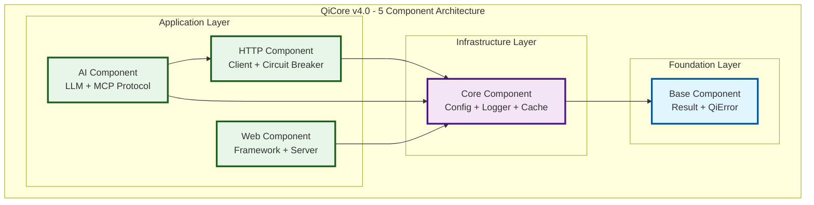

# QiCore v4.0 Core Component Contracts

> **Stage 1: Enhanced Property Specifications**  
> **Depends on**: [Core Class Contracts](core.class.contracts.md)  
> **Implements**: Component boundaries and interfaces for 5-component architecture  
> Version: v4.0  
> Date: January 2025  
> Status: Core Foundation Phase  
> Purpose: Component-level organization for QiCore 5-component system

## Component Architecture Overview

QiCore v4.0 is organized into **5 distinct components**, each providing cohesive functionality with well-defined interfaces and clear dependencies:



### Component Dependency Rules

1. **Base Component**: No dependencies (foundation layer)
2. **Core Component**: Depends only on Base Component
3. **Application Components**: Depend on Core and Base, may depend on each other
4. **Circular Dependencies**: Forbidden except for optional runtime dependencies

---

## Base Component

**Purpose**: Foundational error handling and result types used by all other components

### Component Interface

```typescript
namespace BaseComponent {
  // Result operations
  export function success<T>(data: T): Result<T>;
  export function failure<T>(error: QiError): Result<T>;
  export function fromTryCatch<T>(operation: () => T): Result<T>;
  
  // Error operations
  export function createError(code: string, message: string, category: ErrorCategory): QiError;
  export function withContext(error: QiError, context: Record<string, unknown>): QiError;
  export function withCause(error: QiError, cause: QiError): QiError;
}
```

### Included Contracts
- **Result<T>**: Type-safe error handling with functional composition
- **QiError**: Structured error representation with context and chaining

### Dependencies
- **None**: Base component has no dependencies

### Exported Types
```typescript
export type Result<T> = {
  readonly isSuccess: boolean;
  readonly data: T | null;
  readonly error: QiError | null;
  map<U>(transform: (value: T) => U): Result<U>;
  flatMap<U>(chain: (value: T) => Result<U>): Result<U>;
  unwrap(): T;
  unwrapOr(defaultValue: T): T;
  match<U>(onSuccess: (T) => U, onError: (QiError) => U): U;
  orElse(alternative: (QiError) => Result<T>): Result<T>;
};

export type QiError = {
  readonly code: string;
  readonly message: string;
  readonly category: ErrorCategory;
  readonly context: Record<string, unknown> | null;
  readonly cause: QiError | null;
  readonly timestamp: number;
  toString(): string;
  toStructuredData(): Record<string, unknown>;
  withContext(context: Record<string, unknown>): QiError;
  withCause(cause: QiError): QiError;
};

export enum ErrorCategory {
  VALIDATION = "VALIDATION",
  NETWORK = "NETWORK",
  FILESYSTEM = "FILESYSTEM", 
  CONFIGURATION = "CONFIGURATION",
  CACHE = "CACHE",
  TIMEOUT = "TIMEOUT",
  PERMISSION = "PERMISSION",
  UNKNOWN = "UNKNOWN"
}
```

### Component Guarantees
- **Zero Dependencies**: Can be used standalone
- **Immutable**: All types are immutable after creation
- **Thread-Safe**: Safe for concurrent use
- **Minimal Overhead**: < 1KB runtime overhead

---

## Core Component

**Purpose**: Essential infrastructure services for configuration, logging, and caching

### Component Interface

```typescript
namespace CoreComponent {
  // Configuration operations
  export function fromFile(path: string): Promise<Result<ConfigData>>;
  export function fromObject(data: Record<string, unknown>): Result<ConfigData>;
  export function fromEnvironment(prefix?: string): Result<ConfigData>;
  export function mergeConfigs(configs: ConfigData[]): Result<ConfigData>;
  export function getConfigValue<T>(config: ConfigData, key: string): Result<T>;
  
  // Logging operations
  export function createLogger(config: LogConfig): Result<Logger>;
  export function log(logger: Logger, level: LogLevel, message: string, context?: Record<string, unknown>): void;
  export function isLevelEnabled(logger: Logger, level: LogLevel): boolean;
  
  // Cache operations
  export function createMemoryCache(config: MemoryCacheConfig): Result<Cache>;
  export function createPersistentCache(path: string, config: PersistentCacheConfig): Promise<Result<Cache>>;
  export function cacheGet<T>(cache: Cache, key: string): Result<T | null>;
  export function cacheSet<T>(cache: Cache, key: string, value: T, ttl?: number): Result<void>;
}
```

### Included Contracts
- **Configuration**: Multi-source config loading with monoid merge semantics
- **Logging**: High-performance structured logging with level-based filtering
- **Cache**: High-performance caching with TTL and eviction policies

### Dependencies
- **Base Component**: Uses Result<T> and QiError throughout

### Exported Types
```typescript
export type ConfigData = {
  readonly data: Record<string, unknown>;
  readonly source: string;
  readonly timestamp: number;
};

export type Logger = {
  debug(message: string, context?: Record<string, unknown>): void;
  info(message: string, context?: Record<string, unknown>): void;
  warn(message: string, context?: Record<string, unknown>): void;
  error(message: string, error?: Error, context?: Record<string, unknown>): void;
  fatal(message: string, error?: Error, context?: Record<string, unknown>): void;
  isLevelEnabled(level: LogLevel): boolean;
};

export type Cache = {
  get<T>(key: string): Result<T | null>;
  set<T>(key: string, value: T, ttl?: number): Result<void>;
  delete(key: string): Result<boolean>;
  clear(): Result<void>;
  has(key: string): boolean;
  size(): number;
  keys(): string[];
};

export enum LogLevel {
  DEBUG = 0,
  INFO = 1,
  WARN = 2,
  ERROR = 3,
  FATAL = 4
}
```

### Component Guarantees
- **Independent Services**: Config, Logger, and Cache can be used independently
- **Consistent Error Handling**: All operations return Result<T>
- **Async-Aware**: File I/O operations are properly async
- **Performance**: Sub-microsecond level checking, O(1) cache operations
- **Resource Management**: Proper cleanup for persistent resources

### Internal Dependencies
- Configuration has no internal dependencies
- Logger may use Configuration for initialization
- Cache may use Configuration for settings and Logger for operations

---

## HTTP Component

**Purpose**: Asynchronous HTTP client functionality with robust error handling and resilience patterns

### Component Interface

```typescript
namespace HttpComponent {
  // HTTP client operations
  export function createClient(config?: HttpClientConfig): Result<HttpClient>;
  export function createWithCircuitBreaker(config: CircuitBreakerConfig): Result<HttpClient>;
  
  // HTTP operations (all async)
  export function get(client: HttpClient, url: string, options?: HttpOptions): Promise<Result<HttpResponse>>;
  export function post(client: HttpClient, url: string, body: unknown, options?: HttpOptions): Promise<Result<HttpResponse>>;
  export function put(client: HttpClient, url: string, body: unknown, options?: HttpOptions): Promise<Result<HttpResponse>>;
  export function del(client: HttpClient, url: string, options?: HttpOptions): Promise<Result<HttpResponse>>;
  export function request(client: HttpClient, config: HttpConfig): Promise<Result<HttpResponse>>;
  export function stream(client: HttpClient, url: string, options?: HttpOptions): Promise<Result<AsyncIterable<Uint8Array>>>;
  
  // Circuit breaker operations
  export function getCircuitState(client: HttpClient): CircuitState;
  export function resetCircuit(client: HttpClient): Result<void>;
}
```

### Included Contracts
- **HTTP Client**: Full-featured HTTP client with retries and timeouts
- **Circuit Breaker**: Failure detection and recovery patterns
- **Streaming**: Support for chunked responses and large payloads

### Dependencies
- **Base Component**: Uses Result<T> and QiError
- **Core Component**: 
  - Uses Configuration for default settings (timeouts, retries)
  - Uses Logger for request/response logging
  - May use Cache for response caching

### Exported Types
```typescript
export type HttpClient = {
  get(url: string, options?: HttpOptions): Promise<Result<HttpResponse>>;
  post(url: string, body: unknown, options?: HttpOptions): Promise<Result<HttpResponse>>;
  put(url: string, body: unknown, options?: HttpOptions): Promise<Result<HttpResponse>>;
  delete(url: string, options?: HttpOptions): Promise<Result<HttpResponse>>;
  request(config: HttpConfig): Promise<Result<HttpResponse>>;
  stream(url: string, options?: HttpOptions): Promise<Result<AsyncIterable<Uint8Array>>>;
};

export type HttpResponse = {
  readonly status: number;
  readonly headers: Record<string, string>;
  readonly body: unknown;
  readonly url: string;
  readonly duration: number;
};

export type HttpClientConfig = {
  timeout: number;
  retries: number;
  retryDelay: number;
  headers: Record<string, string>;
  baseUrl?: string;
};

export type CircuitBreakerConfig = {
  failureThreshold: number;
  resetTimeout: number;
  monitoringPeriod: number;
  halfOpenRequests: number;
};

export enum CircuitState {
  CLOSED = "CLOSED",
  OPEN = "OPEN", 
  HALF_OPEN = "HALF_OPEN"
}
```

### Component Guarantees
- **Async Operations**: All operations are asynchronous
- **Automatic Retries**: Configurable retry policies with exponential backoff
- **Timeout Management**: Request-level timeout control
- **Connection Pooling**: Efficient connection reuse
- **Circuit Breaking**: Automatic failure detection and recovery
- **Streaming Support**: Memory-efficient large response handling

---

## AI Component

**Purpose**: Unified AI/LLM interface and MCP protocol implementation with circuit breaker patterns

### Component Interface

```typescript
namespace AIComponent {
  // LLM client operations
  export function createLLMClient(provider: LLMProvider, config: LLMConfig): Result<LLMClient>;
  export function createWithCircuitBreaker(client: LLMClient, config: CircuitBreakerConfig): LLMClient;
  
  // LLM operations
  export function chat(client: LLMClient, messages: ChatMessage[], options?: ChatOptions): Promise<Result<ChatResponse>>;
  export function chatStream(client: LLMClient, messages: ChatMessage[], options?: ChatOptions): Promise<Result<AsyncIterable<ChatChunk>>>;
  export function complete(client: LLMClient, prompt: string, options?: CompletionOptions): Promise<Result<CompletionResponse>>;
  export function embed(client: LLMClient, text: string | string[], options?: EmbedOptions): Promise<Result<EmbeddingResponse>>;
  
  // MCP server operations
  export function createMCPServer(config: MCPConfig): Result<MCPServer>;
  export function registerTool(server: MCPServer, name: string, handler: ToolHandler): Result<void>;
  export function startServer(server: MCPServer): Promise<Result<void>>;
  export function stopServer(server: MCPServer): Promise<Result<void>>;
  
  // MCP client operations
  export function createMCPClient(config: MCPConfig): Result<MCPClient>;
  export function connectToServer(client: MCPClient, serverUrl: string): Promise<Result<void>>;
  export function callTool(client: MCPClient, name: string, args: Record<string, unknown>): Promise<Result<ToolResponse>>;
  export function listTools(client: MCPClient): Promise<Result<ToolInfo[]>>;
}
```

### Included Contracts
- **LLM Client**: Unified LLM interface with circuit breaker patterns
- **MCP Protocol**: Model Context Protocol with resilience patterns

### Dependencies
- **Base Component**: Uses Result<T> and QiError
- **Core Component**:
  - Uses Configuration for AI provider settings
  - Uses Logger for AI interaction logging
  - Uses Cache for response caching
- **HTTP Component**: Uses HTTP client for cloud LLM providers

### Exported Types
```typescript
export type LLMClient = {
  chat(messages: ChatMessage[], options?: ChatOptions): Promise<Result<ChatResponse>>;
  chatStream(messages: ChatMessage[], options?: ChatOptions): Promise<Result<AsyncIterable<ChatChunk>>>;
  complete(prompt: string, options?: CompletionOptions): Promise<Result<CompletionResponse>>;
  embed(text: string | string[], options?: EmbedOptions): Promise<Result<EmbeddingResponse>>;
};

export type MCPServer = {
  registerTool(name: string, handler: ToolHandler): Result<void>;
  unregisterTool(name: string): Result<boolean>;
  listTools(): ToolInfo[];
  start(): Promise<Result<void>>;
  stop(): Promise<Result<void>>;
  handleRequest(request: MCPRequest): Promise<Result<MCPResponse>>;
};

export type MCPClient = {
  callTool(name: string, arguments: Record<string, unknown>): Promise<Result<ToolResponse>>;
  listTools(): Promise<Result<ToolInfo[]>>;
  connect(serverUrl: string): Promise<Result<void>>;
  disconnect(): Promise<Result<void>>;
};

export enum LLMProvider {
  OPENAI = "openai",
  ANTHROPIC = "anthropic",
  OLLAMA = "ollama", 
  GEMINI = "gemini"
}

export type ChatMessage = {
  role: 'system' | 'user' | 'assistant';
  content: string;
  metadata?: Record<string, unknown>;
};

export type ToolHandler = (arguments: Record<string, unknown>) => Promise<Result<unknown>>;

export type ToolInfo = {
  name: string;
  description: string;
  parameters: JSONSchema;
  deprecated?: boolean;
};
```

### Component Guarantees
- **Provider Agnostic**: Unified interface for all LLM providers
- **Circuit Breaker**: Built-in resilience for unreliable AI services
- **Streaming Support**: Real-time response streaming
- **Protocol Compliance**: Full MCP specification implementation

---

## Web Component

**Purpose**: Asynchronous web framework with routing, middleware, and Result<T> integration

### Component Interface

```typescript
namespace WebComponent {
  // Web application operations
  export function createApp(config?: WebConfig): Result<WebApp>;
  export function route(app: WebApp, method: string, path: string, handler: RouteHandler): void;
  export function middleware(app: WebApp, handler: Middleware): void;
  export function listen(app: WebApp, port: number, host?: string): Promise<Result<WebServer>>;
  
  // Server operations
  export function stopServer(server: WebServer): Promise<Result<void>>;
  export function getServerStats(server: WebServer): ServerStats;
  
  // Request validation
  export function validateRequest(request: WebRequest, schema: ValidationSchema): Result<ValidatedRequest>;
}
```

### Included Contracts
- **Web Framework**: Async web framework with Result<T> integration
- **Server Management**: Production-ready server with graceful shutdown

### Dependencies
- **Base Component**: Uses Result<T> and QiError
- **Core Component**:
  - Uses Configuration for server settings
  - Uses Logger for request/response logging
  - May use Cache for response caching

### Exported Types
```typescript
export type WebApp = {
  get(path: string, handler: RouteHandler): void;
  post(path: string, handler: RouteHandler): void;
  put(path: string, handler: RouteHandler): void;
  delete(path: string, handler: RouteHandler): void;
  use(middleware: Middleware): void;
  listen(port: number, host?: string): Promise<Result<WebServer>>;
};

export type WebServer = {
  stop(): Promise<Result<void>>;
  getStats(): ServerStats;
};

export type RouteHandler = (request: WebRequest) => Promise<Result<WebResponse>>;

export type Middleware = (request: WebRequest, next: NextFunction) => Promise<Result<WebResponse>>;

export type NextFunction = () => Promise<Result<WebResponse>>;

export type WebRequest = {
  readonly method: string;
  readonly url: string;
  readonly headers: Record<string, string>;
  readonly params: Record<string, string>;
  readonly query: Record<string, string>;
  readonly body: unknown;
};

export type WebResponse = {
  status: number;
  headers: Record<string, string>;
  body: unknown;
};

export type WebConfig = {
  cors: boolean;
  compression: boolean;
  maxBodySize: number;
  timeout: number;
};

export type ServerStats = {
  uptime: number;
  requestCount: number;
  errorCount: number;
  averageResponseTime: number;
};
```

### Component Guarantees
- **Result<T> Integration**: All handlers return Result<T>
- **Middleware Pipeline**: Composable request/response processing
- **Production Ready**: Graceful shutdown and performance monitoring
- **Type Safety**: Request/response validation with schemas

---

## Component Integration Patterns

### Initialization Order

Components must be initialized in dependency order:

```typescript
// 1. Base Component (no initialization needed)
// 2. Core Component
const config = await CoreComponent.fromFile("config.json").unwrap();
const logger = CoreComponent.createLogger(config.logging).unwrap();
const cache = CoreComponent.createMemoryCache(config.cache).unwrap();

// 3. Application Components
const httpClient = HttpComponent.createClient(config.http).unwrap();
const llmClient = AIComponent.createLLMClient(LLMProvider.OLLAMA, config.ai).unwrap();
const webApp = WebComponent.createApp(config.web).unwrap();
```

### Error Propagation

All components use consistent error handling:

```typescript
// Cross-component error chaining
const result = await CoreComponent.fromFile("config.json")
  .flatMap(config => HttpComponent.createClient(config.http))
  .flatMap(client => HttpComponent.get(client, "https://api.example.com"));

result.match(
  data => console.log("Success:", data),
  error => console.error("Failed:", error.message)
);
```

### Async Coordination

Components coordinate async operations while maintaining Result<T> consistency:

```typescript
// Parallel component initialization
const [configResult, cacheResult] = await Promise.all([
  CoreComponent.fromFile("config.json"),
  CoreComponent.createPersistentCache("./cache", cacheConfig)
]);

// Combine results functionally
const combined = configResult.flatMap(config =>
  cacheResult.map(cache => ({ config, cache }))
);
```

### Resource Management

Components provide consistent resource cleanup:

```typescript
// Graceful shutdown pattern
async function shutdown() {
  const results = await Promise.all([
    WebComponent.stopServer(webServer),
    AIComponent.stopServer(mcpServer),
    // Core component resources are cleaned up automatically
  ]);
  
  // Check if all shutdowns succeeded
  const allSucceeded = results.every(r => r.isSuccess);
  return allSucceeded ? Result.success(undefined) : Result.failure(
    new QiError("SHUTDOWN_FAILED", "Some components failed to shutdown", ErrorCategory.UNKNOWN)
  );
}
```

---

## Component Testing Specifications

### Component Contract Testing

Each component must include:

1. **Interface Tests**: All exported functions work as specified
2. **Dependency Tests**: Proper dependency injection and usage
3. **Error Propagation Tests**: Result<T> error handling works correctly
4. **Performance Tests**: Meet component-specific performance targets
5. **Integration Tests**: Cross-component interactions work properly

### Example Component Test Structure

```typescript
describe('HTTP Component', () => {
  describe('Component Interface', () => {
    test('createClient returns Result<HttpClient>', () => {
      const result = HttpComponent.createClient();
      expect(result.isSuccess).toBe(true);
      expect(result.unwrap()).toHaveProperty('get');
    });
  });
  
  describe('Dependency Integration', () => {
    test('uses Core Component for logging', async () => {
      const config = CoreComponent.fromObject({ logging: { level: LogLevel.INFO } }).unwrap();
      const logger = CoreComponent.createLogger(config.logging).unwrap();
      const client = HttpComponent.createClient({ logger }).unwrap();
      
      // Verify logging integration works
      const response = await HttpComponent.get(client, "https://httpbin.org/get");
      expect(response.isSuccess).toBe(true);
    });
  });
  
  describe('Error Propagation', () => {
    test('network errors are properly wrapped in QiError', async () => {
      const client = HttpComponent.createClient().unwrap();
      const result = await HttpComponent.get(client, "https://invalid-domain-12345.com");
      
      expect(result.isSuccess).toBe(false);
      expect(result.error?.category).toBe(ErrorCategory.NETWORK);
    });
  });
});
```

---

## Component Performance Specifications

### Per-Component Performance Targets

**Base Component**:
- Result<T> creation: < 1μs
- Error creation: < 5μs
- Functional operations: O(1)

**Core Component**:
- Configuration merge: O(k×d) where k=configs, d=depth
- Logger level check: < 10ns
- Cache get/set: O(1) memory, O(log n) persistent

**HTTP Component**:
- Client creation: < 1ms
- Request overhead: < 1ms excluding network
- Circuit breaker check: < 100ns

**AI Component**:
- LLM client creation: < 5ms
- MCP tool registration: < 1ms
- Request overhead: < 5ms excluding model inference

**Web Component**:
- App creation: < 5ms
- Request routing: O(log n) for n routes
- Middleware execution: < 100μs per middleware

### Memory Usage Targets

- **Base Component**: < 1KB per instance
- **Core Component**: < 10MB total for config/logging/cache
- **HTTP Component**: < 5MB for connection pools and buffers
- **AI Component**: < 20MB for client state and caches
- **Web Component**: < 15MB for server state and connections

This completes the core component contracts for QiCore v4.0, providing clear boundaries, interfaces, and integration patterns for the 5-component architecture. 