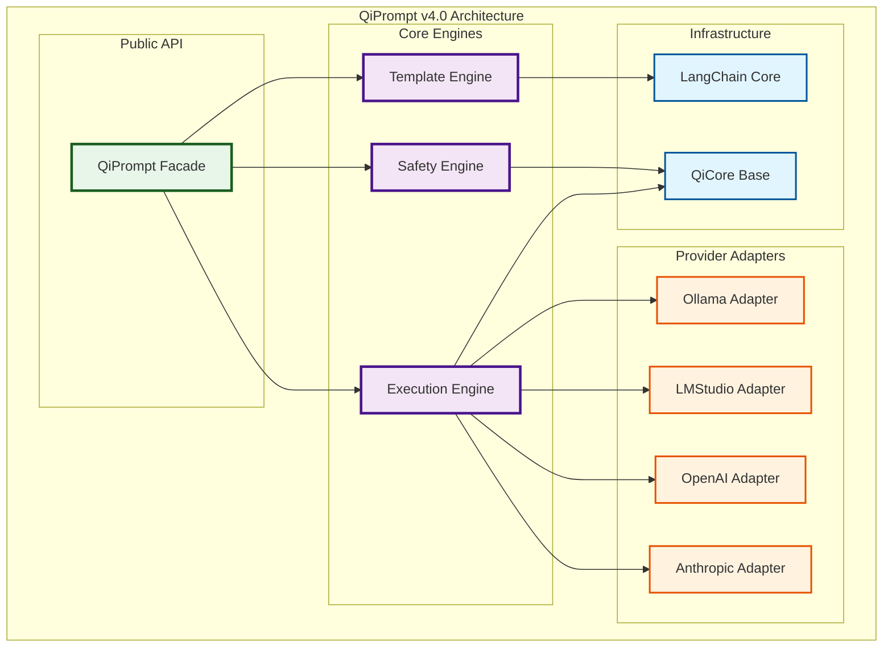

# QiPrompt v4.0 Contracts

> **Stage 1: Enhanced Property Specifications**  
> **Depends on**: LangChain Core, QiCore Base Components  
> **Implements**: Sophisticated prompt execution engine with multi-provider support  
> Version: v4.0  
> Date: January 2025  
> Status: Core Foundation Phase  
> Purpose: Unified prompt engineering and execution layer for QiCore ecosystem

## Purpose and Scope

QiPrompt serves as the **sophisticated prompt execution engine** that replaces simple LLM wrappers like OllamaOnlyAgent. It provides enterprise-grade prompt engineering, safety validation, template management, and multi-provider LLM execution with consistent Result<T> error handling.

**Key Responsibilities**:
- **Prompt Engineering**: Advanced templating, safety checks, and optimization
- **LLM Execution**: Multi-provider support (Ollama, LMStudio, OpenAI, Anthropic)
- **Safety & Security**: Content filtering, injection detection, rate limiting
- **Performance**: Caching, optimization, and monitoring
- **Experimentation**: A/B testing and prompt versioning

**Not Responsible For**:
- **Agent Logic**: Workflow orchestration (QiAgent's responsibility)
- **Tool Integration**: MCP protocol handling (QiMCP's responsibility)
- **Process Management**: Housekeeping tasks (ProcessExecutor's responsibility)

---

## Core Architecture

### Mathematical Properties

**Prompt Compilation (Functor)**:
```
map: (Template, Variables) → CompiledPrompt
compose: map(f) ∘ map(g) = map(f ∘ g)
identity: map(id) = id
```

**Execution Chain (Monad)**:
```
flatMap: CompiledPrompt → (Model → Result<Response>)
left_identity: return(a) >>= f = f(a)
right_identity: m >>= return = m
associativity: (m >>= f) >>= g = m >>= (λx. f(x) >>= g)
```

**Safety Validation (Monoid)**:
```
combine: SafetyCheck ⊕ SafetyCheck = SafetyCheck
identity: SafetyCheck ⊕ ∅ = SafetyCheck
associative: (a ⊕ b) ⊕ c = a ⊕ (b ⊕ c)
```

### Component Dependencies



---

## Core Contracts

### QiPrompt Facade Contract

**Purpose**: Main interface for all prompt engineering and execution operations with enterprise-grade reliability.

**Core Interface**:
```typescript
interface QiPrompt {
  // Prompt compilation and validation
  compile(input: PromptInput): Result<CompiledTemplate>;
  validate(input: PromptInput): Result<PromptValidationResult>;
  
  // LLM execution
  execute(template: CompiledTemplate, model: ModelConfig): Promise<Result<PromptExecutionResult>>;
  executeRaw(prompt: string, model: ModelConfig): Promise<Result<PromptExecutionResult>>;
  
  // Streaming execution
  executeStream(template: CompiledTemplate, model: ModelConfig): Promise<Result<AsyncIterable<PromptChunk>>>;
  
  // Experimentation and versioning
  createExperiment(config: ExperimentConfig): Result<PromptExperiment>;
  getVersion(templateId: string, version?: string): Result<PromptVersion>;
  
  // System management
  reset(): void;
  getStats(): PromptEngineStats;
}
```

**Factory Operations**:
```typescript
class QiPrompt {
  static create(options?: QiPromptConfig): Result<QiPrompt>;
  static createDev(): Result<QiPrompt>;
  static createSecure(): Result<QiPrompt>;
}
```

**Configuration**:
```typescript
interface QiPromptConfig {
  // Safety configuration
  safetyConfig?: {
    enableContentFilter: boolean;
    enableInjectionDetection: boolean;
    maxPromptLength: number;
    allowedDomains: string[];
    blockedTerms: string[];
    rateLimit: { requests: number; window: number };
  };
  
  // Template engine configuration
  engineConfig?: {
    cacheSize: number;
    enableOptimization: boolean;
    templateTimeout: number;
  };
  
  // Provider configuration
  providers?: {
    ollama?: { baseUrl: string; timeout: number };
    lmstudio?: { baseUrl: string; timeout: number };
    openai?: { apiKey: string; baseUrl?: string };
    anthropic?: { apiKey: string; baseUrl?: string };
  };
}
```

**Error Conditions**:
- **SAFETY_VIOLATION**: Prompt fails safety checks
- **COMPILATION_ERROR**: Template compilation fails
- **EXECUTION_ERROR**: LLM execution fails
- **PROVIDER_UNAVAILABLE**: LLM provider is not accessible
- **RATE_LIMIT_EXCEEDED**: Too many requests in time window
- **TEMPLATE_NOT_FOUND**: Requested template version doesn't exist

**Performance Requirements**:
- **Compilation**: < 10ms for simple templates, < 100ms for complex
- **Safety Checks**: < 5ms for content filtering
- **Execution Overhead**: < 50ms excluding actual LLM inference
- **Cache Hit**: < 1ms for cached templates

---

### Prompt Input Contract

**Purpose**: Structured input for prompt compilation with support for advanced techniques and safety validation.

**Core Structure**:
```typescript
interface PromptInput {
  // Template definition
  template: string | StructuredTemplate;
  variables: Record<string, unknown>;
  
  // Advanced techniques
  techniques?: {
    chainOfThought?: {
      enabled: boolean;
      steps: string[];
      reasoning: 'explicit' | 'implicit';
    };
    fewShot?: {
      enabled: boolean;
      examples: Array<{ input: string; output: string }>;
      maxExamples: number;
    };
    rolePlay?: {
      enabled: boolean;
      role: string;
      context: string;
    };
    constraints?: {
      maxLength?: number;
      format?: 'json' | 'yaml' | 'markdown' | 'text';
      language?: string;
    };
  };
  
  // Metadata and context
  metadata?: {
    purpose: string;
    domain: string;
    safetyLevel: 'low' | 'medium' | 'high' | 'critical';
    version?: string;
  };
}
```

**Structured Template Support**:
```typescript
interface StructuredTemplate {
  system?: string;
  user: string;
  assistant?: string;
  context?: Array<{ role: string; content: string }>;
}
```

**Validation Rules**:
- **Template**: Must be non-empty string or valid StructuredTemplate
- **Variables**: Must be serializable object with string keys
- **Chain-of-Thought**: If enabled, must have at least one step
- **Few-Shot**: If enabled, must have at least one example
- **Safety Level**: Must be valid enum value

**Examples**:
```typescript
// Simple template
const simpleInput: PromptInput = {
  template: "Analyze this mathematical contract: {contract}",
  variables: { contract: "Result<T> monad specification" },
  metadata: { purpose: "mathematical_analysis", safetyLevel: "medium" }
};

// Chain-of-thought template
const cotInput: PromptInput = {
  template: "Solve this step by step: {problem}",
  variables: { problem: "Prove monad associativity law" },
  techniques: {
    chainOfThought: {
      enabled: true,
      steps: [
        "Identify the mathematical structures",
        "Apply the associativity definition", 
        "Show the equality holds"
      ],
      reasoning: 'explicit'
    }
  }
};

// Few-shot template
const fewShotInput: PromptInput = {
  template: "Generate YAML specification for: {request}",
  variables: { request: "HTTP client with retry logic" },
  techniques: {
    fewShot: {
      enabled: true,
      examples: [
        {
          input: "Result type with error handling",
          output: "metadata:\n  component: Result\n  foundation: Either Monad"
        }
      ],
      maxExamples: 3
    }
  }
};
```

---

### Compiled Template Contract

**Purpose**: Optimized, validated template ready for execution with performance guarantees and safety assurances.

**Core Structure**:
```typescript
interface CompiledTemplate {
  readonly id: string;
  readonly template: string;
  readonly variables: ReadonlyArray<{
    readonly name: string;
    readonly type: string;
    readonly required: boolean;
    readonly defaultValue?: unknown;
  }>;
  readonly metadata: Readonly<Record<string, unknown>>;
  readonly safetyChecks: SafetyCheckResult;
  readonly compiledAt: Date;
  readonly optimizations: ReadonlyArray<string>;
  
  // Execution methods
  render(variables: Record<string, unknown>): Promise<Result<string>>;
  validate(variables: Record<string, unknown>): Result<ValidationResult>;
  getEstimatedTokens(): number;
}
```

**Render Method**:
```typescript
async render(variables: Record<string, unknown>): Promise<Result<string>> {
  // Validates variables against template requirements
  // Applies optimizations and safety transformations
  // Returns final prompt string ready for LLM execution
}
```

**Performance Guarantees**:
- **Render**: < 5ms for simple templates, < 50ms for complex
- **Validation**: < 1ms for variable checking
- **Token Estimation**: < 1ms using cached calculations

**Immutability**:
- All properties are readonly
- Template cannot be modified after compilation
- Variables structure is frozen
- Metadata is deeply readonly

---

### Model Configuration Contract

**Purpose**: Provider-agnostic model configuration with automatic provider detection and optimization.

**Core Structure**:
```typescript
interface ModelConfig {
  // Provider identification
  provider: 'ollama' | 'lmstudio' | 'openai' | 'anthropic' | 'auto';
  modelName: string;
  
  // Generation parameters
  temperature?: number;           // 0.0 - 2.0, default: 0.7
  maxTokens?: number;            // Default: 4000
  topP?: number;                 // 0.0 - 1.0, default: 1.0
  topK?: number;                 // Integer, default: 40
  repeatPenalty?: number;        // 0.0 - 2.0, default: 1.1
  
  // Provider-specific settings
  providerConfig?: {
    ollama?: {
      baseUrl?: string;
      keepAlive?: string;
      numCtx?: number;
    };
    lmstudio?: {
      baseUrl?: string;
      timeout?: number;
    };
    openai?: {
      apiKey?: string;
      baseUrl?: string;
      organization?: string;
    };
    anthropic?: {
      apiKey?: string;
      baseUrl?: string;
      version?: string;
    };
  };
  
  // Execution settings
  timeout?: number;              // Default: 30000ms
  retries?: number;              // Default: 3
  stream?: boolean;              // Default: false
}
```

**Provider Auto-Detection**:
```typescript
// When provider is 'auto', QiPrompt will:
// 1. Check for local providers (Ollama, LMStudio) first
// 2. Fall back to cloud providers if configured
// 3. Select based on model name patterns
// 4. Prefer faster/cheaper options for simple tasks
```

**Model Name Patterns**:
```typescript
// Ollama models
"qwen2.5-coder:7b" | "llama3:8b" | "mistral:7b"

// LMStudio models  
"llama-3.2-1b-instruct" | "qwen2.5-coder-14b"

// OpenAI models
"gpt-4" | "gpt-3.5-turbo" | "gpt-4-turbo"

// Anthropic models
"claude-3-opus" | "claude-3-sonnet" | "claude-3-haiku"
```

---

### Execution Result Contract

**Purpose**: Comprehensive execution results with performance metrics, token usage, and metadata for monitoring and optimization.

**Core Structure**:
```typescript
interface PromptExecutionResult {
  readonly id: string;
  readonly prompt: {
    readonly formatted: string;
    readonly tokens: number;
  };
  readonly response: {
    readonly content: string;
    readonly tokens: number;
    readonly finishReason: 'stop' | 'length' | 'content_filter' | 'error';
    readonly model: string;
  };
  readonly performance: {
    readonly latency: number;           // Total execution time in ms
    readonly tokensPerSecond: number;   // Generation speed
    readonly cost: number;              // Estimated cost in USD
  };
  readonly metadata: {
    readonly timestamp: Date;
    readonly provider: string;
    readonly version: string;
    readonly techniques: ReadonlyArray<string>;
    readonly safetyChecks: SafetyCheckResult;
  };
}
```

**Streaming Result**:
```typescript
interface PromptChunk {
  readonly content: string;
  readonly isComplete: boolean;
  readonly metadata?: {
    readonly tokens: number;
    readonly timestamp: Date;
  };
}
```

**Performance Metrics**:
- **Latency**: End-to-end execution time including network overhead
- **Tokens Per Second**: Actual generation speed from the model
- **Cost**: Estimated based on provider pricing and token usage
- **Safety Overhead**: Time spent on safety checks and validation

---

### Safety and Validation Contracts

**Safety Check Result**:
```typescript
interface SafetyCheckResult {
  readonly safe: boolean;
  readonly violations: ReadonlyArray<{
    readonly type: 'content_filter' | 'injection' | 'length' | 'rate_limit';
    readonly severity: 'low' | 'medium' | 'high' | 'critical';
    readonly message: string;
    readonly details?: Record<string, unknown>;
  }>;
  readonly score: number;              // 0-100, higher is safer
  readonly checkedAt: Date;
}
```

**Validation Result**:
```typescript
interface PromptValidationResult {
  readonly isValid: boolean;
  readonly errors: ReadonlyArray<{
    readonly field: string;
    readonly message: string;
    readonly severity: 'error' | 'warning' | 'info';
  }>;
  readonly warnings: ReadonlyArray<string>;
  readonly suggestions: ReadonlyArray<string>;
  readonly metrics: {
    readonly tokenCount: number;
    readonly complexity: number;       // 0-100
    readonly readability: number;      // 0-100
  };
}
```

**Safety Configuration**:
```typescript
interface SafetyConfig {
  enableContentFilter: boolean;
  enableInjectionDetection: boolean;
  maxPromptLength: number;
  allowedDomains: string[];
  blockedTerms: string[];
  rateLimit: {
    requests: number;
    window: number;                    // Time window in milliseconds
  };
}
```

---

## Provider Adapter Contracts

### Ollama Adapter Contract

**Purpose**: Efficient local model execution with Ollama runtime.

**Interface**:
```typescript
interface OllamaAdapter {
  execute(prompt: string, model: ModelConfig): Promise<Result<PromptExecutionResult>>;
  executeStream(prompt: string, model: ModelConfig): Promise<Result<AsyncIterable<PromptChunk>>>;
  listModels(): Promise<Result<string[]>>;
  pullModel(modelName: string): Promise<Result<void>>;
  healthCheck(): Promise<Result<boolean>>;
}
```

**Configuration**:
```typescript
interface OllamaConfig {
  baseUrl: string;                     // Default: "http://localhost:11434"
  timeout: number;                     // Default: 30000
  keepAlive: string;                   // Default: "5m"
  numCtx: number;                      // Context window, default: 8192
}
```

**Features**:
- **Local Execution**: No API keys required
- **Model Management**: Pull and list models
- **Streaming**: Real-time response generation
- **Performance**: Optimized for local hardware

### LMStudio Adapter Contract

**Purpose**: Professional local model execution with LMStudio runtime.

**Interface**:
```typescript
interface LMStudioAdapter {
  execute(prompt: string, model: ModelConfig): Promise<Result<PromptExecutionResult>>;
  executeStream(prompt: string, model: ModelConfig): Promise<Result<AsyncIterable<PromptChunk>>>;
  listLoaded(): Promise<Result<string[]>>;
  loadModel(modelName: string): Promise<Result<void>>;
  healthCheck(): Promise<Result<boolean>>;
}
```

**Features**:
- **GUI Integration**: Works with LMStudio GUI
- **Model Loading**: Dynamic model loading/unloading
- **TypeScript SDK**: Native TypeScript support
- **Professional Tools**: Advanced debugging and monitoring

### Cloud Provider Adapters

**OpenAI Adapter**:
```typescript
interface OpenAIAdapter {
  execute(prompt: string, model: ModelConfig): Promise<Result<PromptExecutionResult>>;
  executeStream(prompt: string, model: ModelConfig): Promise<Result<AsyncIterable<PromptChunk>>>;
  listModels(): Promise<Result<string[]>>;
  getUsage(): Promise<Result<UsageStats>>;
}
```

**Anthropic Adapter**:
```typescript
interface AnthropicAdapter {
  execute(prompt: string, model: ModelConfig): Promise<Result<PromptExecutionResult>>;
  executeStream(prompt: string, model: ModelConfig): Promise<Result<AsyncIterable<PromptChunk>>>;
  getModels(): Promise<Result<string[]>>;
  getUsage(): Promise<Result<UsageStats>>;
}
```

---

## Integration Patterns

### QiAgent Integration

```typescript
// QiAgent uses QiPrompt for all LLM interactions
class QiAgent {
  constructor(private promptEngine: QiPrompt) {}
  
  async analyzeContract(contract: string): Promise<Result<Analysis>> {
    const promptInput: PromptInput = {
      template: "Analyze this mathematical contract: {contract}",
      variables: { contract },
      techniques: {
        chainOfThought: {
          enabled: true,
          steps: ["Identify structures", "Verify laws", "Check completeness"],
          reasoning: 'explicit'
        }
      },
      metadata: { purpose: "mathematical_analysis", safetyLevel: "high" }
    };
    
    const compiled = this.promptEngine.compile(promptInput);
    if (!compiled.isSuccess) return compiled;
    
    const result = await this.promptEngine.execute(compiled.data, {
      provider: 'auto',
      modelName: 'qwen2.5-coder:7b',
      temperature: 0.1
    });
    
    return result.map(r => parseAnalysis(r.response.content));
  }
}
```

### Error Propagation

```typescript
// All operations use Result<T> for consistent error handling
const result = await qiPrompt.compile(promptInput)
  .flatMap(template => qiPrompt.execute(template, modelConfig))
  .map(result => processResponse(result.response.content));

result.match(
  data => console.log("Success:", data),
  error => console.error("Failed:", error.message)
);
```

### Performance Monitoring

```typescript
// Built-in performance tracking
const stats = qiPrompt.getStats();
console.log(`Templates cached: ${stats.templates.cached}`);
console.log(`Active experiments: ${stats.experiments.active}`);

// Execution timing
const result = await qiPrompt.execute(template, model);
if (result.isSuccess) {
  console.log(`Latency: ${result.data.performance.latency}ms`);
  console.log(`Speed: ${result.data.performance.tokensPerSecond} tok/s`);
}
```

---

## Testing Specifications

### Contract Testing

**Template Compilation Tests**:
```typescript
describe('QiPrompt Template Compilation', () => {
  test('compiles simple templates correctly', () => {
    const input: PromptInput = {
      template: "Hello {name}",
      variables: { name: "World" }
    };
    
    const result = qiPrompt.compile(input);
    expect(result.isSuccess).toBe(true);
    expect(result.data.variables).toHaveLength(1);
    expect(result.data.variables[0].name).toBe("name");
  });
  
  test('validates required variables', () => {
    const input: PromptInput = {
      template: "Hello {name}",
      variables: {}  // Missing required variable
    };
    
    const validation = qiPrompt.validate(input);
    expect(validation.isSuccess).toBe(true);
    expect(validation.data.isValid).toBe(false);
    expect(validation.data.errors).toContainEqual(
      expect.objectContaining({
        field: "variables",
        message: expect.stringContaining("Missing required variable: name")
      })
    );
  });
});
```

**Safety Testing**:
```typescript
describe('QiPrompt Safety Checks', () => {
  test('blocks unsafe content', () => {
    const input: PromptInput = {
      template: "How to hack into {system}",
      variables: { system: "database" }
    };
    
    const result = qiPrompt.compile(input);
    expect(result.isSuccess).toBe(false);
    expect(result.error?.code).toBe("SAFETY_VIOLATION");
  });
  
  test('enforces length limits', () => {
    const longTemplate = "x".repeat(100000);
    const input: PromptInput = {
      template: longTemplate,
      variables: {}
    };
    
    const result = qiPrompt.compile(input);
    expect(result.isSuccess).toBe(false);
    expect(result.error?.code).toBe("SAFETY_VIOLATION");
  });
});
```

**Provider Integration Tests**:
```typescript
describe('QiPrompt Provider Integration', () => {
  test('executes with Ollama provider', async () => {
    const template = await qiPrompt.compile({
      template: "Say hello",
      variables: {}
    }).unwrap();
    
    const result = await qiPrompt.execute(template, {
      provider: 'ollama',
      modelName: 'qwen3:0.6b',
      temperature: 0.1
    });
    
    expect(result.isSuccess).toBe(true);
    expect(result.data.response.content).toBeTruthy();
    expect(result.data.metadata.provider).toBe('ollama');
  });
});
```

**Performance Testing**:
```typescript
describe('QiPrompt Performance', () => {
  test('compilation meets performance targets', () => {
    const start = performance.now();
    
    const result = qiPrompt.compile({
      template: "Analyze {input}",
      variables: { input: "test data" }
    });
    
    const duration = performance.now() - start;
    expect(duration).toBeLessThan(10); // < 10ms
    expect(result.isSuccess).toBe(true);
  });
  
  test('cached templates are fast', () => {
    // First compilation
    qiPrompt.compile({ template: "Hello {name}", variables: { name: "test" } });
    
    // Second compilation should be cached
    const start = performance.now();
    const result = qiPrompt.compile({ template: "Hello {name}", variables: { name: "test" } });
    const duration = performance.now() - start;
    
    expect(duration).toBeLessThan(1); // < 1ms for cache hit
    expect(result.isSuccess).toBe(true);
  });
});
```

---

## Migration from OllamaOnlyAgent

### Replacement Strategy

**Before (OllamaOnlyAgent)**:
```typescript
const agent = new OllamaOnlyAgent();
const result = await agent.generateYamlSpec(request);
```

**After (QiPrompt)**:
```typescript
const qiPrompt = QiPrompt.create().unwrap();

const promptInput: PromptInput = {
  template: yamlSpecTemplate,
  variables: { request },
  techniques: { chainOfThought: { enabled: true, steps: yamlSteps } },
  metadata: { purpose: "yaml_generation", safetyLevel: "medium" }
};

const compiled = qiPrompt.compile(promptInput).unwrap();
const result = await qiPrompt.execute(compiled, {
  provider: 'ollama',
  modelName: 'qwen2.5-coder:7b',
  temperature: 0.1
});
```

**Benefits of Migration**:
- ✅ **Advanced Prompting**: Chain-of-thought, few-shot, role-play
- ✅ **Safety Validation**: Content filtering, injection detection
- ✅ **Multi-Provider**: Ollama, LMStudio, OpenAI, Anthropic
- ✅ **Performance**: Caching, optimization, monitoring
- ✅ **Experimentation**: A/B testing, versioning
- ✅ **Enterprise Features**: Rate limiting, audit logging

### Compatibility Layer

```typescript
// Temporary compatibility wrapper for gradual migration
class OllamaCompatibilityLayer {
  constructor(private qiPrompt: QiPrompt) {}
  
  async generateYamlSpec(request: string): Promise<string> {
    const result = await this.qiPrompt.executeRaw(
      `Generate YAML spec for: ${request}`,
      { provider: 'ollama', modelName: 'qwen2.5-coder:7b' }
    );
    
    return result.match(
      data => data.response.content,
      error => { throw new Error(error.message); }
    );
  }
}
```

This completes the comprehensive QiPrompt contract specification, defining it as the sophisticated prompt execution engine that replaces OllamaOnlyAgent and provides the foundation for QiAgent orchestration. 

# QiPrompt Natural Language Contracts

> **Stage 1: Enhanced Property Specifications**  
> **Depends on**: QiCore Base Components (Result<T>, QiError)  
> **Purpose**: Mathematical properties for sophisticated prompt execution engine  
> **Audience**: AI mathematical verification and pattern discovery  

## Contract Philosophy

QiPrompt serves as the sophisticated prompt execution engine with complete mathematical properties that constrain the implementation space. AI systems analyze these algebraic constraints to discover optimal mathematical structures for prompt engineering, safety validation, and multi-provider execution.

**Key Principle**: Properties define mathematical necessities; AI discovers the structures that satisfy them.

---

## Prompt Compilation Contract

### Required Mathematical Properties

**Template Composition Laws**:
```
Identity: compile(template, ∅) where ∅ is empty variables produces valid compilation
Determinism: compile(T, V) = compile(T, V) for identical template T and variables V
Idempotence: compile(compile(T, V)) = compile(T, V) for all valid inputs
Closure: Compilation preserves all safety and validation properties
```

**Variable Substitution Laws**:
```
Completeness: All template variables must have corresponding values or defaults
Type Preservation: Variable substitution maintains type safety throughout compilation
Context Preservation: Variable context is never lost during substitution
Associativity: Variable operations compose associatively: (v₁ ∪ v₂) ∪ v₃ = v₁ ∪ (v₂ ∪ v₃)
```

**Safety Preservation Laws**:
```
Monotonic Safety: Safe inputs produce safe outputs; unsafe inputs are rejected
Safety Composition: safe(A) ∧ safe(B) → safe(A ⊕ B) for all operations
Immutable Safety: Safety checks are deterministic and context-independent
Transitivity: If template T is safe and variables V are safe, then compile(T, V) is safe
```

### Required Workflow Patterns

**Compilation Pipeline**:
- Template parsing must be deterministic and complete
- Variable validation must occur before substitution
- Safety checks must be comprehensive and non-bypassable
- Compiled output must be immutable and cacheable

---

## Execution Chain Contract

### Required Mathematical Properties

**Provider Abstraction Laws**:
```
Provider Equivalence: Equivalent inputs produce equivalent outputs across providers
Execution Determinism: Same compiled template produces consistent results (within model variance)
Error Propagation: Provider failures propagate without data loss or corruption
Timeout Consistency: Execution timeouts behave consistently across all providers
```

**Result Composition Laws**:
```
Monad Laws: Execution results must satisfy monad composition properties
Left Identity: return(a) >>= f = f(a) for successful executions
Right Identity: m >>= return = m for all execution results
Associativity: (m >>= f) >>= g = m >>= (λx. f(x) >>= g)
```

**Performance Invariants**:
```
Overhead Bounds: Execution overhead must be bounded and predictable
Streaming Consistency: Streaming operations preserve all execution properties
Caching Transparency: Cached results are indistinguishable from fresh executions
Resource Cleanup: All execution resources are properly released
```

### Required Workflow Patterns

**Multi-Provider Execution**:
- Provider selection must be deterministic and configurable
- Failover between providers must be seamless and automatic
- Provider-specific optimizations must not affect result consistency
- All provider interactions must be wrapped in Result<T> error handling

---

## Safety Validation Contract

### Required Mathematical Properties

**Content Filtering Laws**:
```
Monotonic Filtering: Content safety is monotonic - safe content stays safe
Filter Composition: Multiple safety filters compose without interference
Deterministic Assessment: Same content receives same safety assessment
Context Independence: Safety assessment is independent of execution context
```

**Injection Prevention Laws**:
```
Boundary Preservation: Template boundaries are never violated by variable content
Escape Completeness: All dangerous content patterns are properly escaped
Context Isolation: Variable content cannot affect template structure
Validation Completeness: All input vectors are validated before processing
```

**Rate Limiting Laws**:
```
Temporal Consistency: Rate limits are enforced consistently over time windows
Fair Distribution: Rate limiting distributes fairly across concurrent requests
Graceful Degradation: Rate limit violations degrade gracefully without data loss
Recovery Behavior: Rate limit recovery follows predictable temporal patterns
```

### Required Workflow Patterns

**Safety Pipeline**:
- Content validation must occur before any processing
- Multiple safety checks must compose without interference
- Safety violations must be reported with complete context
- Safety state must be immutable once established

---

## Caching and Optimization Contract

### Required Mathematical Properties

**Cache Consistency Laws**:
```
Temporal Consistency: Cached values remain valid within their TTL
Key Determinism: Same inputs produce same cache keys
Invalidation Completeness: Cache invalidation removes all dependent entries
Composition Transparency: Cached operations compose identically to uncached
```

**Optimization Preservation Laws**:
```
Semantic Preservation: Optimizations never change semantic meaning
Performance Monotonicity: Optimizations never decrease performance
Safety Preservation: Optimizations preserve all safety properties
Determinism Maintenance: Optimizations maintain deterministic behavior
```

**Memory Management Laws**:
```
Bounded Growth: Cache size is bounded and configurable
LRU Consistency: Least recently used items are evicted first
Resource Cleanup: All cached resources are properly released
Memory Pressure Response: Cache responds appropriately to memory pressure
```

### Required Workflow Patterns

**Optimization Pipeline**:
- Template analysis must identify optimization opportunities
- Optimizations must be applied consistently and deterministically
- Cache hits must be indistinguishable from cache misses
- Memory usage must be predictable and bounded

---

## Streaming and Async Contract

### Required Mathematical Properties

**Streaming Consistency Laws**:
```
Order Preservation: Streaming maintains content order and integrity
Partial Result Validity: Each stream chunk is a valid partial result
Completion Guarantee: Streams either complete successfully or fail cleanly
Resource Cleanup: Stream resources are cleaned up regardless of completion status
```

**Async Composition Laws**:
```
Async Monad Laws: Async operations satisfy monadic composition
Cancellation Safety: Operations can be cancelled without resource leaks
Timeout Determinism: Timeouts behave consistently across all async operations
Error Propagation: Async errors propagate correctly through composition chains
```

**Concurrency Safety Laws**:
```
Thread Safety: All operations are safe for concurrent access
State Isolation: Concurrent operations do not interfere with each other
Resource Contention: Shared resources are accessed safely
Deadlock Freedom: No operation combinations can cause deadlocks
```

### Required Workflow Patterns

**Async Execution**:
- All I/O operations must be properly async
- Cancellation must be supported at all levels
- Progress reporting must be accurate and timely
- Error handling must work correctly in async contexts

---

## Universal Constraints

**Cross-Contract Requirements**:
```
Result<T> Integration: All fallible operations return Result<T>
Error Context Preservation: Error context is never lost through any operation
Immutability: Operations create new instances rather than mutating existing ones
Type Safety: Strong typing is maintained throughout all operations
Performance Bounds: All operations have documented performance characteristics
```

**Composition Inevitability Constraints**:
```
Fluent Chaining: Operations returning chainable types must support method chaining
Pipeline Composition: Operations must compose naturally in processing pipelines
Error Short-Circuiting: Error states must short-circuit processing pipelines
Context Threading: Execution context must thread automatically through operations
```

**AI Discovery Constraints**:
```
Mathematical Completeness: Properties must uniquely determine optimal implementations
Pattern Inevitability: API patterns must emerge from mathematical necessity
Provider Abstraction: Mathematical properties must be provider-independent
Workflow Optimization: Mathematical structures must force efficient workflows
```

## AI Discovery Process

**Stage 2 Analysis Should Discover**:
1. **Optimal Mathematical Models**: Which algebraic structures (functors, monads, etc.) satisfy these properties
2. **Provider Abstraction Patterns**: How to achieve provider independence through mathematical abstractions
3. **Safety Composition Structures**: Mathematical frameworks for composing safety validations
4. **Caching Algebraic Structures**: Mathematical models for cache consistency and optimization
5. **Async Composition Patterns**: Monadic or other structures for async operation composition

The mathematical structures should **emerge from the properties**, enabling any AI to discover the same optimal patterns through mathematical analysis. 