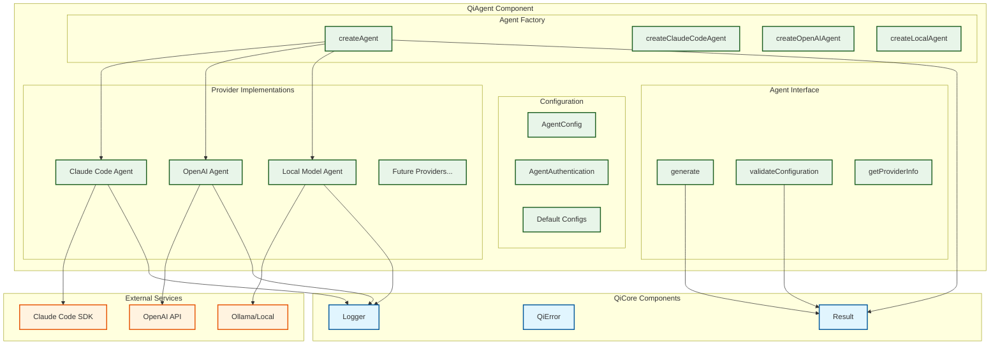

# QiAgent Component Contract

> **Purpose**: AI Agent Interaction Component for Multi-Provider AI Services  
> **Depends on**: QiCore Base Component (Result<T>, QiError), QiCore Core Component (Logger)  
> **Implements**: Multi-provider AI agent abstraction with extensible architecture  
> Version: v1.0  
> Date: June 28, 2025  
> Status: Implementation Phase  
> Purpose: Unified AI model interactions (Claude Code, OpenAI, Local models, etc.)

## Component Architecture Overview

QiAgent provides a unified interface for interacting with multiple AI providers through a pluggable agent architecture. Each provider implements the Agent interface, enabling seamless switching between AI services.



---

## QiAgent Component

**Purpose**: Unified AI agent interaction layer providing consistent interface across multiple AI providers (Claude Code, OpenAI, local models) with robust error handling and extensible architecture.

### Component Interface

```
QiAgentComponent provides:
  Agent Factory operations:
    - createAgent(config) → Result<Agent>
    - createClaudeCodeAgent(config) → Agent
    - createOpenAIAgent(config) → Agent  
    - createLocalAgent(config) → Agent
  
  Agent operations (async):
    - generate(request) → async Result<AgentResponse>
    - validateConfiguration() → Result<void>
    - getProviderInfo() → ProviderInfo
  
  Configuration operations (pure):
    - createDefaultAgentConfig(provider) → AgentConfig
    - createClaudeCodeConfig(apiKey?) → AgentConfig
    - createOpenAIConfig(apiKey?) → AgentConfig
    - createLocalConfig(endpoint) → AgentConfig
  
  Validation operations (pure):
    - validateGenerationRequest(request) → Result<GenerationRequest>
```

### Included Contracts
- **Multi-Provider Support**: Unified interface for Claude Code, OpenAI, Anthropic, Bedrock, Vertex AI, local models
- **Agent Abstraction**: Common interface hiding provider-specific implementation details
- **Configuration Management**: Type-safe configuration with provider-specific authentication
- **Error Handling**: Consistent error reporting across all providers
- **Request Validation**: Type-safe validation of generation requests
- **Timeout Management**: Configurable timeouts with automatic retry strategies

### Dependencies
- **QiCore Base Component**: Uses Result<T> for error handling and QiError for failures
- **QiCore Core Component**: Uses Logger for operation tracking and debugging
- **External AI Services**: Integrates with Claude Code SDK, OpenAI API, local model endpoints

### Exported Types
- `Agent`: Core agent interface for AI interactions
- `AgentProvider`: Supported provider enumeration
- `AgentConfig`: Provider configuration including authentication
- `AgentAuthentication`: Authentication credential structure
- `AgentResponse`: Standardized response format across providers
- `GenerationRequest`: Type-safe request structure for code generation

### Component Guarantees
- **Provider Abstraction**: Consistent interface regardless of underlying AI service
- **Type Safety**: Full TypeScript coverage with runtime validation
- **Error Consistency**: Standardized error format across all providers
- **Timeout Protection**: All operations respect configured timeout limits
- **Authentication Security**: Secure credential handling with environment variable fallbacks
- **Extensibility**: Easy addition of new AI providers through Agent interface
- **Resource Management**: Proper cleanup and connection management

### Internal Dependencies
- Agent Factory uses configuration validation
- Specific agents (Claude, OpenAI, Local) implement common Agent interface
- All agents use shared logging and error handling
- Configuration helpers are independent utilities

### Usage Example
```typescript
// Creating and configuring agents
const claudeConfig = QiAgent.createClaudeCodeConfig(process.env.ANTHROPIC_API_KEY);
const agentResult = QiAgent.createAgent(claudeConfig);

if (agentResult.isSuccess) {
  const agent = agentResult.data;
  
  // Validate configuration
  const configValidation = agent.validateConfiguration();
  if (configValidation.isFailure) {
    console.error('Agent configuration invalid:', configValidation.error);
    return;
  }
  
  // Generate code
  const request: GenerationRequest = {
    model: {
      id: 'claude-3.5',
      name: 'Claude 3.5 Sonnet',
      provider: 'anthropic',
      modelName: 'claude-3-5-sonnet-20241022',
      temperature: 0.7,
      maxTokens: 4000
    },
    systemPrompt: 'You are an expert Haskell programmer.',
    userPrompt: 'Implement a pure function for list reversal.',
  };
  
  const generationResult = await agent.generate(request);
  if (generationResult.isSuccess) {
    const response = generationResult.data;
    console.log('Generated code:', response.content);
    console.log('Usage:', response.usage);
  }
}

// Multi-provider support
const providers = ['claude-code', 'openai', 'local'] as const;
const agents = await Promise.all(
  providers.map(async provider => {
    const config = QiAgent.createDefaultAgentConfig(provider);
    return QiAgent.createAgent(config);
  })
);

// Provider information
const providerInfo = agent.getProviderInfo();
console.log(`Using ${providerInfo.provider} v${providerInfo.version}`);
```

### Error Conditions
- **INVALID_PROVIDER**: Unknown or unsupported AI provider specified
- **MISSING_AUTH**: Required authentication credentials not provided
- **NETWORK_ERROR**: Communication failure with AI service
- **TIMEOUT_ERROR**: Operation exceeded configured timeout limit
- **VALIDATION_ERROR**: Generation request fails validation checks
- **RATE_LIMIT**: AI service rate limit exceeded
- **SERVICE_UNAVAILABLE**: AI service temporarily unavailable
- **INSUFFICIENT_CREDITS**: Account lacks sufficient credits/quota

### Performance Specifications
- **Agent Creation**: < 10ms for configuration and validation
- **Request Validation**: < 1ms per request
- **Network Timeout**: Configurable (default 30s for Claude, 60s for local)
- **Retry Strategy**: Exponential backoff with provider-specific limits
- **Memory Usage**: < 5MB per agent instance
- **Concurrent Requests**: Limited by provider rate limits and configuration

### Provider Support Matrix
| Provider | Status | Authentication | Features |
|----------|--------|----------------|----------|
| Claude Code | ✅ Implemented | API Key, Bedrock, Vertex | Full feature set |
| OpenAI | 🚧 Planned | API Key | Basic implementation |
| Anthropic | 🚧 Planned | API Key | Direct API access |
| Local (Ollama) | 🚧 Planned | Endpoint URL | Self-hosted models |
| Bedrock | 🚧 Planned | AWS Credentials | Amazon integration |
| Vertex AI | 🚧 Planned | GCP Credentials | Google integration |

### Extensibility Guide
```typescript
// Adding a new provider
export const createCustomAgent = (config: AgentConfig): Agent => {
  const validateConfig = (): Result<void> => {
    // Provider-specific validation
  };
  
  const generate = async (request: GenerationRequest): Promise<Result<AgentResponse>> => {
    // Provider-specific implementation
  };
  
  return {
    generate,
    validateConfiguration: validateConfig,
    getProviderInfo: () => ({ provider: 'custom', version: '1.0.0' }),
  };
};
``` 