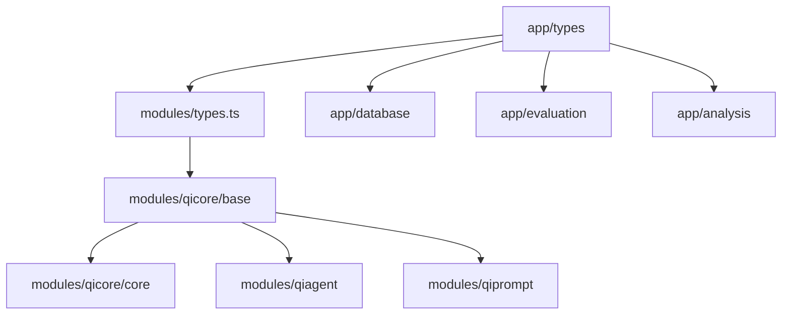

# AI Code Generation Consistency Study Platform

**TypeScript/Bun implementation for measuring AI model consistency in code generation**

## 📋 Project Overview

This platform measures **AI code generation consistency** across different models and prompts, focusing on Haskell code generation that follows QiCore v4 architectural patterns.

### **Core Purpose**
- **Quantify AI consistency**: Measure how consistently different AI models generate code
- **Quality assessment**: Score generated code against established architectural contracts
- **Model comparison**: Compare models based on consistency and quality metrics
- **Research insights**: Generate data for AI code generation research

## 🏗️ Architecture Overview

### **Clean Module-Based Architecture**
```
src/
├── modules/              # Self-contained reusable modules
│   ├── qicore/          # QiCore v4 base functionality
│   │   ├── base/        # Result<T>, QiError, fundamental types
│   │   └── core/        # Configuration, logging, caching
│   ├── qiagent/         # AI model integration (Claude, OpenAI, Local)
│   ├── qiprompt/        # Prompt engineering and content extraction
│   └── types.ts         # Core AI types (AIModel, GenerationRequest, etc.)
├── app/                 # Study-specific application logic
│   ├── database/        # SQLite storage with Bun
│   ├── evaluation/      # Implementation scoring system
│   ├── analysis/        # Statistical analysis
│   ├── generators/      # Code generation orchestration
│   ├── runners/         # Study execution
│   ├── config/          # Configuration management
│   ├── types/           # Study-specific types
│   └── study-orchestrator.ts
└── index.ts            # Main entry point
```

### **Dependency Flow**


## 🎯 Key Features

### **1. Multi-Model Support**
- **Claude Code**: Anthropic's Claude with tool access
- **OpenAI Models**: GPT-4, GPT-3.5-turbo, etc.
- **Local Models**: Ollama, local LLM endpoints

### **2. Comprehensive Scoring System**
- **Contract Compliance (40% weight)**: Adherence to QiCore architectural patterns
- **Modernity Score (20% weight)**: Use of modern Haskell features (GHC2024, strict fields)
- **Completeness Score (30% weight)**: API coverage and comprehensive implementation
- **Quality Score (10% weight)**: Documentation, safety patterns, performance considerations

### **3. Data Storage & Analytics**
- **SQLite Database**: Fast local storage with Bun integration
- **Statistical Analysis**: Consistency metrics, model comparisons
- **Result Persistence**: JSON exports, raw data storage

### **4. Study Orchestration**
- **Batch Processing**: Configurable concurrency and rate limiting
- **Progress Tracking**: Real-time execution monitoring
- **Error Handling**: Comprehensive error collection and analysis

## 🚀 Getting Started

### **Prerequisites**
```bash
# Install Bun runtime
curl -fsSL https://bun.sh/install | bash

# Install dependencies
bun install

# Verify setup
bun run lint
bun run test
```

### **Configuration**
Create `config/study.json`:
```json
{
  "models": [
    {
      "id": "claude-sonnet",
      "name": "Claude 3.5 Sonnet", 
      "provider": "anthropic",
      "modelName": "claude-3-5-sonnet-20241022"
    }
  ],
  "instructions": [
    {
      "id": "haskell-cache",
      "name": "Haskell Cache Implementation",
      "category": "modern",
      "language": "haskell",
      "complexity": "high"
    }
  ],
  "execution": {
    "runsPerCombination": 5,
    "maxConcurrency": 3,
    "timeout": 60000
  }
}
```

### **Running a Study**
```typescript
import { createStudyOrchestrator, createDefaultAppConfig } from './src/app/study-orchestrator';

const orchestrator = createStudyOrchestrator(createDefaultAppConfig());
const result = await orchestrator.executeStudy(studyConfig);

console.log(`Study completed: ${result.statistics.totalGenerations} generations`);
console.log(`Mean consistency: ${result.statistics.coefficientOfVariation}`);
```

## 📊 Core Types & Interfaces

### **Study Configuration**
```typescript
interface StudyConfig {
  readonly id: string;
  readonly name: string;
  readonly models: readonly AIModel[];
  readonly instructions: readonly InstructionSet[];
  readonly execution: {
    readonly runsPerCombination: number;
    readonly timeout: number;
    readonly maxConcurrency: number;
  };
}
```

### **Generation Result**
```typescript
interface GenerationResult {
  readonly id: string;
  readonly studyId: string;
  readonly modelId: string;
  readonly instructionId: string;
  readonly runNumber: number;
  readonly generatedCode: GeneratedCode;
  readonly compilation?: CompilationResult;
  readonly timestamp: Date;
}
```

### **Implementation Score**
```typescript
interface ImplementationScore {
  readonly contractCompliance: number;  // 0-100
  readonly modernityScore: number;      // 0-100  
  readonly completenessScore: number;   // 0-100
  readonly qualityScore: number;        // 0-100
  readonly overallScore: number;        // weighted average
}
```

## 🔧 Module APIs

### **QiCore Base** (`modules/qicore/base/`)
```typescript
// Result<T> - Functional error handling
export const success: <T>(value: T) => Result<T>
export const failure: (error: QiError) => Result<never>
export const map: <T, U>(fn: (value: T) => U) => (result: Result<T>) => Result<U>

// QiError - Structured error information
export const createQiError: (code: string, message: string, category: ErrorCategory, context?: Record<string, unknown>) => QiError
```

### **QiAgent** (`modules/qiagent/`)
```typescript
// AI model integration
export const QiAgent = {
  createClaudeCodeAgent: (config: AgentConfig) => Agent,
  createOpenAIAgent: (config: AgentConfig) => Agent,
  createLocalAgent: (config: AgentConfig) => Agent,
}
```

### **QiPrompt** (`modules/qiprompt/`)
```typescript
// Prompt engineering
export const QiPrompt = {
  buildSystemPrompt: (model: AIModel, instruction: InstructionSet) => string,
  buildCompletePrompt: (model: AIModel, instruction: InstructionSet, config?: PromptConfig) => Result<{systemPrompt?: string; userPrompt: string}>,
  extractCodeFromResponse: (responseContent: string) => string,
  cleanGeneratedCode: (code: string) => string,
}
```

## 📈 Scoring Methodology

### **Contract Compliance (40% weight)**
Measures adherence to QiCore architectural patterns:
- **Result<T> type definition** (20 points)
- **QiError integration** (20 points) 
- **Core functions** (success, failure, map, flatMap) (40 points)
- **Error handling patterns** (20 points)

### **Modernity Score (20% weight)**
Evaluates use of modern Haskell features:
- **GHC2024 language pragma** (15 points)
- **Strict field annotations** (10 points)
- **Deriving strategies** (8 points)
- **Modern syntax** (lambda-case, etc.) (12 points)

### **Completeness Score (30% weight)**
Assesses API coverage and implementation depth:
- **Required functions with type signatures** (60 points)
- **Additional utility functions** (25 points)
- **Edge case handling** (15 points)

### **Quality Score (10% weight)**
Evaluates documentation and safety:
- **Haddock documentation** (30 points)
- **Safety patterns** (no partial functions) (40 points)
- **Performance considerations** (20 points)
- **Code style consistency** (10 points)

## 🗄️ Data Storage

### **Database Schema**
```sql
-- Main study metadata
CREATE TABLE studies (
  id TEXT PRIMARY KEY,
  name TEXT NOT NULL,
  created_at DATETIME DEFAULT CURRENT_TIMESTAMP,
  status TEXT DEFAULT 'running'
);

-- Generation results
CREATE TABLE generations (
  id TEXT PRIMARY KEY,
  study_id TEXT NOT NULL,
  model_id TEXT NOT NULL,
  instruction_id TEXT NOT NULL,
  run_number INTEGER NOT NULL,
  generated_code TEXT NOT NULL,
  compilation_success BOOLEAN DEFAULT FALSE,
  syntactic_score REAL DEFAULT 0,
  semantic_score REAL DEFAULT 0,
  modern_score REAL DEFAULT 0,
  completeness_score REAL DEFAULT 0,
  documentation_score REAL DEFAULT 0,
  performance_score REAL DEFAULT 0,
  overall_score REAL DEFAULT 0,
  tokens_used INTEGER DEFAULT 0,
  response_time REAL DEFAULT 0,
  FOREIGN KEY (study_id) REFERENCES studies(id)
);
```

### **Query Examples**
```typescript
// Get all results for a study
const results = await db.getGenerationResults(studyId);

// Get model comparison
const comparison = await db.getModelComparisons(studyId);

// Get consistency metrics
const stats = await db.getStudyStatistics(studyId);
```

## 📁 File Structure

```
qicore-v4/typescript/study/
├── docs/
│   └── readme.md              # This file
├── src/
│   ├── modules/               # Self-contained modules
│   │   ├── qicore/           # QiCore v4 implementation
│   │   ├── qiagent/          # AI model integration
│   │   ├── qiprompt/         # Prompt engineering
│   │   └── types.ts          # Core AI types
│   ├── app/                  # Study application logic  
│   │   ├── database/         # Data storage
│   │   ├── evaluation/       # Scoring system
│   │   ├── analysis/         # Statistical analysis
│   │   ├── config/           # Configuration
│   │   ├── types/            # Study-specific types
│   │   └── study-orchestrator.ts
│   └── index.ts
├── tests/                     # Test suite
├── config/                    # Configuration files
├── results/                   # Study output
├── package.json
├── tsconfig.json
└── biome.json
```

## 🔬 Research Applications

### **Consistency Measurement**
- **Coefficient of Variation**: Measures consistency across multiple runs
- **Model Ranking**: Compare models by consistency and quality
- **Instruction Effectiveness**: Identify which prompts produce most consistent results

### **Quality Analysis**
- **Architectural Compliance**: How well models follow established patterns
- **Modern Feature Usage**: Adoption of language-specific best practices
- **Documentation Quality**: Completeness and accuracy of generated docs

### **Performance Metrics**
- **Generation Speed**: Time per generation
- **Token Efficiency**: Tokens used vs. output quality
- **Success Rate**: Percentage of compilable/valid outputs

## 🛠️ Development

### **Available Scripts**
```bash
bun run lint          # Code linting with Biome
bun run test          # Run test suite
bun run build         # Build for production
bun run dev           # Development mode
bun run study         # Execute default study
```

### **Contributing**
1. Follow architectural principles (modules are self-contained)
2. Maintain type safety throughout
3. Add comprehensive tests for new features
4. Update documentation for API changes

### **Code Quality Standards**
- **TypeScript strict mode** enabled
- **Biome** for formatting and linting  
- **Result<T>** for error handling
- **Readonly types** for immutability
- **Comprehensive JSDoc** documentation

---

## 📚 Additional Resources

- **QiCore v4 Architecture**: See `modules/qicore/` for foundational patterns
- **Scoring Algorithms**: See `app/evaluation/implementation-scorer.ts`
- **Study Examples**: See `examples/` directory
- **API Reference**: Generated from TypeScript definitions

**Version**: 1.0.0  
**Status**: Active Development  
**License**: MIT
